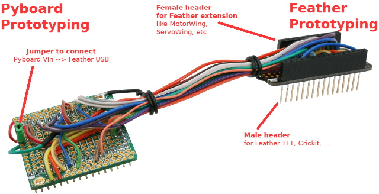
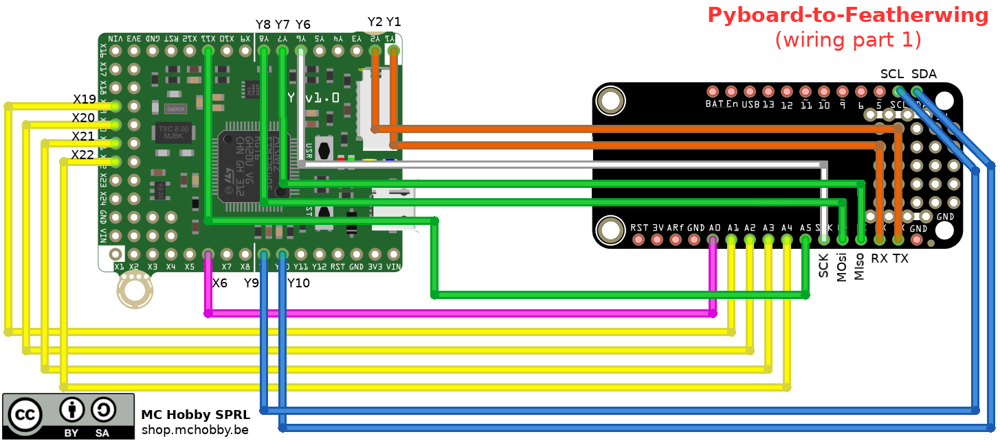

[This file also exists in ENGLISH here](readme_ENG.md)

# Connecteur FeatherWing sur Pyboard

Voici une proposition de raccordement (et brochage) pour brancher un connecteur FeatherWing sur une carte PyBoard.



# Qu'est ce que l'écosystème Feather ?

([Adafruit Industries](https://www.adafruit.com/category/943)) a créé un écosystème complet autour du facteur de forme Feather. Feather c'est des cartes microcontroler et des cartes d'extensions nommées __FeatherWing__. Feather exploite une connectique unique ou les fonctionnalités (bus I2C, SPI, UART, entrée analogique, alimentations) sont toujours au même endroit sur la carte Feather!

Cette standardisation est un grand avantage car il devient possible de réaliser un prototype d'interface permettant à la Pyboard d'être compatible avec les extensions Feather. Feather exploite une __logique 5V__.


Utiliser une interface standardisée sur une __grande variété de carte__ est absolument génial! Le facteur de Forme et brochage unique de Feather est devenu un standard de l'industrie. Les nombreuses cartes d'extension Feather et FeatherWing disponibles sur le marché des projets d'envergures sans se prendre la prendre la tête avec les détails d'interface (contrôleur moteur, TFT, etc).

Adafruit Industries maintien de nombreuses ressources relatives à ses produits (tutoriels, GitHub avec pilotes Arduino, C, Python, ...).

# Connecteur FeatherWing
Pour connecter une extension FeatherWing sur votre Pyboard, vous aurez besoin de savoir quel bus (SPI, I2C, GPIO) cette extension exploite. Dans la plupart des cas, c'est le bus I2C (avec 3.3V et la masse) ou le bus SPI (ex TFT).

Le raccordement proposé ci-dessous couvre toutes les broches du FeatherWing!. __Le mapping est compatible avec UEXT, NCD, QWIIC déjà proposés sur ce dépôt__. Il se base sur les fonctionnalités offertes par le Feather M0 ( [voir le brochage du Feather M0 ici](docs/_static/arduino_feather_M0_Express_Pinout_v1.2-1.png) )


NCD dispose déjà de nombreuses cartes adaptateur [disponibles ici](https://store.ncd.io/shop/?fwp_product_type=adapters) mais nous pouvons également créer nos propres branchement vers d'autres cartes de développement (comme suggéré ci-dessous).

# brochage
Le brochage proposé provient du projet UPPY (_Universal Prototyping Pyboard_) visant à offrir un maximum de connectivité à votre carte Pyboard.

Les détails du branchement sont disponibles ici dans le projet [Pin-Mapping-table.pdf](../UPPY/docs/Pin-Mapping-table.pdf)



.png)

.png)


# Bus I2C, SPI, UART
Voici les instructions permettant de créer une instance du bus I2C sur le connecteur NCD.

```
from machine import I2C
i2c = I2C(2)

from machine import SPI
spi = SPI(2)

from machine import SPI
uart = UART(6, 9600) # UART à 9600 bauds
```

# Où trouver des pilotes MicroPython pour cartes FeatherWing

Tous nos pilotes MicroPython sont stockés sur le GitHub [pyboard-driver](https://github.com/mchobby/pyboard-driver) ET le GitHub [esp8266-upy](https://github.com/mchobby/esp8266-upy). Les pilotes MicroPython fonctionnant sur ESP8266 fonctionneront aussi avec des Pyboard :-)

Les pilotes MicroPython pour les cartes exposants un facteur de forme FeatherWing sont stockes dans des répertoires commençant avec "__feather-__" (ex: feather-motor, etc).

* GitHub __esp8266-upy__ propose une liste des pilotes pour [interface FeatherWing sur __esp8266-upy__](https://github.com/mchobby/esp8266-upy/blob/master/docs/indexes/drv_by_intf_FEATHERWING.md).

# Liste d'achat
* [Carte prototypage Pyboard](https://shop.mchobby.be/fr/micropython/598-plaque-de-prototypage-pour-pyboard-3232100005983.html)
* [Carte de prototypage FeatherWing](https://shop.mchobby.be/fr/feather-adafruit/861-feather-protoo-3232100008618-adafruit.html)
* [Stacking Header pour Feather](https://shop.mchobby.be/fr/feather-adafruit/832-stacking-header-pour-feather-3232100008328-adafruit.html)
* [Cartes MicroPython Pyboard](https://shop.mchobby.be/fr/56-micropython)
* [Gamme Feather @ MCHobby](https://shop.mchobby.be/fr/87-feather-adafruit).
* [Gamme Feather @ Adafruit](https://www.adafruit.com/category/943).
