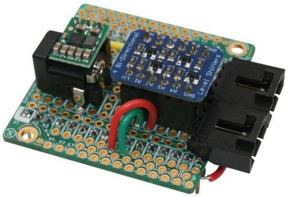
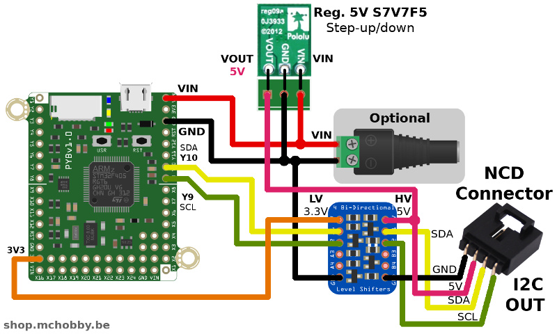

[This file also exists in ENGLISH here](readme_eng.md)

# Connecteur NCD sur Pyboard

Voici une proposition de raccordement (et brochage) pour brancher un connecteur NCD sur une carte PyBoard.



# Qu'est ce que l'écosystème NCD  / National Control Device ?

([National Control Device](https://store.ncd.io)) a créé de nombreuses cartes capteurs I2C (nommée "_I2C Mini Board_" ou mini carte I2C) exploitant un connecteur standardisé à 4 broches et utilisant une __alimentation 5V__ et __logique 5V__.


Utiliser une interface standardisée sur une __grande variété de carte__ (comme Arduino, Raspberry, Feather, WiPy, LoPy, etc) et carte capteur est absolument génial! Ce facilite la prototypage et le développement de solutions personnalisées sans la difficulté d'avoir à disposer de connaissances en électronique ou en soudure (NCD maintien également un GitHub communautaire avec du code pour Arduino, C, Python, ...).


# Connecteur NCD
Pour connecter une mini carte I2C de NCD, vous aurez besoin d'un connecteur NCD (connecteur de sortie I2C) et fils de raccordement.


NCD dispose déjà de nombreuses cartes adaptateur [disponibles ici](https://store.ncd.io/shop/?fwp_product_type=adapters) mais nous pouvons également créer nos propres branchement vers d'autres cartes de développement (comme suggéré ci-dessous).

# brochage


Le brochage proposé avec un régulateur DC/DC permettant de produire une tension de 5V à partie de Vin.
Comme le régulateur utilisé (S7V7F5) fonctionne en step-up et step-down, il est possible d'envisager une multitude de source d'alimentation (comme USB, bloc pile, accu Lipo).


__Note 1:__ Lorsque alimenté via l'USB de la Pyboard, VIn = 4.40V (VUSB - Shottky Diode de protection). Cette tension est ramenée à 5V par le régulateur (en mode step-up).

__Note 2:__ il est également possible d'opter pour une alimentation 5V sur Vin et dans ce cas, il faut placer un pont Vin-->Vout en lieu et place du régulateur.

# Bus I2C
Voici les instructions permettant de créer une instance du bus I2C sur le connecteur NCD.

```
from machine import I2C

i2c = I2C(2)
```

# Où trouver des pilotes MicroPython pour cartes NCD

Tous nos pilotes MicroPython sont stockés sur le GitHub [pyboard-driver](https://github.com/mchobby/pyboard-driver) ET le GitHub [esp8266-upy](https://github.com/mchobby/esp8266-upy). Les pilotes MicroPython fonctionnant sur ESP8266 fonctionneront aussi avec des Pyboard :-)

Les pilotes MicroPython pour les cartes exposants un connecteur NCD sont stockes dans des répertoires commencant avec "__ncd-__" (ex: ncd-si7005, ncd-mpl115-a2, etc).

# Liste d'achat
* [Carte prototypage Pyboard](https://shop.mchobby.be/fr/micropython/598-plaque-de-prototypage-pour-pyboard-3232100005983.html)
* Connecteur NCD mâle: [disponible sur NCD.io](https://store.ncd.io/product/i2c-interface-cable-connector-4-pin-male-molex-0705530003-wm4902-nd/)
* Extension NCD: [vaste gamme disponible chez ncd.io](https://ncd.io/).
* [Cartes MicroPython Pyboard](https://shop.mchobby.be/fr/56-micropython)
