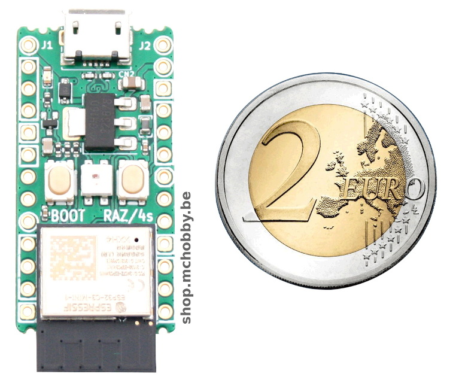
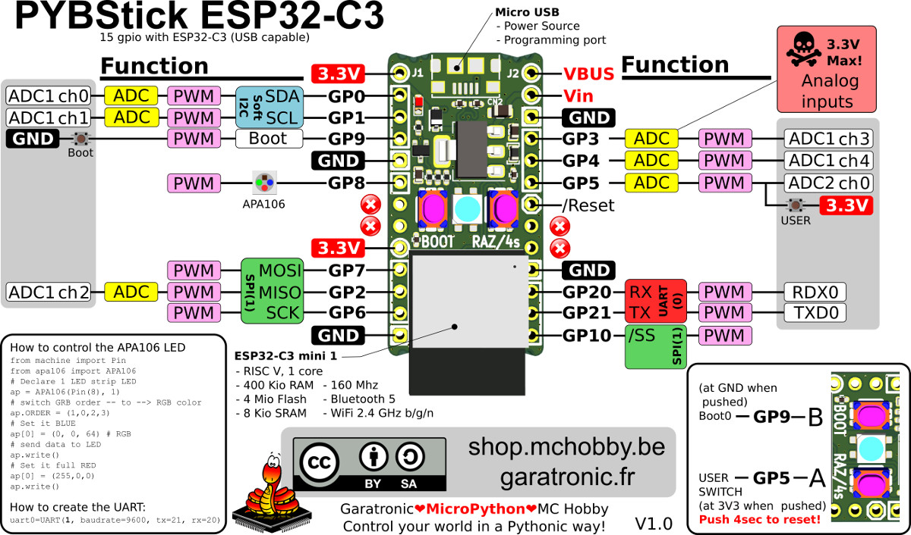
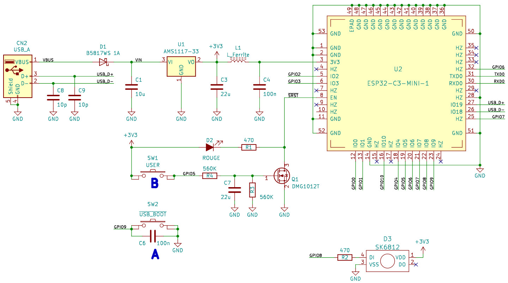
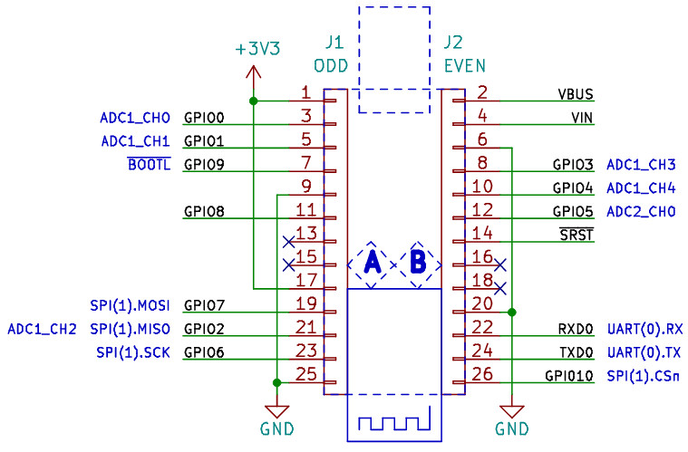

# PYBStick-ESP32-C3 : La carte MicroPython à base d'ESP32-C3

Les cartes PYBStick sont issues d'un projet démarré par Garatronic et MCHobby
pour rendre l'accès à la programmation MicroPython et Arduino plus abordable,
pratique et documenté en Français.

Si la [PYBStick standard est basée sur le puissant STM32](https://github.com/mchobby/pyboard-driver/tree/master/PYBStick), ce modèle ci est
basé sur un microcontrôleur de Espressif.

L'ESP32-C3 est un microcontrôleur mono coeur RISC-V WiFi et BLE qui s'est fait connaître pour son support USB natif.
qui supporte MicroPython et d'autres environnements de développement... que demander de plus?

Toujours avec le même facteur de forme, la PYBStick-ESP32-C3 reste très compacte et abordable.

# PYBStick ESP32-C3

La version PYBStick ESP32-C3 fait 26 est équipée d'un ESP32-C3 mini 1 cadencé à 160 MHz.
Il s'agit d'un simple coeur RISC-V avec 400 Kio RAM et 4 Mio de mémooire Flash.

[Fiche technique de ESP32-C3-Mini 1](http://df.mchobby.be/datasheet/esp32-c3-mini-1_datasheet_en.pdf) (pdf).

# Schémas

# Ressources

## Des pilotes micropython

MCHobby SPRL développe de nombreux pilotes MicroPython mis à disposition gratuitement. Ce projet à débuté avec l'écriture du Livre "[Python, Raspberry Pi et Flask](https://www.editions-eni.fr/livre/python-raspberry-pi-et-flask-capturez-des-donnees-telemetriques-et-realisez-des-tableaux-de-bord-web-9782409016318)" et prolongé avec le livre "[MicroPython et Pyboard](https://www.editions-eni.fr/livre/micropython-et-pyboard-python-sur-microcontroleur-de-la-prise-en-main-a-l-utilisation-avancee-9782409022906)", ouvrages écris par Dominique (de chez MCHobby).

Il s'agit de pilotes multi-plateformes (fonctionnant indépendamment de la plateforme MicroPython):

* [__GitHub ESP8266__ - Pilote MicroPython](https://github.com/mchobby/esp8266-upy)
* [__GitHub Pyboard-Driver__](https://github.com/mchobby/pyboard-driver) des pilotes MicroPython gourmand en ressources (donc plutôt réservé à des carte puissante comme PYBStick Pro, Pyboard, PYBD)

## PYBStick Drawing
Envie de faire vos propres schémas à base de PYBStick? Pas de problème, nous avons prévu une image PNG avec fond transparent. Nous les utilisons régulièrement avec Gimp.
* [GAR-PYBSTICK26-C3-mUSB(640px).png](docs/_static/GAR-PYBSTICK26-C3-mUSB(640px).png) - 640 pixels de haut
* [GAR-PYBSTICK26-C3-mUSB.png](docs/_static/GAR-PYBSTICK26-C3-mUSB.png) - 1000 pixels de haut

# Où acheter
* [PYBStick 26 ESP32 C3 - MicroPython - USB A](https://shop.mchobby.be/product.php?id_product=2504) GAR-PYBSTICK26-C3 @ MCHobby
* [PYBStick26 ESP32 C3 - MicroPython - microUSB](https://shop.mchobby.be/product.php?id_product=2505) GAR-PYBSTICK26-C3-mUSB @ MCHobby
