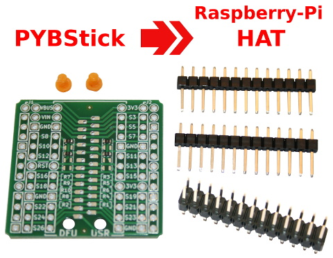
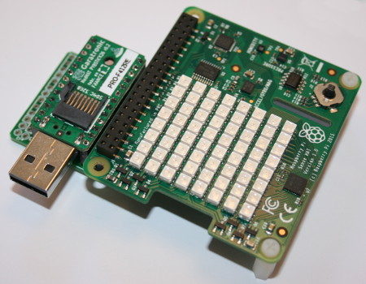
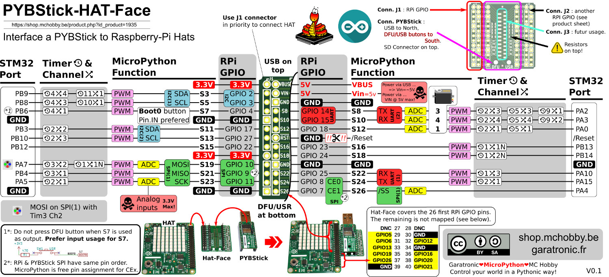

# Interface HAT pour PYBStick

La carte d'extension [PYBStick HAT-FACE](https://shop.mchobby.be/product.php?id_product=1935) permet d'interfacer facilement un ou deux HAT Raspberry-Pi sur la [PYBStick](https://shop.mchobby.be/fr/recherche?controller=search&orderby=position&orderway=desc&search_query=pybstick&submit_search=).

Branchez votre PYBStick, enfichez votre HAT et c'est parti. Vous pouvez contrôler votre HAT à partir de la PYBStick.

## Assembler
Avant de pouvoir utiliser la carte HAT-Face, il sera nécessaire de souder les différents connecteurs.

Ces [opérations de soudures sont détaillées dans ce tutoriel](https://wiki.mchobby.be/index.php?title=MicroPython.PYBStick.hat-face) (wiki mchobby)

# Brochage et branchement

L'image haute [résolution est disponible ici (png)](docs/_static/hat-face-pinout.png) .

# Les résistances
La carte présente des résistances 0 ohms au format 0603 déjà soudées (et des emplacements vides). Il y en 10 ou 2x5, pour desservir les deux connecteurs périphériques J1 et J2.

__J1 est desservi par R7, R8, R10, R9 et R2 :__

Si R2 est montée alors elle propage le signal de la pin 14 vers J1 (R2 est non montée par défaut). C'est pour une utilisation PYBStick car sur hat raspberry-pi, cette broche est une masse.

R7 et R10 montées (R8 et R9 non montées) propagent les signaux des broches 8 et 10 sans modification, c'est les signaux de l'UART historique sur raspberry-pi. Ce cas de figure permet à la PYBStick de dialoguer avec un HAT GPS.

R8 et R9 montées (R7 et R10 non montées) croisent les signaux des broches 8 et 10, c'est le cas pour deux périphériques DCE (_Data Circuit-terminating Equipement__) comme un Raspberry-Pi + une PYBStick (connectés ensemble). Dans ce cas, il faut croiser RX et TX entre les deux périphériques. La pybstick devient alors une carte d'extension pour le Raspberry-Pi (et ils peuvent communiqués ensembles via la voie série).

__J2 est desservi par R3, R5, R6, R4 et R1 :__

C'est exactement pareil que pour J1. R1 est également NM.

__Pour résumer :__

Pour résumer, avec R3, R6, R7, R8 montées, vous avez une configuration droite (pour le port série) et pas de propagation de la broche 14 (/RESET).

# Tester

Still to do.

# Où acheter

* La [carte PYBStick](https://shop.mchobby.be/fr/recherche?controller=search&orderby=position&orderway=desc&search_query=pybstick&submit_search=) est disponible chez MCHobby
* La carte [PYBStick HAT-FACE](https://shop.mchobby.be/product.php?id_product=1935) est disponible chez MCHobby
