[This file also exists in ENGLISH here](readme_ENG.md)

# PYBStick 26 : La carte MicroPython d'entrée de gamme pour tous les projets

TODO : description


## Modèles de PYBStick

La PYBStick 26 existe en 3 modèle: Lite, Standard et Pro


# Information technique

## PYBStick Lite 26


Aussi disponible en haute définition sur le lien [PYBStick-LITE-26.png](docs/_static/PYBStick-LITE-26.png)

## Schéma
* Schéma [PYBStick Lite 26.pdf](docs/Schema_PYBSTICK26_LITE-STD_r2.pdf)
* Assignation des broches [PYBStick-pinout.ods](docs/_static/PYBStick-pinout.ods) (_LibreOffice Calc_)

## Logique 3.3V

Les plateforme STM32 fonctionnent en logique 3.3V et dispose de nombreuses broches tolérantes 5V (broche en entrée).

Attention cependant à ne pas abuser de cette tolérance et de réaliser autant-que-faire-ce-peut des raccordements en logique 3.3V.

# Bibliothèque

## Dépendances

Les bibliothèques suivantes sont nécessaires pour exploiter toutes les fonctionnalités de la carte. Les bibliothèques doivent être accessibles dans le système de fichiers de la carte MicroPython (à la racine ou dans un sous-répertoire `lib`).

* __ws2812.py__ : contrôler des NeoPixels avec le bus SPI [disponible ici (esp8266-upy GitHub)](https://github.com/mchobby/esp8266-upy/tree/master/neopixel)

## Bibliothèque "pwm"
La bibliothèque [`pwm.py`](lib/pwm.py) contient des définitions et fonctions permettant de facilement contrôler les différentes broches PWM d'une PYBStick.

L'utilisation de cette bibliothèque est décrite plus bas dans la section "Sorties PWM".


# Prise en main
Cette section reprend l'utilisation des différents éléments de la carte.

## Bouton utilisateur (A)


Le bouton A correspond au bouton USR présent sur la carte Pyboard. Il est donc possible d'utiliser la classe `Switch`.

La classe `Switch` permet de lire l'état du bouton.

```
>>> from pyb import Switch
>>> sw = Switch()
>>> # Bouton non pressé
>>> sw.value()
False
>>> # Presser le bouton
>>> sw.value()
True
```

La classe `Switch` permet aussi d'assigner une fonction de rappel qui sera invoquée chaque fois que le bouton USB sera relâché.

```
>>> from pyb import Switch
>>>
>>> definir fonction de rappel
def rappel():
    print("Hello")
>>>
>>> sw = Switch()
>>> sw.callback( rappel )
>>>
>>> # Presser le bouton USR
>>> Hello
Hello
Hello
Hello
```

## Bouton Boot0 (B)

Ce bouton est utilisé pour placer la carte en mode DFU lorsqu'il est enfoncé au démarrage de la plateforme. Le mode DFU permet de téléverser un nouveau firmware (Arduino ou mise-à-jour de MicroPython) sur la carte.

Une fois la carte démarrée et le firmware en cours d'exécution, ce bouton est libre d'usage (car Boot0 n'est plus contrôlé).

Il est possible de réutiliser ce bouton dans vos propres scripts utilisateur. Voici comment faire.

```
>>> from machine import Pin
>>> p = Pin( "SW2", Pin.IN )
>>>
>>> # bouton non pressé
>>> p.value()
0
>>> # Bouton pressé
>>> p.value()
1
```

__Attention:__ Boot0, donc le bouton B, est branché sur la broche S7. Lorsque le bouton B est pressé, S7 est connecté sur +3.3V par l'intermédiaire d'une résistance de 470 Ohms.

C'est pour cette raison qu'__il est vivement recommandé d'utilisé S7 en entrée__. Si S7 est utilisé en sortie alors il ne faut pas utiliser le bouton B durant le fonctionnement de votre script.

## LEDs utilisateurs

La PYBStick, tout comme la Pyboard originale dispose de 4 LEDs de couleurs qui peuvent être contrôlées depuis le script utilisateur.


```
>>> from pyb import LED
>>>
>>> l1 = LED(1) # P5 = Red / Rouge
>>> l1.on()     # allumer
>>> l1.off()    # éteindre
>>> l1.toggle() # Inverser état
>>>
>>> l2 = LED(2) # P4 = Green / Vert
>>> l2.on()     # allumer
>>> l2.off()    # éteindre
>>> l2.toggle() # Inverser état
>>>
>>> l3 = LED(3) # P3 = Orange
>>> l3.on()
>>> l3.off()
>>> l3.intensity( 20 ) # Intensité entre 0 et 255. l3 et l4 uniquement.
>>>
>>> l4 = LED(4) # P4 = Blue / Bleu
>>> l4.on()
>>> l4.off()
>>> l4.intensity( 20 ) # Intensité entre 0 et 255. l3 et l4 uniquement.
```

## Broche Numérique - en entrée

La lecture de l'état d'une entrée se fait à l'aide de la classe Pin configurée en entrée.

* Lorsque le bouton est pressé, le potentiel de la broche S3 est placé/connecté à la masse.
* Lorsque le bouton est relâché, la broche S3 est rappelée à +3.3V par la résistance de 10 KOhms.


L'exemple ci-dessous permet de lire l'état de la broche d'entrée. A noter que la lecture de l'état retourne False lorsque le bouton est pressé. Nous sommes donc dans une logique inversée.

```
>>> from machine import Pin
>>> p = Pin( "S3", Pin.IN )
>>> # Ne pas presser le bouton
>>> p.value()
True
>>> # Presser le bouton
>>> p.value()
False
```

La microcontrôleur peut également activer une résistance pull-up interne, ce qui permet d'éviter le montage de la résistance de 10 KOhms.


Le script suivant affiche l'état du bouton toutes les demi-secondes.
Presser Ctrl+C pour stopper le script.

```
>>> from machine import Pin
>>> from time import sleep
>>> p = Pin( "S3", Pin.IN, Pin.PULL_UP  )
>>> while True:
>>>     s = "..." if p.value() else "Pressé"
>>>     print( s )
>>>     sleep( 0.5 )
>>>
```

## Broche Numérique - en sortie

Une broche en sortie permet au script de contrôler l'état de la broche (niveau haut ou nouveau bas). Cela se fait également par l'intermédiaire de la classe Pin.

La broche du microcontrôleur peut donc commander un périphérique externe uniquement si celui-ci consomme un faible courant (par exemple, une LED ou une carte breakout).

__Attention:__ Pour commander un périphérique énergivore comme un moteur ou un relais, il est impératif de passer par une interface d'amplification appropriée.  

Le montage suivant permet de contrôler une LED par l'intermédiaire d'une résistance de  1K Ohms. Cette résistance permet de limiter le courant lorsque la LED devient conductrice et émet de la lumière. Sans cette résistance, le courant tendra vers l'infini (ce qui détruira le microcontrôleur).


Pour contrôler la sortie (et la LED), il suffit de saisir les quelques instructions suivantes

```
>>> from machine import Pin
>>> p = Pin( "S8", Pin.OUT )
>>>
>>> # Sortie au Niveau Haut (3.3V) -> Allume LED
>>> p.value( 1 )
>>>
>>> # Sortie au Niveau Bas (0V) -> LED éteinte
>>> p.value( 0 )
```

Le script suivant produit effet de battement de coeur.

```
>>> from time import sleep_ms
>>> from machine import Pin
>>> p = Pin( "S8", Pin.OUT )
>>> while True:
>>>     sleep_ms( 1300 ) # Attendre 1100 millisecondes
>>>     p.value( 1 ) # Allume LED
>>>     sleep_ms( 80 )
>>>     p.value( 0 ) # Eteindre LED
>>>     sleep_ms( 80 )
>>>     p.value( 1 ) # Allume LED
>>>     sleep_ms( 80 )
>>>     p.value( 0 ) # Eteindre LED
>>>
```

## Entrée Analogique (3.3 V max)

La carte est équipée de de plusieurs entrée analogiques (S8, S10, S12, S19, S23, S26).

__Attention: en aucun cas la tension appliquée sur l'entrée analogique ne peut être supérieure à 3.3V__ au risque de détruire le microcontrôleur.

Celle-cis peuvent être utilisés pour lire une tension entre 0 et 3.3V avec un résolution de 12 bits.

Le convertisseur Analogique Digital (appelé ADC) retourne donc une valeur entre 0 et 4095 (soit 4096 valeurs possibles).

Le graphique suivant utilise un potentiomètre de 10 KOhms linéaire pour générer une tension entre 0 et 3.3V sur l'entrée S26).


En tournant le potentiomètre, la tension varie sur l'entrée analogique et le résultat est visible sur l'information retournée par le convertisseur analogique digital.

Le script suivant affiche la valeur du convertisseur toutes les 300ms
```
>>> from pyb import ADC
>>> from time import sleep
>>> adc26 = ADC("S26")
>>> while True:
>>>     print( adc26.read() )
>>>     sleep( 0.3 )

```

Quelques exemples complémentaires fournissent de nombreuses autres informations sur le convertisseur ADC:
* [`adc_all.py`](examples/adc_all.py) effectue une lecture de toutes les entrées analogiques (affiche valeur ADC et Tension correspondante)
* [`adc_10bits.py`](examples/adc_10bits.py) effectue une lecture en retrogradant la précision à 10 bits (valeurs entre 0 et 1024)
* [`adc_sampling.py`](examples/adc_sampling.py) effectue un échantillonnage 8 bits sur une entrée.
* Plus d'information sur [la page ADC de MicroPython.org](https://docs.micropython.org/en/latest/library/pyb.ADC.html)

__Parasites:__ un potentiomètre étant constitué d'un curseur se déplaçant le long d'une résistance, il n'est pas rare d'avoir des faux-contacts et effets transitoires. Si ceux-ci sont faible et très court, ils peuvent néanmoins planter un convertisseur ADC (démontré sur un ADC1115). Si vous expérimentez ce type de désagrément, placez alors une capacité de 10nF entre la sortie du signal et la masse :-)

## Sortie Analogique (DAC)

La PYBStick Lite ne dispose pas de sortie analogique (DAC).


## Sortie PWM

La carte PYBStick 26 expose de nombreuses broches PWM (Pulse Modulation Width = Modulation de largeur d'impulsion) qu'il est très facile de piloter à l'aide de la bibliothèque [`lib/pwm.py`](lib/pwm.py).


```
>>> from pwm import *
>>> p = pwm( "S8" )
>>> # Set 33% of duty cycle
>>> p.percent = 33
```
L'exemple suivant permet de commander l'intensité de la LED sur la broche S8 en fonction de la position du potentiomètre branché sur la S19.

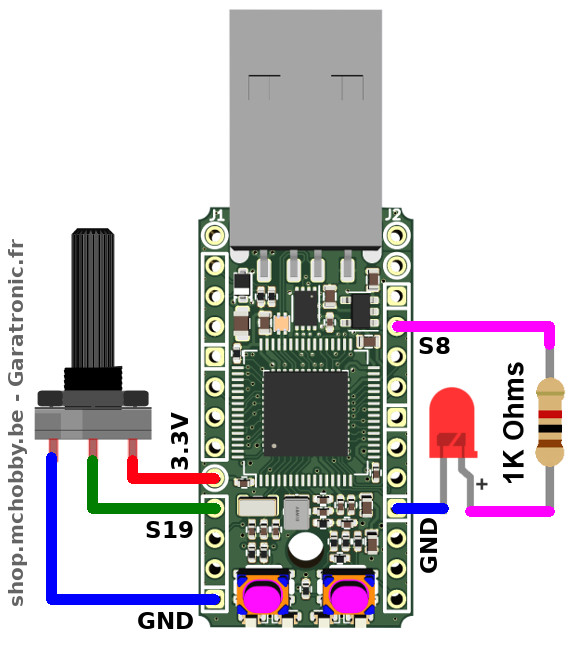

```
from pwm import *
from pyb import ADC
from time import sleep

p = pwm("S8")
adc = ADC("S19")

while True:
	p.percent = int( adc.read()*100/4095 )
	sleep( 0.300 )
```

Ce script est disponible dans les exemples sous le nom [`pwm_led.py`](examples/pwm_led.py)

Ressources:
* L'exemple [`pwm_all.py`](examples/pwm_all.py) permet de tester une à une (en pressant le bouton USR) toutes les broches PWM de la PYBStick.
* MicroPython.org propose la page "[Hardware timer](https://docs.micropython.org/en/latest/wipy/tutorial/timer.html)".
* Le livre ["MicroPython et Pyboard" paru aux éditions Eni](https://www.editions-eni.fr/livre/micropython-et-pyboard-python-sur-microcontroleur-de-la-prise-en-main-a-l-utilisation-avancee-9782409022906) consacre une section entière à la gestion des Timers, Channel, PWM, cycle utile.

## NeoPixel

__Dépendance:__ la bibliothèque `ws2812` doit être présente sur la carte. Voir la section dépendance pour localiser la bibliothèque.

Grâce à son bus SPI, la PYBStick peut contrôler des LEDs WS2812b (également appelée [NéoPixel dans les produits Adafruit Industries](https://shop.mchobby.be/fr/55-neopixels-et-dotstar)). Il s'agit de LED RVB intelligentes pouvant être chaînée dont le protocole exploitant un seul signal de donné à 800 KHz exige une maîtrise totale du timing durant l'envoi des données. [Cette vidéo YouTube](https://youtu.be/x7EwcywFcYU) permet de se faire une idée du résultat lumineux que l'on peut obtenir avec ce type de LED.

Grâce au bus SPI présent sur la PYBStick et au procédé d'oversampling (sur-échantillonnage) la PYBStick est capable de contrôler des NeoPixels.

Le schéma ci-dessous montre comment raccorder un [Stick NeoPixel composé de 8 LEDs](https://shop.mchobby.be/fr/neopixels-et-dotstar/407-stick-neopixel-8-leds-rgb--3232100004078-adafruit.html) et le contrôler avec une tension et signal logique de 3.3V. Le régulateur 3.3V de la PYBStick permet de contrôler uniquement LEDs NeoPixels (comptez jusqu'a 60mA par LED), voyez la section "__NeoPixel sous 5V__" pour contrôler plus de LEDs.

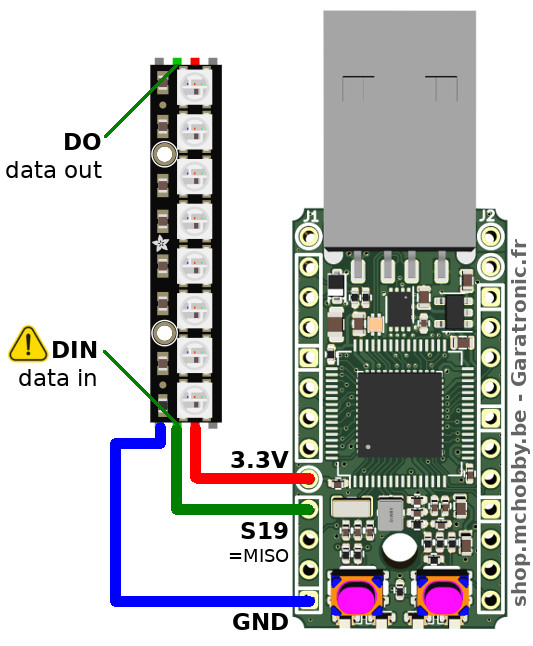

Le fichier d'exemple [`neopixel_simple.py`](examples/neopixel_simple.py), repris partiellement ci-dessous, indique comment prendre le contrôle des LEDs NeoPixels.

```
from ws2812 import NeoPixel
from time import sleep
np = NeoPixel( spi_bus=1, led_count=8, intensity=1 )

# Fixer la couleur la couleur du premier pixel
# avec un tuple (r,g,b) ou chaque valeur est
# située entre 0 et 255
np[0] = (255,0,0) # rouge

np[1] = (0,255,0) # vert
np[2] = (0,0,128) # bleu (1/2 brillance)

# Voir aussi HTML Color Picker
# https://www.w3schools.com/colors/colors_picker.asp
np[3] = (255, 102, 0) # Orange
np[4] = (255, 0, 102) # Rose bonbon
np[5] = (153, 51, 255) # Violet
np[6] = (102, 153, 255) # bleu pastel
np[7] = (153, 255, 153) # vert pastel

np.write()

sleep( 2 )

# Tout éteindre
np.fill( (0,0,0) )
np.write()
```

__NeoPixel sous 5V:__

Bien que fonctionnant sous 3V, le  


Grâce  La carte PYBOARD-UNO-R3 dispose d'un convertisseur de niveau logique pour commander cette LED sous 5V afin d'avoir un maximum de luminosité et des couleurs vives. La carte dispose également d'une sortie permettant d'ajouter d'autres LEDs.

__Ressources__
* La bibliothèque [`esp8266-upy/neopixel`](https://github.com/mchobby/esp8266-upy/tree/master/neopixel)<br />Contenant quelques exemples Pyboard que vous pourrez utiliser directement avec la PYBStick puisqu'ils utilisent tout deux la SPI(1) .
* [Guide NeoPixel]https://wiki.mchobby.be/index.php?title=NeoPixel-UserGuide) (_MCHobby Wiki, Français_)<br />un guide utilisateur avec tout ce qu'il faut savoir à propos de ces LEDs exceptionnelles.
* [Alimenter des Pixels LEDs avec piles et accus](https://wiki.mchobby.be/index.php?title=Piles_et_accus_pour_alimenter_des_Pixels) (_MCHobby Wiki, Français_)<br />Guide trouver la meilleure façon d'alimenter projets à base de LEDs NeoPixels.

## Servo

La PYBStick expose 3 sorties permettant de contrôler des [servo-moteurs modélistes](https://fr.wikipedia.org/wiki/Servomoteur).

__Alimentation:__ Il est possible d'alimenter un ou deux micro-servo par l'intermédiaire du port USB de la PYBStick (via un ordinateur). Cependant cela risque fort d'injecter pléthore de parasite sur l'alimentation de votre ordinateur et de la PYBStick sans compter qu'ils sont aussi énergivores (un courant de blocage de 500mA n'est pas une exception). Voyez la proposition d'alimentation plus bas.

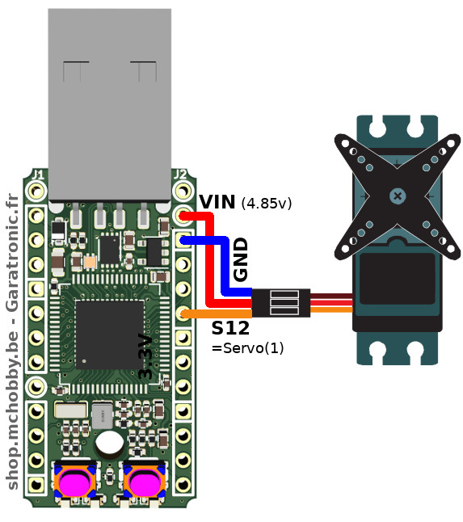

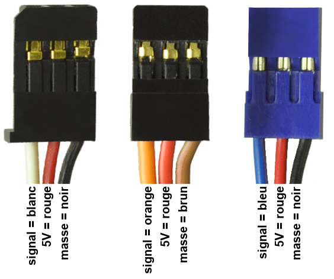

Les servos sont positionnés entre -90 et +90 degrés. A l'initialisation, le servo-moteur est positionné à 0 degrés.

```
from pyb import Servo
from time import sleep

s = Servo(1)    # initialise l angle à 0°
time.sleep( 1 ) # Attendre 1 seconde
s.angle( 90 )
time.sleep( 1 )
s.angle( -90 )
time.sleep( 1 )
s.angle( -90 )
```

Alimentation externe pour les servo-moteurs.

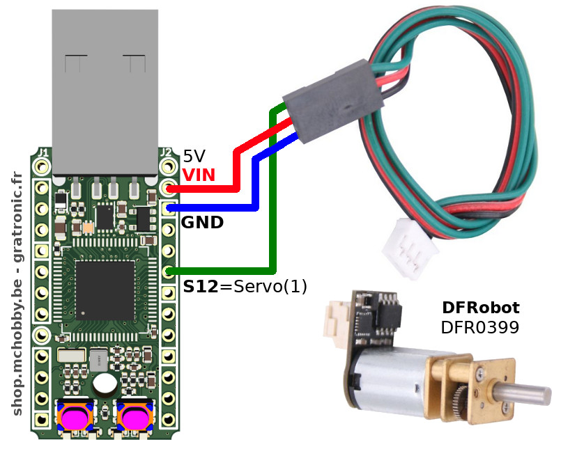

Brancher deux servo-moteurs sur les sorties SERVO(1) et SERVO(4) puis saisir le code suivant pour coordonner le mouvement des deux servo-moteurs.

```
from pyb import Servo
from time import sleep
s1 = Servo(1)
s1.angle(+90)
s4 = Servo(4)
s4.angle(-90)
# déplacement coordonné
s1.angle(-90,4000) # Déplacement à -90 pendant 4000 ms
s4.angle(+90,4000) # Déplacement à +90 pendant 4000 ms
sleep( 4 ) # Attendre fin de déplacement
s1.angle(0)
s4.angle(0)
```

## Moteur continu à commande Servo

Il existe également des moteurs continu que l'on peu commander à l'aide d'un signal de servo-moteur.

C'est le cas de ce [Micro moteur 75:1 Gravity avec contrôleur Servo de DFRobot](https://shop.mchobby.be/product.php?id_product=1811) disponible chez MCHobby.

Grâce à un seul fils de commande transportant le signal Servo et au contrôleur équipant le moteur, il est possible de commander ce moteur:
* En marche/l'arrêt
* En vitesse
* En sens de rotation

Cela ravira les nouveaux venus car il n'y a pas à se compliquer la vie avec les raccordement d'un circuit de puissance (L293/L298), etc tout est déjà présent sur le moteur.


```
MicroPython v1.11-473-g86090de on 2019-11-15; PYBv1.1 with STM32F405RG
Type "help()" for more information.
>>>
>>> from pyb import Servo
>>> s1 = Servo(1)
>>> s1.speed( +100 ) # sens anti-horlogique, vitesse 100%
>>> s1.speed( -100 ) # Sens horlogique, vitesse 100%
>>> s1.speed( -50 )  # Sens horlogique, vitesse 50%
>>> s1.speed( -10 )  # Sens horlogique, vitesse 10%
>>> s1.speed( 0 )    # Arrêt
```

__Note technique:__
* Le signal d'un servo-moteur est une impulsion de 500µs à 2500µs correspondant à un angle allant de -90° à +90°.
* Les impulsions entre 1400µs et 1600µs (soit -9° à +9°) place le moteur à l'arrêt. Lorsqu'une impulsion est inférieure à 1400us (<= -10°) le moteur commence à tourner dans le sens des aiguilles d'une montre et de plus en plus vite pour des valeurs d'impulsions approchant 500us (tendant vers -90°).
* Les valeurs supérieures à 1600µs (>= 10°) font tourner le moteur anti-horlogique. Plus la valeur tend vers 2500µs (soit +90°) et plus le moteur tourne vite.

Vous trouverez également d'autres informations techniques sur la page dédiée à [l'utilisation de ce moteur avec la carte MicroPython Pyboard](https://wiki.mchobby.be/index.php?title=Hack-micropython-dfrobot-motor) (_Wiki, MCHobby_)

## Bus I2C

Le bus I2C est un bus de communication 2 fils transportant le signal de donnée (SDA) et signal d'horloge (SCL).

Le protocol de communication inclus un mécanisme d'adressage, ce qui permet de connecter plusieurs périphériques I2C (pour autant que chaque périphérique dispose de sa propre adresse). Une fois découvert et maîtrisé le bus I2C devient presque incontournable.

La PYBStick dispose de 2 bus I2C:
* I2C(1) sur S3=sda et S5=scl
* I2C(3) sur S11=sda et S13=scl

L'exemple ci-dessous présente le branchement d'un capteur '''[BME280](https://shop.mchobby.be/fr/breakout/684-bme280-sens-temperature-humidite-pression--3232100006843-adafruit.html)''' de Bosch permettant de relever pression atmosphérique, température et humidité relative.

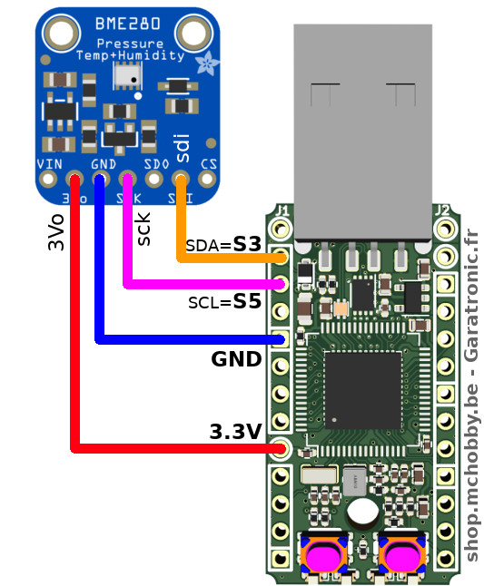

Après avoir branché un composant sur un bus I2C il est facile de détecter sa présence à l'aide d'une opération de scan.

```
>>> from machine import I2C
>>> i2c = I2C(1) # SDA=S3, SCL=S5
>>> i2c.scan()
[119]
>>>
```
Un périphérique répond à l'adresse 119 (décimal, soit 0x77), c'est l'adresse par défaut du BME280.

L'utilisation de ce composant s'appuie sur la bibliothèque [`bme280.py`](https://github.com/mchobby/esp8266-upy/tree/master/bme280-bmp280) disponible sur le [__dépôt esp8266-upy__](https://github.com/mchobby/esp8266-upy) (des pilotes MicroPython multiplateforme).

Après avoir copié le fichier `bme280.py` sur la carte MicroPython, le code suivant peut être saisi dans la session REPL pour tester la capteur.

```
>>> from machine import I2C
>>> from bme280 import *
>>>
>>> # Créer le bus I2C
>>> i2c = I2C(1) # SDA=S3, SCL=S5
>>>
>>> # créer un instance du pilote BME280
>>> bme = BME280(i2c=i2c)
>>>
>>> print( bme.values )
('22.22C', '1005.85hPa', '44.46%')
>>> print( bme.raw_values )
(22.24, 1005.83, 44.48)
>>>
```

La classe `BME280` expose deux propriétés `values` retournant les valeurs sous forme de chaîne de caractères avec unité et `raw_values` permettant d'obtenir des données typées autorisant les traitements mathématiques.

## Bus UART

todo

## Bus SPI

todo

# Bouton Reset et mode DFU

## Mode DFU
Pour passer en mode DFU (Device Firmware Upgrade), il faut que le bouton B (Boot0) soit enfoncé au moment de la mise sous tension.

Le mode DFU est utilisé pour mettre le Firmware MicroPython à jour ou pour programmer la  carte PYBStick à partir d'Arduino IDE (ce qui revient à écraser le Firmware MicroPython).

Sous Linux, il est possible de vérifier la présence de la PYBStick en mode DFU à l'aide de l'utilitaire `dfu-util --list`. Si la PYBStick est en mode DFU alors vous obtiendrez le résultat suivant:

```
$ dfu-util --list
dfu-util 0.9

Copyright 2005-2009 Weston Schmidt, Harald Welte and OpenMoko Inc.
Copyright 2010-2016 Tormod Volden and Stefan Schmidt
This program is Free Software and has ABSOLUTELY NO WARRANTY
Please report bugs to http://sourceforge.net/p/dfu-util/tickets/

Found DFU: [0483:df11] ver=2200, devnum=52, cfg=1, intf=0, path="2-1.4", alt=3, name="@Device Feature/0xFFFF0000/01*004 e", serial="346A386B3437"
Found DFU: [0483:df11] ver=2200, devnum=52, cfg=1, intf=0, path="2-1.4", alt=2, name="@OTP Memory /0x1FFF7800/01*512 e,01*016 e", serial="346A386B3437"
Found DFU: [0483:df11] ver=2200, devnum=52, cfg=1, intf=0, path="2-1.4", alt=1, name="@Option Bytes  /0x1FFFC000/01*016 e", serial="346A386B3437"
Found DFU: [0483:df11] ver=2200, devnum=52, cfg=1, intf=0, path="2-1.4", alt=0, name="@Internal Flash  /0x08000000/04*016Kg,01*064Kg,03*128Kg", serial="346A386B3437"
```

Pour la mise-à-jour du Firmware MicroPython, [vous pouvez vous référer à notre tutoriel sur la MicroPython Pyboard](https://wiki.mchobby.be/index.php?title=MicroPython.Pyboard.mise-a-jour). Il faudra, bien entendu, télécharger (depuis Internet) et téléverser le Firmware correspondant à la PYBStick.

## Mode DFU et Reset

Il est également possible d'activer le mode DFU en gardant le bouton B (Boot0) enfoncé pendant que l'activation de la broche Reset.

La broche Reset peut être activée en la placant à la masse à l'aide d'un morceau de fil ou en plaçant vous même un bouton poussoir entre les broches __/rst__ et __GND__.

Nulle doute que cette dernière option ravira les développeurs Arduino.

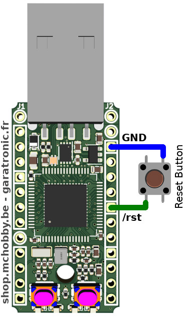

__Note:__ le bouton Reset n'est pas présent sur la carte pour des raisons de coût et d'encombrement.

# Réinitialisation d'usine

MicroPython dispose d'un __mode sans échec__ et d'une procédure de __réinitialisation d'usine__. Ces deux procedures sont identique sur la carte MicroPython Pyboard et son documentés sur le Wiki de MCHobby.

* [Mode sans Echec (safe mode)](https://wiki.mchobby.be/index.php?title=MicroPython-Hack-safemode) démarre la carte sans exécuter `boot.py` et `main.py`.
* [Réinitialisation d'usine](https://wiki.mchobby.be/index.php?title=MicroPython-Hack-safemode) (plus bas dans l'article) pour réinitialiser le firmware MicroPython sur la carte.

# Où trouver des pilotes MicroPython

Tous nos pilotes MicroPython sont stockés sur le GitHub [pyboard-driver](https://github.com/mchobby/pyboard-driver) ET le GitHub [esp8266-upy](https://github.com/mchobby/esp8266-upy). Les pilotes MicroPython fonctionnant sur ESP8266 fonctionneront aussi avec des Pyboard :-)

# Ressources

## sticker-connector

Le documents [`sticker-connector.pdf`](docs/sticker-connectors.pdf) permet d'imprimer deux petites bandelettes couleurs permettant d'identifier facilement les broches de la PYBStick.

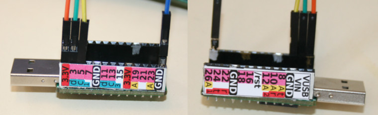

Pour coller les bandelettes, vous pouvez utiliser des gommettes de collage pour album photo et un bon cutter pour couper les excédents.

## pin-mapping

Il existe également le document [pin-scale-map.pdf](docs/pin-scale-map.pdf) reprenant le mapping des broches à l'échelle 1:1

En repliant et collant le papier puis en pratiquant les découpes aux emplacements indiqués, il est possible de glisser l'assemblage sur les GPIOs du PYBStick

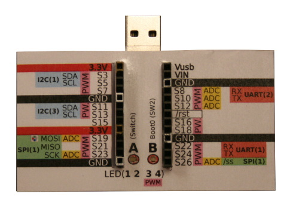


## PYBStick drawing

__Image PNG:__

Envie de faire vos propres schéma à base de PYBStick? Pas de problème, nous avons prévu une image PNG avec fond transparent en 3 résolution. Nous les utilisons régulièrement avec Gimp.
* [PYBStick-Lite-26-template(640px).png](docs/_statics/PYBStick-Lite-26-template(640px).png) - 640 pixels de haut
* [PYBStick-Lite-26-template(800px).png](docs/_statics/PYBStick-Lite-26-template(800px).png) - 800 pixels de haut
* [PYBStick-Lite-26-template.png](docs/_statics/PYBStick-Lite-26-template.png) - la plus haute résolution, 2700 pixels de haut

__Composant Fritzing:__

Un composant Fritzing est disponible pour la PYBStick, vous le trouverez dans le répertoire [`docs/fritzing/`](docs/fritzing/)

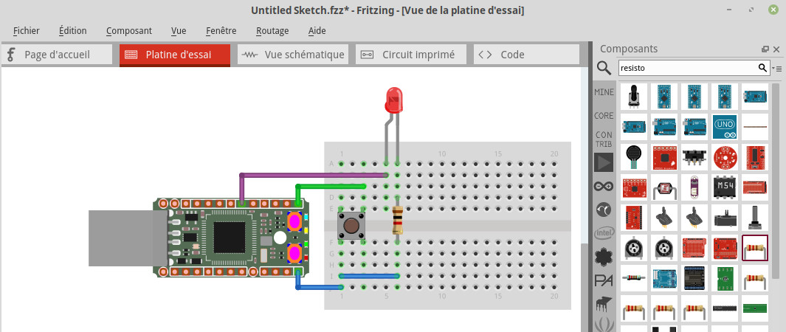

## 3D - Case basique

Garatronic, le créateur de la PYBStick propose un boîtier à imprimer. Les fichiers STL peuvent être téléchargés depuis le répertoire [`docs/3d/case-basic`](docs/3d/case-basic)

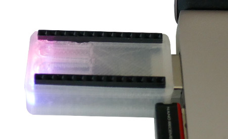

# Liste d'achat

TODO

* [PYBStick-Lite-26](https://shop.mchobby.be/product.php?id_product=1830)
* [Cartes MicroPython](https://shop.mchobby.be/fr/56-micropython)
