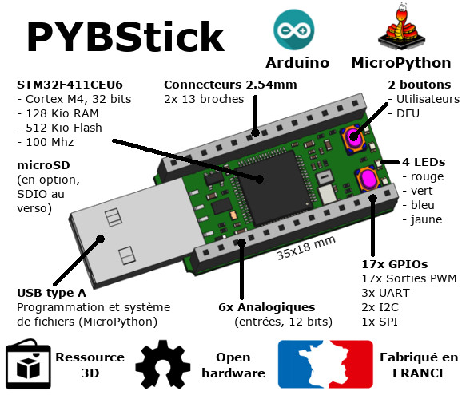
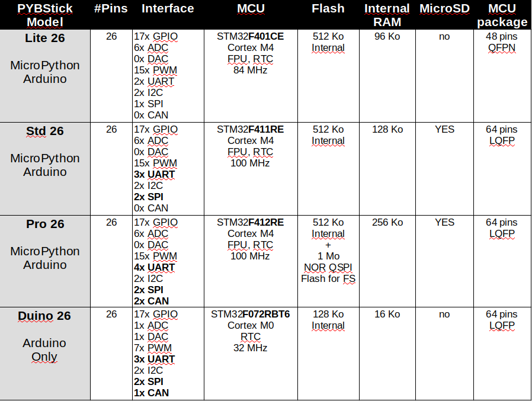
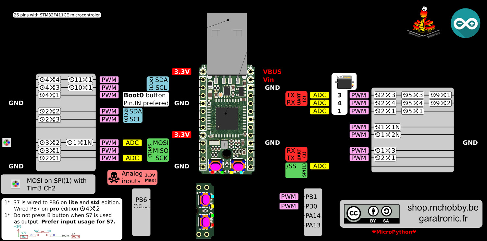
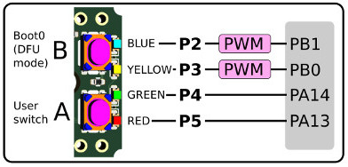
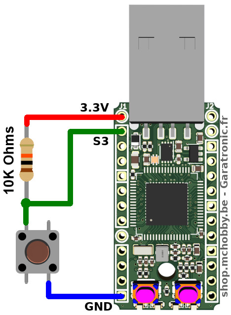
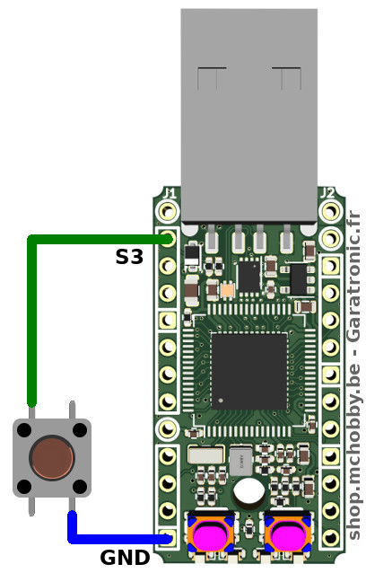
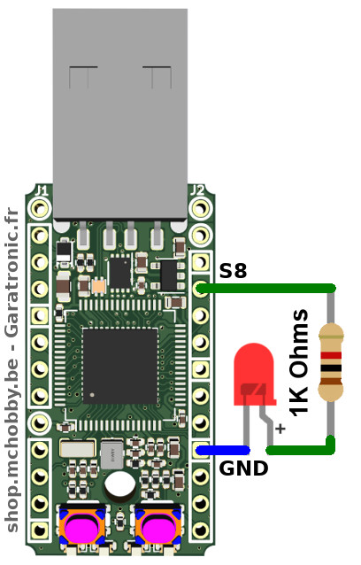
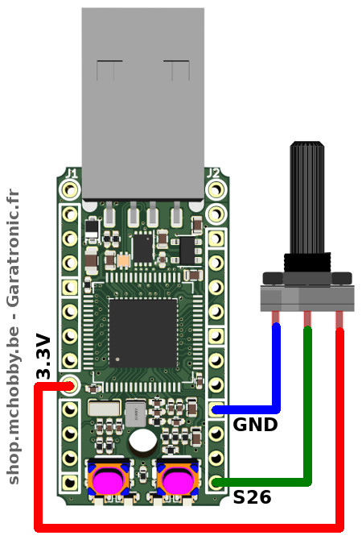

[This file also exists in ENGLISH here](readme_ENG.md)

# PYBStick 26 : La carte MicroPython d'entrée de gamme pour tous les projets

TODO : description



## Modèles de PYBStick

La PYBStick 26 existe en 3 modèle: Lite, Standard et Pro



# Information technique

## PYBStick Lite 26



Aussi disponible en haute définition sur le lien [PYBStick-LITE-26.png](docs/_static/PYBStick-LITE-26.png)

## Schéma
* Schéma [PYBStick Lite 26.pdf](docs/_static/Schematic_V1.0-PYBStick26Lite.pdf)
* Assignation des broches [PYBStick-pinout.ods](docs/_static/PYBStick-pinout.ods) (_LibreOffice Calc_)

## Logique 3.3V

TODO

# Bibliothèque

## Dépendances
TODO : a revoir

Les bibliothèques suivantes sont nécessaires pour exploiter toutes les fonctionnalités de la carte. Les bibliothèques doivent être accessibles dans le système de fichiers de la carte MicroPython (à la racine ou dans un sous-répertoire `lib`).

* ws2812.py : contrôler des NeoPixels avec le bus SPI [disponible ici (esp8266-upy GitHub)](https://github.com/mchobby/esp8266-upy/tree/master/neopixel)

## Bibliothèque "pwm"
La bibliothèque `pwm.py` contient des définitions et fonctions permettant de facilement contrôler les différentes broches PWM d'une PYBStick.

L'utilisation de cette bibliothèque est décrite plus bas dans la section "Sorties PWM".


# Prise en main
Cette section reprend l'utilisation des différents éléments de la carte.

## Bouton utilisateur (A)



Le bouton A correspond au bouton USR présent sur la carte Pyboard. Il est donc possible d'utiliser la classe `Switch`.

La classe `Switch` permet de lire l'état du bouton.

```
>>> from pyb import Switch
>>> sw = Switch()
>>> # Bouton non pressé
>>> sw.value()
False
>>> # Presser le bouton
>>> sw.value()
True
```

La classe `Switch` permet aussi d'assigner une fonction de rappel qui sera invoquée chaque fois que le bouton USB sera relâché.

```
>>> from pyb import Switch
>>>
>>> definir fonction de rappel
def rappel():
    print("Hello")
>>>
>>> sw = Switch()
>>> sw.callback( rappel )
>>>
>>> # Presser le bouton USR
>>> Hello
Hello
Hello
Hello
```

## Broche Numérique - en entrée

La lecture de l'état d'une entrée se fait à l'aide de la classe Pin configurée en entrée.

* Lorsque le bouton est pressé, le potentiel de la broche S3 est placé/connecté à la masse.
* Lorsque le bouton est relâché, la broche S3 est rappelée à +3.3V par la résistance de 10 KOhms.



L'exemple ci-dessous permet de lire l'état de la broche d'entrée. A noter que la lecture de l'état retourne False lorsque le bouton est pressé. Nous sommes donc dans une logique inversée.

```
>>> from machine import Pin
>>> p = Pin( "S3", Pin.IN )
>>> # Ne pas presser le bouton
>>> p.value()
True
>>> # Presser le bouton
>>> p.value()
False
```

La microcontrôleur peut également activer une résistance pull-up interne, ce qui permet d'éviter le montage de la résistance de 10 KOhms.



Le script suivant affiche l'état du bouton toutes les demi-secondes.
Presser Ctrl+C pour stopper le script.

```
>>> from machine import Pin
>>> from time import sleep
>>> p = Pin( "S3", Pin.IN, Pin.PULL_UP  )
>>> while True:
>>>     s = "..." if p.value() else "Pressé"
>>>     print( s )
>>>     sleep( 0.5 )
>>>
```

## Broche Numérique - en sortie

Une broche en sortie permet au script de contrôler l'état de la broche (niveau haut ou nouveau bas). Cela se fait également par l'intermédiaire de la classe Pin.

La broche du microcontrôleur peut donc commander un périphérique externe uniquement si celui-ci consomme un faible courant (par exemple, une LED ou une carte breakout).

__Attention:__ Pour commander un périphérique énergivore comme un moteur ou un relais, il est impératif de passer par une interface d'amplification appropriée.  

Le montage suivant permet de contrôler une LED par l'intermédiaire d'une résistance de  1K Ohms. Cette résistance permet de limiter le courant lorsque la LED devient conductrice et émet de la lumière. Sans cette résistance, le courant tendra vers l'infini (ce qui détruira le microcontrôleur).



Pour contrôler la sortie (et la LED), il suffit de saisir les quelques instructions suivantes

```
>>> from machine import Pin
>>> p = Pin( "S8", Pin.OUT )
>>>
>>> # Sortie au Niveau Haut (3.3V) -> Allume LED
>>> p.value( 1 )
>>>
>>> # Sortie au Niveau Bas (0V) -> LED éteinte
>>> p.value( 0 )
```

Le script suivant produit effet de battement de coeur.

```
>>> from time import sleep_ms
>>> from machine import Pin
>>> p = Pin( "S8", Pin.OUT )
>>> while True:
>>>     sleep_ms( 1300 ) # Attendre 1100 millisecondes
>>>     p.value( 1 ) # Allume LED
>>>     sleep_ms( 80 )
>>>     p.value( 0 ) # Eteindre LED
>>>     sleep_ms( 80 )
>>>     p.value( 1 ) # Allume LED
>>>     sleep_ms( 80 )
>>>     p.value( 0 ) # Eteindre LED
>>>
```

## Entrée Analogique (3.3 V max)

La carte est équipée de de plusieurs entrée analogiques (S8, S10, S12, S19, S23, S26).

__Attention: en aucun cas la tension appliquée sur l'entrée analogique ne peut être supérieure à 3.3V__ au risque de détruire le microcontrôleur.

Celle-cis peuvent être utilisés pour lire une tension entre 0 et 3.3V avec un résolution de 12 bits.

Le convertisseur Analogique Digital (appelé ADC) retourne donc une valeur entre 0 et 4095 (soit 4096 valeurs possibles).

Le graphique suivant utilise un potentiomètre de 10 KOhms linéaire pour générer une tension entre 0 et 3.3V sur l'entrée S26).



En tournant le potentiomètre, la tension varie sur l'entrée analogique et le résultat est visible sur l'information retournée par le convertisseur analogique digital.

Le script suivant affiche la valeur du convertisseur toutes les 300ms
```
>>> from pyb import ADC
>>> from time import sleep
>>> adc26 = ADC("S26")
>>> while True:
>>>     print( adc26.read() )
>>>     sleep( 0.3 )

```

Quelques exemples complémentaires fournissent de nombreuses autres informations sur le convertisseur ADC:
* [`adc_all.py`](examples/adc_all.py) effectue une lecture de toutes les entrées analogiques (affiche valeur ADC et Tension correspondante)
* [`adc_10bits.py`](examples/adc_10bits.py) effectue une lecture en retrogradant la précision à 10 bits (valeurs entre 0 et 1024)
* [`adc_sampling.py`](examples/adc_sampling.py) effectue un échantillonnage 8 bits sur une entrée.
* Plus d'information sur [la page ADC de MicroPython.org](https://docs.micropython.org/en/latest/library/pyb.ADC.html)

__Parasites:__ un potentiomètre étant constitué d'un curseur se déplaçant le long d'une résistance, il n'est pas rare d'avoir des faux-contact et effet transitoire. Si ceux-ci sont faible et très court, ils peuvent néanmoins planter un convertisseur ADC (démontré sur un ADC1115). Si vous expérimentez ce type de désagrément, placez alors une capacité de 10nF entre la sortie du signal et la masse :-)

## Sortie Analogique (DAC)

La PYBStick Lite ne dispose pas de sortie analogique (DAC).


## Sortie PWM

TODO

La carte PYBStick 26 expose de nombreuses broches PWM (Pulse Modulation Width = Modulation de largeur d'impulsion) qu'il est très facile de piloter à l'aide de la bibliothèque `pwm.py`.

## NeoPixel

TODO - Revoir et corriger

La carte est équipée d'une LED WS2812b (également appelée [NéoPixel dans les produits Adafruit Industries](https://shop.mchobby.be/fr/55-neopixels-et-dotstar)). Il s'agit de LED RVB intelligentes pouvant être chaînée. La carte PYBOARD-UNO-R3 dispose d'un convertisseur de niveau logique pour commander cette LED sous 5V afin d'avoir un maximum de luminosité et des couleurs vives. La carte dispose également d'une sortie permettant d'ajouter d'autres LEDs.

__Dépendance:__ la bibliothèque `ws2812` doit être présente sur la carte. Voir la section dépendance pour localiser la bibliothèque.

Voir le fichier d'exemple [`test_led.py`](examples/test_led.py) et sa [vidéo sur YouTube](https://youtu.be/NBv3lBmyQYc)

## Buzzer

La carte PYBStick peu être équipé d'un buzzer pour produire produire des sons et des notes.

TODO - s'insiprer de Pyboard-UNO-R3

## Servo

TODO - a revoir et compléter

Il y a 4 sorties Servo prêt à l'emploi sur la PYBOARD-UNO-R3 pour commander un Servo.

Les servo sont positionnés entre -90 et +90 degrés. A l'initialisation, le servo moteur est positionné à 0 degrés.

Voir le fichier d'exemple [`test_servo.py`](examples/test_servo.py) et sa [vidéo sur YouTube](https://youtu.be/0a2VYjg0XG8).

Brancher deux servo-moteurs sur les sorties SERVO1 et SERVO2 puis saisir le code suivant:

## Bus I2C, SPI, UART

TODO - a revoir complètement

La carte expose les bus standard d'un Arduino ainsi que de nombreux bus en extra.
Les notes ci-dessous expliquent comment créer les différents bus nécessaires.

__Connecteur:__ créer les bus standards

``` python
# I2C côté broche 13 (I2C matériel)
from machine import I2C
i2c = I2C(2)

# Sur broche A4, A5 (I2C logiciel, Bit-Banging)
from machine import I2C
i2c = I2C( sda=Pin("X5"), scl=Pin("X6") )

# Broche 10,11,12,13
from machine import SPI
spi = SPI(2)

# Port série sur 0 et 1 (totalement libre d'usage)
from machine import UART
uart = UART(6, 9600) # UART à 9600 bauds
```

# Où trouver des pilotes MicroPython

Tous nos pilotes MicroPython sont stockés sur le GitHub [pyboard-driver](https://github.com/mchobby/pyboard-driver) ET le GitHub [esp8266-upy](https://github.com/mchobby/esp8266-upy). Les pilotes MicroPython fonctionnant sur ESP8266 fonctionneront aussi avec des Pyboard :-)

# Liste d'achat

TODO

* [PYBStick-Lite-26](https://shop.mchobby.be/product.php?id_product=1830)
* [Cartes MicroPython](https://shop.mchobby.be/fr/56-micropython)
