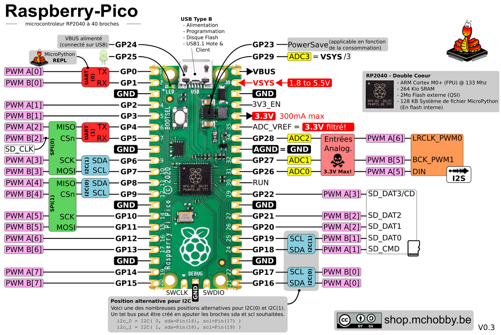
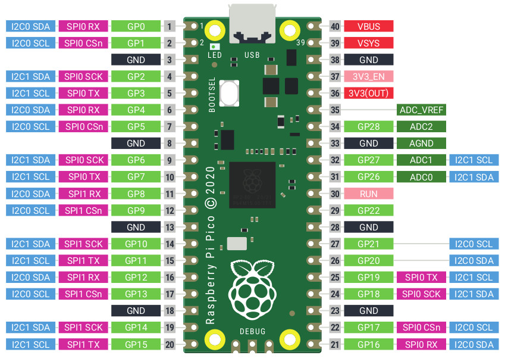
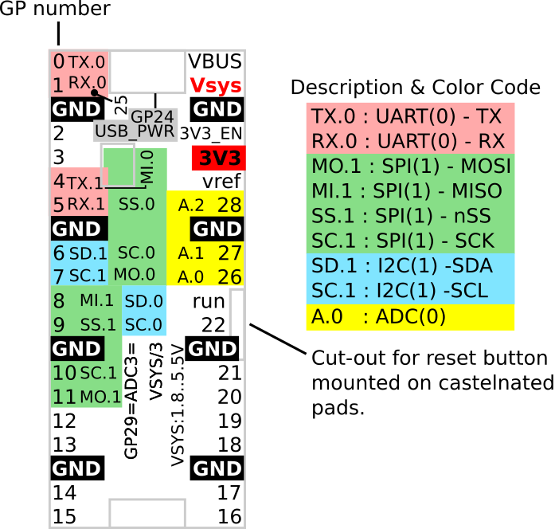
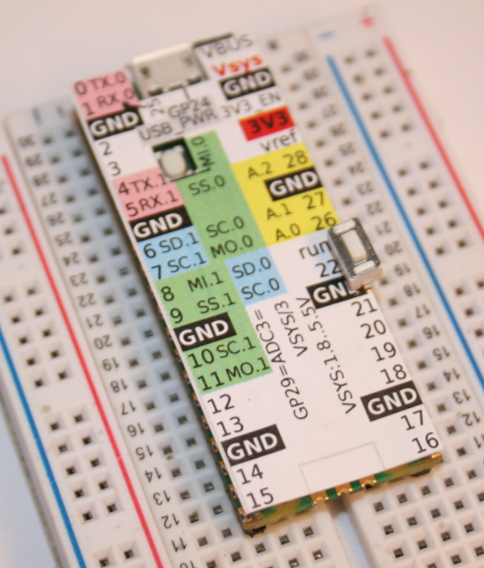

[This file also exists in ENGLISH](readme_ENG.md)
# Raspberry-Pi Pico

Cette section du GitHub contient des __ressources__ utiles concernant le MicroControleur Raspberry-Pi Pico (RP2040) utilisé avec MicroPython.

Il vient épauler notre [Wiki sur le Pico](https://wiki.mchobby.be/index.php?title=MicroPython-Accueil#Pico_.28Raspberry-Pi.29)

# Brochage
Schéma du brochage pour le Pico destiné à une utilisation avec MicroPython.

* [Pico Brochage FR](docs/_static/Pico_FR.jpg)  format jpg, voir aussi [PNG haute resolution](docs/_static/Pico_FR.png)
* [Pico PinOut](docs/_static/Pico.jpg) format jpg, voir [PNG haute resolution](docs/_static/Pico.png)

# Pico overlay
[Pico overlay est un document pdf](docs/_static/Pico-overlay.pdf) à imprimer et à découper. L'overlay prévoit des découpes de précision pour le port USB, bouton Boot (et éventuel Reset).

Une fois fixé sur le Pico avec du double face, il permet de repérer précisément les broches du Pico et c'est vraiment pratique!

L'overlay reprend également l'identification synthétique de bus et fonctions (voir le PDF pour les explications).

# Pico Annoté
Simple et efficace, avec n° de broche, n° de GPIO et informations utiles.

800 px de haut sur fond transparent.

Parfait pour un travail graphique avec Gimp.

* [Pico annoted](docs/_static/PICO-800px-annoted.png) format png, 800px haut

# Pico sous diverses résolutions

Pico sur fond transparent en 640px, 800px, 1024px de hauteur et en haute résolution.

* [Pico 640px (png)](docs/_static/PICO-640px.png)
* [Pico 800px (png)](docs/_static/PICO-800px.png)
* [Pico 1024px (png)](docs/_static/PICO-1024px.png)
* [Pico hires (png)](docs/_static/PICO-high-res.png) 1700 x 3832px

# Flash_Nuke

Le firmware [flash_nuke.uf2](rp2-pico-flash_nuke.uf2) permet d'effacer le système de fichier de MicroPython sur votre RP2040 / Pico.

C'est très pratique si vous avez un script qui bloque complètement le système (et empêche d'établir une session REPL).
