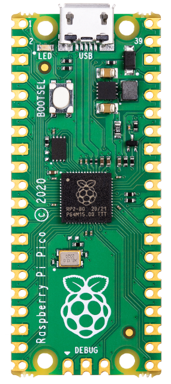
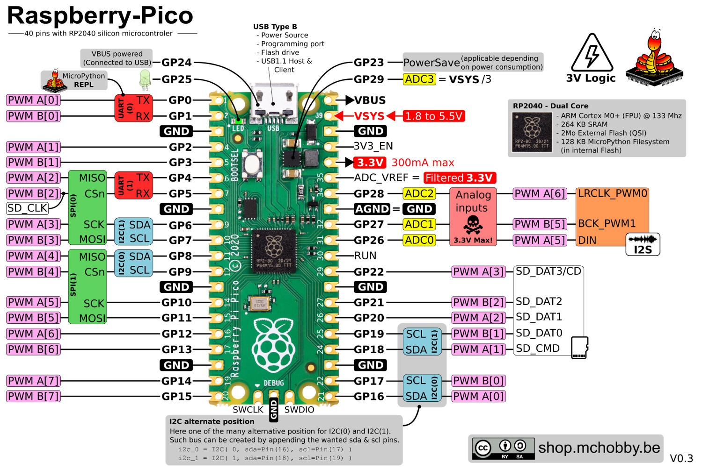
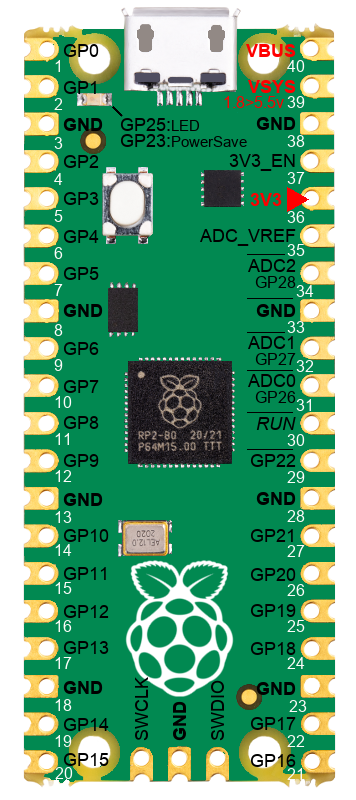

[Ce fichier existe également en FRANCAIS](readme.md)
# Raspberry-Pi Pico

This section of the GitHub contains useful __ressources__ for the Raspberry-Pi PICO MicroControler (RP2040) running under MicroPython.

This complete our work on [MC Hobby's Wiki for the Pico](https://wiki.mchobby.be/index.php?title=MicroPython-Accueil#Pico_.28Raspberry-Pi.29)

# PinOut
Here is the Pinout of Pico when used under MicroPython MicroPython.

* [Pico PinOut](docs/_static/Pico.jpg) jpg format, see also [HighRes PNG](docs/_static/Pico.png)
* [Pico Pinout FR](docs/_static/Pico_FR.jpg)  jpg format, see also [HighRes png](docs/_static/Pico_FR.png)

# Annoted Pico
Simple & efficient, with Pin number, GPIO number and some useful information.

800px height over transparent background.

Suited for graphical work with Gimp.

* [Pico annoted](docs/_static/PICO-800px-annoted.png) png format, 800px height

# Pico under various resolution

Pico over a transparent background640px, 800px, 1024px height and also with High Resolution.

* [Pico 640px (png)](docs/_static/PICO-640px.png)
* [Pico 800px (png)](docs/_static/PICO-800px.png)
* [Pico 1024px (png)](docs/_static/PICO-1024px.png)
* [Pico hires (png)](docs/_static/PICO-high-res.png) 1700 x 3832px
