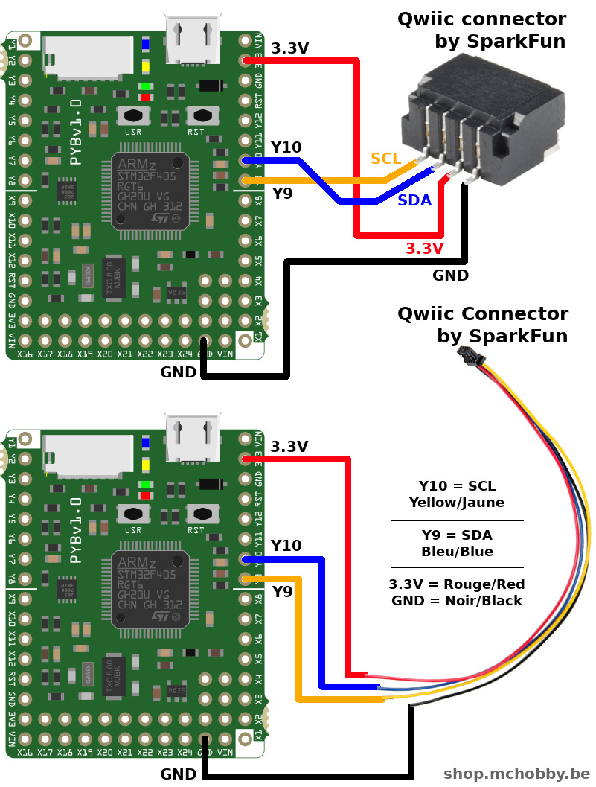
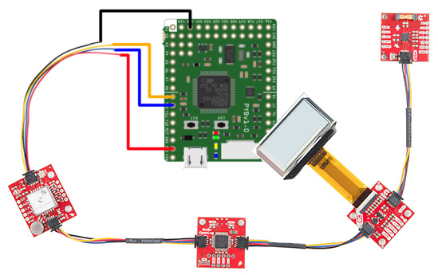
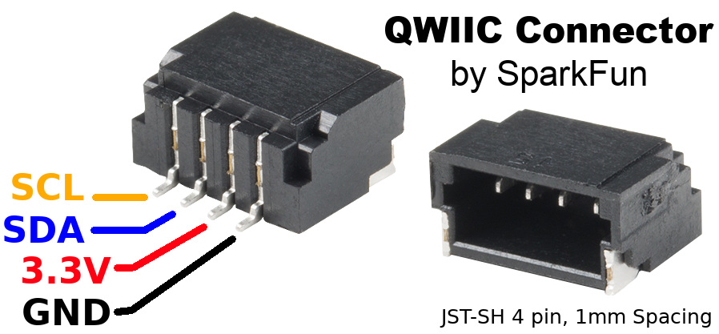

[Ce fichier existe également en FRANCAIS ici](readme.md)

# QWIIC connector on a Pyboard

Here is a wiring proposant (and pinout) to place a QWIIC connector on the MicroPython PyBoard.



# What is the QWIIC EcoSystem ?

([SparkFun Electronic](https://www.sparkfun.com)) did created numerous I2C sensor board named "_QWIIC Board_" using a standardized 4 pins connector also carrying __3.3V power supply__ and using __3.3V logic__.



Using a standard interface connector on __a wide variety of boards__ (like Arduino, Raspberry, Feather, WiPy, LoPy, etc) and sensor board is absolutely awesome! This made the prototyping and customized solution development quite easy. No need to have electronic skill or soldering skill... just plug it and your are ready to code.

# QWIIC connector
You will need for a QWIIC connector or QWIIC wire to connect an SparkFun's I2C board to your favourite development board.



Sparkfun already have many adapter board [disponibles ici](https://www.sparkfun.com/qwiic) but we can also create our own wiring to dévelopment board (like proposed here upper).

# I2C bus
Here is the line of code needed to create an instance of the I2C bus for the QWIIC connector.

```
from machine import I2C

i2c = I2C(2)
```

# Where to find MicroPython drivers for QWIIC boards

All our MicroPython drivers are stored on the [pyboard-driver](https://github.com/mchobby/pyboard-driver) and [esp8266-upy](https://github.com/mchobby/esp8266-upy) GitHubs. The drivers running on MicroPython for ESP8266 will always work with the Pyboard :-)

The MicroPython drivers for the popular I2C sensors (eg: BMP280, BME280, TSL2591, etc) will also work with your QWIIC connector, you just need to create the I2C bus instance as appropriate.

The MicroPython drivers for the boards exposing the QWIIC connector are stored into sub-folder starting with "__qwiic-__" (ex: qwiic-mpl115-a2, etc).

# Shopping list
* [Pyboard protoboard](https://shop.mchobby.be/fr/micropython/598-plaque-de-prototypage-pour-pyboard-3232100005983.html)
* mâle QWIIC Connector: [available at SparkFun](https://www.sparkfun.com/products/14417)
* QWIIC boards: [wide product line available at SparkFun](//https://www.sparkfun.com/qwiic/).
* [MicroPython Pyboard](https://shop.mchobby.be/fr/56-micropython)
