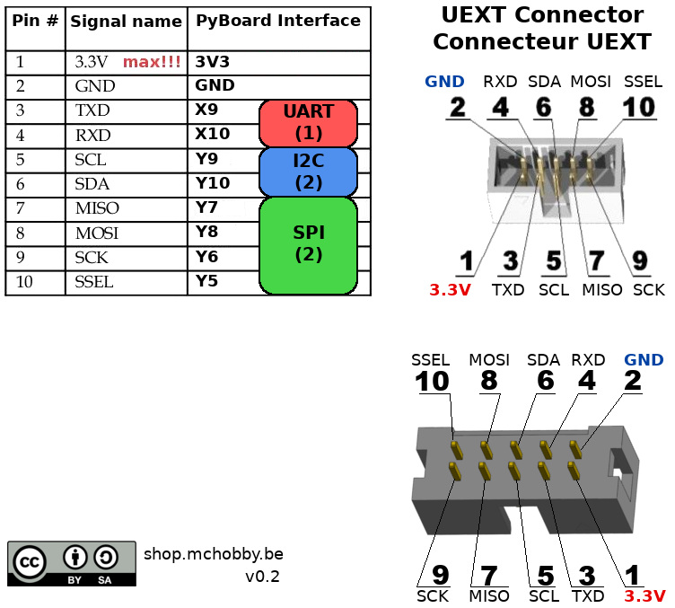

[This file also exists in english here](README_eng.md)

# Connecteur UEXT sur Pyboard

Voici une proposition de raccordement (et brochage) pour connecter un connecteur UEXT sur une carte PyBoard.


De la sorte, il est plus facile de réaliser des tests et du prototypage avec des cartes exposants un connecteur (ou branchement) UEXT. 
- Voir la [gamme d'extension UEXT](https://shop.mchobby.be/fr/138-uext) chez MCHobby
- Voir la [vaste gamme UEXT](https://www.olimex.com/Products/Modules/) chez Olimex.

J'ai fini par faire une carte de prototypage pour poursuivre les essais du [module MOD-VGA (carte Gameduino 3.3V) exposant une interface UEXT](https://shop.mchobby.be/fr/uext/1431-mod-vga-carte-type-gameduino-en-33v-3232100014312-olimex.html) avec ma Pyboard. 

# Brochage 

Voici le brochage proposé:



## Pourquoi cet agencement?
Cette déconnectique découle du projet UPPY qui prévoit également d'autres interfaces de connexions (ce brochage a été pensé avec soin ;-) ).
 
* Cet agencement préserve les sorties DAC
* Garde un deuxième bus I2C à disposition pour une autre interface.
* Garde un maximum de sortie PWM à disposition.
* Garde les entrées analogiques blindées à disposition.
* Préserve un bus CAN. 
* Permet la transformation de l'UART sur UEXT en 2ieme bus I2C (puisque UART(1) et I2C(1) partagent les mêmes broches.

# Bus SPI, I2C, UART

Voici les instructions permettant de créer une instance des différents bus sur le connecteur UEXT.
```
# Create the I2C bus 
from machine import I2C
i2c = I2C( 2 ) # SDA=Y10, SCL=Y9

# Create the SPI bus 
from machine import SPI
spi = SPI(2) # MOSI=Y8, MISO=Y7, SCK=Y6, SS=Y5

# Create the UART bus 
from pyb import UART
ser = UART( 1, 9600 ) # RX=X10, TX=X9, 9600 baud
```
# Où trouver des pilotes MicroPython pour cartes UEXT

Tous nos pilotes MicroPython sont stockés sur le GitHub [pyboard-driver](https://github.com/mchobby/pyboard-driver) ou le GitHub [esp8266-upy](https://github.com/mchobby/esp8266-upy). Les pilotes MicroPython fonctionnant sur ESP8266 fonctionnerons aussi avec des Pyboard :-) 

Les pilotes MicroPython pour les cartes exposants un connecteur UEXT sont stockes dans des répertoires commencant avec "__mod__" (ex: modvga, modrgb, modwii, etc).

# Ressources
* [Modèle UEXT.png pour schéma](uext-conn.png)

# Liste d'achat
* [Carte prototypage Pyboard](https://shop.mchobby.be/fr/micropython/598-plaque-de-prototypage-pour-pyboard-3232100005983.html)
* [Connecteur UEXT mâle](https://shop.mchobby.be/fr/uext/1524-connecteur-idc-case-header-2x5-254mm-3232100015425.html) qui est un connecteur IDC 2x5 broches
* Extension UEXT: [gamme UEXT chez MCHobby](https://shop.mchobby.be/fr/138-uext) et [vaste gamme UEXT chez Olimex](https://www.olimex.com/Products/Modules/) chez Olimex.
* [Cartes MicroPython Pyboard](https://shop.mchobby.be/fr/56-micropython)

