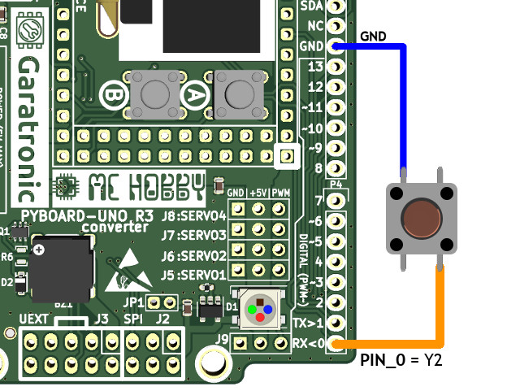
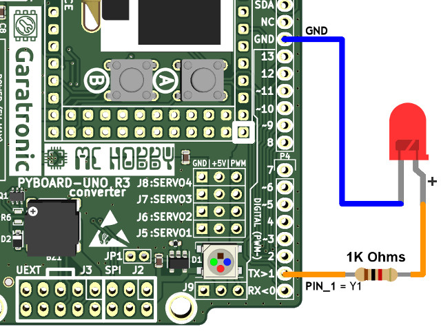
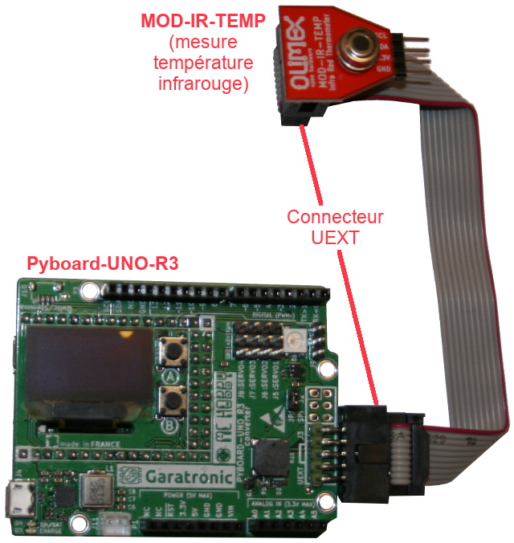

[Ce fichier existe également en FRANCAIS ici](readme.md)

# PYBOARD-UNO-R3 : Pyboard to UNO-R3 adapter

Program the Pyboard with Python is really awesome, doing this with a well popular and known pinout like the UNO-R3 pinout is even better.

This projet offers a very convenient expansion board with several interfaces metamorphosing the Pyboard into a development lab.


The advantage of the [PYBOARD-UNO-R3 adapter](https://shop.mchobby.be/fr/micropython/1745-adaptateur-pyboard-vers-uno-r3-extra-3232100017450.html) is that it allows you to connect Arduino shields (ex: Adafruit motor shield) that you can control from a Pyboard with Python scripts.

In addition, the card contains many interesting features that allow you to quickly transform a Pyboard into a prototyping / learning environment that is very easy to use (see graphic above).

# Technical information
To operate an Arduino shield on your Pyboard, you will need to know which bus (SPI, I2C, GPIO) this extension operates. In most cases, it is the I2C bus (with 3.3V and earth) or the SPI bus (ex TFT).

.jpg)

This interface is intended for 3.3V compatible products/shields (see IORef pin on Arduino R3 extension)

The Pyboard to UNO-R3 pin mapping properly covers the specifications and pin function of the UNO R3. __The pin mapping is compatible with the UEXT, NCD, QWIIC connectors already documented on the [Pyboard-Driver repository](https://github.com/mchobby/pyboard-driver)__.

Charger Note:
* fix yellow + blinking green = No battery
* The charger can also be used with NiMH pack of 3 cells (safer for young poeple). However charging will never get completed with NiMH.

## Schematic
* [PYBV11_to_ARDUINO_UNO_R3.pdf](docs/_static/Schematic_V1.0-_PYBV11_to_ARDUINO_UNO_R3.pdf) pinout
* [Pyboard pin assignation](docs/_static/pyboard-pin-assignation.jpg) still 8 pin available + 4 free pin attached to the red, green, blue, yellow LEDs.

## 3.3V Logic
Even if the Pyboard is 5V tolerant (__but not completely__), it is very important for safety reason to use this UNO R3 adapter as a 3V logic adapter.

The UNO R3 adapter did set the IOREF pin to 3.3V so the shields plugged onto the UNO-R3 adapter knows the active logic level to use is 3.3V.

## UPPY project relationship
The pin mapping in this projet comes in majority from the UPPY (_Universal Prototyping Pyboard_) projet. The UPPY project is made to offers wide connectivity options to the Pyboard.

More details about the UPPY connections is available on the [UPPY Pin-Mapping-table.pdf](../UPPY/docs/Pin-Mapping-table.pdf)

# Libraries

## Dependencies
The following libraries are required to use all the features of the UNO-R3 adpater. The library must be made available on the MicroPython filesystem of the Pyboard (inside the root or under the `lib` subfolder).

* ws2812.py : NeoPixel control over the SPI bus [available here (esp8266-upy GitHub)](https://github.com/mchobby/esp8266-upy/tree/master/neopixel)
* ssd1306.py : SSD1306 based OLED display  [available here (MicroPython GitHub)](https://github.com/micropython/micropython/tree/master/drivers/display)

## "uno" library
The `uno.py` library contains declarations and functions to facilitate the Arduino Pinout usage with the MicroPython Pyboard.

* You can use Pyboard pin name like `"X10"`, matching the Arduino 9.
* The constant `PIN_9` (corresponding to Arduino 9) declared inside the `uno.py` library allows you to control the PYBOARD-UNO-R3 adapter pin with a more "natural" Arduino Pinout naming convention.

So, the two code samples here below does operate exactly the same:
``` python
from machine import Pin
p = Pin( "X10", Pin.IN ) # located on Arduino 9
print( p.value() )       # Display 1 or 0
```
The script version with "UNO" like pin name is:
``` python
from uno import *
from machine import Pin
p = Pin( PIN_9, Pin.IN ) # located on Arduino 9
print( p.value() )       # Display 1 or 0
```

__Tool functions:__

The `uno.py` library also includes tool functions to quickly creates I2C, SPI, UART bus available on the Pyboard-UNO-R3 adapter.

``` python
from uno import *
# Returns the I2C bus placed over the Arduino pin 13.
i2c = i2c_bus( freq=20000 )

# Returns a Bit-Banging I2C bus placed on the Arduino Pin A4, A5.
i2c = i2c_analog_bus( freq=10000 )

# Returns the UART initialized on Arduino pin 0 & 1.
serial = uart_bus( baudrate=9600 )

# Returns the SPI bus and SS control Pin for Arduino pins 10,11,12,13.
spi, ss = spi_bus( baudrate=20000 )

```
All the functions also accept the additional parameters suuported by the MicroPython's `machine` API.

## "pwm" library
The `pwm.py` library contains declaration and functions to made the PWM control easy with MicroPython Pyboard (so with the PYBOARD-UNO-R3 adapter).

The library usage is described in detail in the "PWM Outputs" section.

## "unoextra" library
The `unoextra.py` library contains additionnal utility classes to control the OLED display, the battery charger present on the PYBOARD-UNO-R3 adapter.

The usage of this library is detailled in the "OLED" and "Battery charger" section.

# Taking control
This section details the various PYBOARD-UNO-R3 components and usages.

## User button (A)

The A button is mapped to the USR button available on the Pyboard. So, it is also possible to use the `Switch` class with the A button.

``` python
from pyb import Switch
sw = Switch()

def click():
    print("Clicked")

sw.callback( click )
print( "Press the A button")
```
which produce the following result in the REPL session when the A button is pressed:

```
Press the A button
Clicked
Clicked
Clicked
Clicked
Clicked
Clicked
```
To remove the button callback from the `click()` function, you can just call `sw.callback( None )` to remove the __callback__.

## Digital pin - as input

The pin state can be read with the `Pin` class.

``` python
from machine import PIN
from time import sleep
from uno import *

p = Pin( "Y2", Pin.IN )
# Identical to...
# p = Pin( PIN_0, Pin.IN )

while True:
    if p.value()==1:
        print("Level: HIGH")
    else:
        print("Level: low")
    sleep( 0.5 ) # wait an 1/2 second
```

Just place the pin to the ground or to 3.3V to see the pin state change on the REPL session.

__Internal pull-up resistor:__

An internal pull-up resistor can be activated on an input pin.
Thank to the resistor, the input voltage is pull-up back to 3.3V when the voltage is not forced by an external deviced (eg: pin linked to the ground via a push button).



``` python
from machine import PIN
from time import sleep
from uno import *

p = Pin( "Y2", Pin.IN, Pin.PULL_UP )
# The same as...
# p = Pin( PIN_0, Pin.IN )

while True:
    if p.value():
        print("Level: HIGH")
    else:
        print("Level: low")
    sleep( 0.5 ) # wait  1/2 second
```
## Digital pin - as output

It is possible to control a pin as an output and to set its level to control external device. This is also done with the `Pin` pin.

Set the Pin as an output allows you to light a LED (via a 1K Ohms resistor).



``` python
from machine import PIN
from time import sleep
from uno import *

p = Pin( "Y3", Pin.OUT )
# Same as...
# p = Pin( PIN_0, Pin.IN )

while True:
    if p.value()==1:
        print("Set level to HIGH")
    else:
        print("Set level to low")
    sleep( 0.5 ) # Wait an 1/2 second
```

## Analog input (3.3 V max)
The board does have several analog input (A0 to A5) and also on pins 2 to 7.

Analog pins can be used to read a voltage between 0 and 3.3V.

The constants PIN_A0..PIN_A5 or PIN_2..PIN_7 can be used to identify the pin to be used.
The pinout picture can also be used to find the original pyboard pin name (eg: PIN_A3 = X22).


_Note:_ A 10nF ceramic capacitor can be added between the pot output and the ground for a higher signal stability.

__12 bits analog read:__

By default, the ADC (Analog to Digital Converter) is running in 12 bits resolution. That means that ADC return a value between 0 and 4095. The resolution is 3.3/4096 = 0.0008 V (8 mV)!

This resolution is equivalent to the Arduino Zero, Due & MKR.

``` python
from pyb import ADC
from uno import *
from time import sleep

a3 = ADC(PIN_A3) # same as ADC("X22")
while True:
	# read in 12 bit resolution
	val = a3.read() # 0 à 4095
	volts = val/4096*3.3
	print( "read: %i  Volts: %3f v" % (val,volts) )
	sleep( 0.500 )
```

__10 bits analog read:__

For people used to Arduino UNO world where the ADC resolution is 10 bits (value from 0 to 1023), the `uno.py` library offers the `analog_read()` function to convert the read results to 10 bits.

``` python
from pyb import ADC
from uno import *
from time import sleep

a3 = ADC(PIN_A3) # same as ADC("X22")
while True:
	# 10 bits resolution reading
	val = analog_read(a3) # 0 to 1024
	volts = val/1024*3.3
	print( "read: %i  Volts: %3f v" % (val,volts) )
	sleep( 0.500 )
```

__More information:__
Using analog input is a very interesting subject with lot of possibilities like signal sampling!
You will find more information about this subject in the following references:
* [The ADC class definition on MicroPython.org](http://docs.micropython.org/en/latest/library/pyb.ADC.html) (_English_)
* ["MicroPython et Pyboard" book, French, Meurisse D. @ Editions ENI](https://www.editions-eni.fr/livre/micropython-et-pyboard-python-sur-microcontroleur-de-la-prise-en-main-a-l-utilisation-avancee-9782409022906)

## Analog output (DAC)

The A4 & A5 pins can also be used as analog output to generate an arbitrary voltage between 0 and 3.3V.

__8 bits resolution (by default):__

Over 8 bit, the analog converter can receive a value between 0 and 255 to generate an output voltage from 0v to 3.3V.

To produce an output voltage of 2.3 Volts, the value (255/3.3)x2.6V = 201 must be send on the DAC (Digital to Analog Converter).

``` python
from pyb import DAC
from uno import *
dac = DAC( PIN_A5 )
dac.write( 201 ) # produce 2.6V on the output

```
You can also calculate the output voltage corresponding to an arbitrary 8 bits value send to the DAC. The value 98 will produce the output voltage 3.3/255x98 = 1.27 Volts

__12 bits resolution:__

The DAC can also be configured to to use a 12 bits resolution (value from 0 to 4095).

``` python
from pyb import DAC
from uno import *
dac = DAC( PIN_A4, bits=12 )
out_v = 1.5 # Output voltage = 1.5V
dac.write( int(out_v/(3.3/4095)) )
```

__Generate a signal curve:__

The DAC converter can be used to generate arbitrary signal like sinusoide or other complex signals. Here some references:
* [DAC class on MicroPython.org](https://docs.micropython.org/en/latest/library/pyb.DAC.html) (_English_)
* ["MicroPython et Pyboard" book, French, Meurisse D. @ Editions ENI](https://www.editions-eni.fr/livre/micropython-et-pyboard-python-sur-microcontroleur-de-la-prise-en-main-a-l-utilisation-avancee-9782409022906)

## PWM Outputs

There are many PWM output on the PYBOARD-UNO-R3 board. PWM stand for Pulse Modulation Width = Modulation de largeur d'impulsion.

Thanks to the `pwm.py` library, controling the PWM output is made easy.

``` python
from pwm import *
from uno import *
from time import sleep

# pwm13 = pwm("Y6") are identical
pwm13 = pwm(PIN_13)

print( "PWM de 0 à 100%")
for i in range(0,101, 5): # by step of 5
	pwm13.percent = i  # Set the duty cycle
	sleep(0.200)

# Set the output at LOW level
pwm13.percent = 0
```

__PWM en 8 bits__
Sur un Arduino, le contrôle PWM se fait avec un `analogWrite()` et une valeur de 0-255 (valeur 8 bits).

La bibliothèque PWM supporte la méthode `write()` qui accepte une valeur entre 0 et 255.
``` python
from pwm import *
from uno import *
from time import sleep

pwm13 = pwm(PIN_13)

# Do it like Arduino with 8 bits resolution
for i in range(0,256,3): # per step of 3
	pwm13.write( i )
	sleep(0.050)
```

__PWM release__
Once the PWM pin is initialized, you can set it at LOW level with `pwm13.percent = 0` or set it to HIGH level with `pwm13.percent=100`.

The pin stays configured as output!

The pin can be released with the method `pwm13.release()` which set the pin as input (so high impedance) and stops any PWM operation on the pin.

``` python
from pwm import *
from uno import *
from time import sleep

# pwm13 = pwm("Y6") are identical
pwm13 = pwm(PIN_13)

# PWM set to 40% duty cycle
pwm13.percent = 40
sleep(2)

# Deactivate the PWM and set the pin in high impedancy (as input)
pwm13.release()
sleep( 2 )

# Need to reactivate the PWM on the pin? so set the pin 13 as PWM
pwm13 = pwm(PIN_13)
pwm13.percent = 50
sleep( 2 )

# set it to LOW level
pwm13.percent = 0
```

## Neopixel

The PYBOARD-UNO-R3 board has a WS2812b RGB LED (also named [NeoPixel in the Adafruit Industries products](https://shop.mchobby.be/fr/55-neopixels-et-dotstar)). It is a smart RGB LED that can be daisy chained to create strips and various shapes. The PYBOARD-UNO-R3 feature a logic converter to drive the LED with 5V signal. Thank to the converter, the LED can be powered under 5 Volts to offer a maximum of brightness and colorful light. The board also feature an output to add your own LEDs/pixels.

__Dependancy:__ the `ws2812` library must be made available on the MicroPython board. See the "Dependency" section to find out the library.

See the [`test_led.py`](examples/test_led.py) example file an its [YouTube video](https://youtu.be/NBv3lBmyQYc)

```
from uno import pixels
from time import sleep

led = pixels() # only one LED
rouge = (255,0,0)
vert  = (0,255,0)
bleu  = (0,0,255)
led.fill( rouge )
led.write()
sleep(1)

led.fill( vert )
led.write()
sleep(1)

led.fill( bleu )
led.write()
sleep(1)

led.fill( (255,0,255) ) # Magenta
led.write()
sleep(1)

led.fill( (0,0,0) ) # black / off
led.write()
```
It is also possible to controle several pixels by chaining them on the NeoPixel output. Then indicates the number of LEDs to control when calling the function `pixels()`.

Each picel can be set with a distinct color by using the following syntax:
```
from uno import pixels
from time import sleep

leds = pixels(2) # two LEDs
leds[0] = (255,0,0  ) # Red
leds[1] = (255,0,255) # Magenta
leds.write()
```
See the `test_led_stick.py` example which use a [NeoPixel Stick (Adafruit 1426)](https://www.adafruit.com/product/1426) with 8 pixels (so 9 pixels in total). You can see the result on [this YouTube video](https://youtu.be/x7EwcywFcYU).


More information on RGB/NeoPixel LED usage in the [esp8266-upy/neopixel](https://github.com/mchobby/esp8266-upy/tree/master/neopixel) Github repository.

## Buzzer

The PYBOARD-UNO-R3 includes a magnetic buzzer that can be used to produce sounds and notes.

```
from uno import Buzzer
from time import sleep

bz = Buzzer()
# Play a C/Do @ 593 Hertz
bz.tone( 523 )
sleep( 1 ) # wait 1 seconde
bz.tone()  # Silent
```

The [`test_buzzer_notes.py`](examples/test_buzzer_notes.py) example test every of the notes contained within the `NOTES` dictionnary.
``` python
from uno import Buzzer, NOTES
from time import sleep

bz = Buzzer()
tempo = 300 # Tempo
note_duration = 2 # note duration
print( ", ".join(NOTES.keys()) ) # Available notes
for note in NOTES.keys():
	print( "Play note: %s " % note )
	bz.note( note, tempo*note_duration ) # 600*1000 uS for each note
	sleep( 0.3 ) # wait 300ms between notes
# Silent
bz.tone()
```
Which produce the following results on the REPL session (while producing the sound).
Note that space is for silence:
```
g, f,  , a, c, b, C, e, d
Play note: g
Play note: f
Play note:   
Play note: a
Play note: c
Play note: b
Play note: C
Play note: e
Play note: d
```
It is also possible to play melodies with the `tune()` method as demonstrated in the [`test_buzzer_tune.py`](examples/test_buzzer_tune.py) example.

``` python
from uno import Buzzer
from time import sleep

bz = Buzzer()

# Play a melody:
#   List of note + duration (coma separated)
#   First char = the note/tone (as defined in NOTES)
#   Second char = tone duration (default=1 when missing)
tune1 = "c,c,g,g,a,a,g2,f,f,e,e,d,d,c2, 4"
tune2 = "c2,c,d3,c3,f3,e3,c2,c,d3,c3,g3,f3, 4"

bz.tune( tune1, tempo=300 ) # slower
sleep(1)
bz.tune( tune2, tempo=200 ) # faster
```

It is also possible to drive directly the Buzzer with MicroPython, please check the [`test_buzzer_raw.py`](examples/test_buzzer_raw.py) example for more details.


## Servo

The PYBOARD-UNO-R3 feature 4 servo-motor output read to use.

The servo are positionned between -90 and +90 degrees (angular). The servo motor are positionned at 0 degree at initialization time.

The [`test_servo.py`](examples/test_servo.py) example and it corresponding [YouTube video](https://youtu.be/0a2VYjg0XG8) demonstrate the usage the servos.

The example here below use two servos wired on the SERVO1 & SERVO2 outputs. Once done, key-in the following code:

``` Python
from pyb import Servo
from time import sleep
servo1 = Servo(1)
servo2 = Servo(2)
# Set angles (immediate rotation)
servo1.angle(-90)
servo2.angle(+90)
sleep(1)
# coordinate movements  - return to 0 degrees
servo1.angle(0,2000) # 2 seconds motions time (2000ms)
servo2.angle(0,2000)
# Wait the end of rotation (so 2 secondes)
sleep( 2 )
# Set angles (immediate rotation)
servo1.angle( +90 )
servo2.angle( +90 )
```
Please note that servo outputs (X1 to X4) use the Timer 5 to generate the servo signals.

## OLED Display
The Pyboard-Uno-R3 also fit a 128*64 pixels OLED display wired to a dedicated I2C bus (not sharing the UNO pinout).

That display can be used without interfering with other PYBOARD-UNO-R3 operation. That display is driven with the `ssd1306.py` driver (and `SSD1306_I2C` class) available in the MicroPython github repository (see the "dependency" section to download the library).

To facilitate the display usage, the `unoextra.py` library offer the `Unoled` class that embed the instanciation of the bus, original drivers, etc. The `Unoled` driver also integrates a notion of text cursor to easy the display of lines of texts on the screen (see here under).

As `Unoled` inherits from the `SSD1306_I2C` class, every of the `FrameBuffer` manipulation does also applies to `Unoled` (pixels manipulation, rectangle drawing, etc). The frame buffer manipulations are detailed in the [OLED FeatherWing](https://wiki.mchobby.be/index.php?title=FEATHER-MICROPYTHON-OLED#Tester_la_biblioth.C3.A8que) tutorial... only the `lcd` instance creation is different (see here under).

``` Python
from unoextra import Unoled
from time import sleep

lcd = Unoled()

# FrameBuffer method = absolute positionning
# for text and drawing
lcd.text("Bonjour", 10,10, 1)
lcd.text("MicroPython !", 10,20, 1)
# Draw a white rectangle - rect( x, y, w, h, c )
lcd.rect( 3, 3, 128-2*3, 64-2*3, 1 )
lcd.show() # must be called to refresh the screen
sleep( 2 )

# Display + scrolling
# print() and println() does refresh the screen automagically
lcd.clear()
for i in range(11):
	lcd.println( "Line %s" % i )
	sleep( 0.5 )
sleep(2)
```

The text cursor can also be handled by code, this can be used to show small text animation as demonstrated here below:

``` Python
from unoextra import Unoled
from time import sleep

lcd = Unoled()

lcd.clear()
s = "\|/-"
lcd.print('Progress:')
pos = lcd.cursor()
iCount = 0
while iCount < 20:
	lcd.set_cursor( pos )
	lcd.print( s[iCount%len(s)] )
	sleep( 0.250 )
	iCount += 1
lcd.set_cursor( pos )
lcd.println('Done!')
```

Additional example are available in the [test_oled_basic.py](examples/test_oled_basic.py) example.

**Using the SSD1306_I2C driver directly:**

User that doesn't want to use the `Unoled` class car drive the OLED screen with the `SSD1306_I2C` class.
Here follows the receipt to instanciate all the needed objects to control the OLED display with the `SSD1306_I2C` class.

``` Python
from machine import I2C, Pin
from ssd1306 import SSD1306_I2C

i2c=I2C(sda=Pin("Y4"), scl=Pin("Y3"))
lcd=SSD1306_I2C(128,64,i2c)
# clear the screen
lcd.fill(0)
# Display some text
lcd.text("Bonjour", 10,10, 1)
lcd.text("MicroPython !", 10,20, 1)
# Draw a white rectangle - rect( x, y, w, h, c )
lcd.rect( 3, 3, 128-2*3, 64-2*3, 1 )
lcd.show() # Update the screen
```  

## Battery charger
The Lipo charger available on the PYBOARD-UNO-R3 does have a I2C interface. The charger is wired on the same I2C bus as the OLED screen.

User code can interact with the charger to grab useful informations. The following `test_charger.py` example extract information and displays it on the REPL console. Other examples code dedicated to the charger are available in the repository.

``` Python
from unoextra import *
from time import sleep

ch = Charger()

# Converts status code to text
CHARGING_TEXT = { CHARGING_NOT_CHARGING : "Not charging",
				  CHARGING_PRE_CHARGE   : "< V BATLOWV",
				  CHARGING_FAST_CHARGE  : "Fast Charging",
				  CHARGING_DONE         : "Charge Termination Done" }

VBUS_TEXT = { VBUS_NO_INPUT : "No input",
			  VBUS_USB_SDP  : "USB Host SDP",
			  VBUS_USB_CDP  : "USB CDP (1.5A)",
			  VBUS_USB_DCP  : "USB DCP (3.25A)",
			  VBUS_USB_DCP_MAX : "Adjustable High Voltage DCP (MaxCharge) (1.5A)",
			  VBUS_USB_UNKNOW  : "Unknown Adapter (500mA)",
			  VBUS_NOT_STD     : "Non-Standard Adapter (1A/2A/2.1A/2.4A)",
			  VBUS_OTG         : "USB OTG" }

CHARGING_FAULT_TEXT = { CHARGING_FAULT_NORMAL : "Normal",
		CHARGING_FAULT_INPUT  : "Input fault. VBUS > V ACOV or VBAT < VBUS < V VBUSMIN (typical 3.8V)",
		CHARGING_FAULT_THERMAL: "Thermal shutdown",
		CHARGING_FAULT_TIMER  : "Charge Safety Timer Expiration" }

NTC_FAULT_TEXT = { NTC_FAULT_NORMAL    : "Normal",
				   NTC_FAULT_BUCK_COLD : "TS Cold in Buck mode",
				   NTC_FAULT_BUCK_HOT  : "TS Hot in Buck mode",
				   NTC_FAULT_BOOST_COLD: "TS Cold in Boost mode",
				   NTC_FAULT_BOOST_HOT : "TS Hot in Boost mode" }

# Activate the ADC conversion (every 1 sec)
ch.config( conv_rate=True )

while True:
	# Display the status
	print( "-"*40 )
	print( "USB Input Status      : %s" % ("USB500" if ch.usb_input_status == USB500 else "USB100") )
	print( "VSYS regulation status: %s" % ("BAT < VSYSMIN" if ch.vsys_regulation else "BAT > VSYSMIN") )
	print( "Power Good            : %s" % ch.power_good )
	print( "CHARGING              : %s" % CHARGING_TEXT[ch.charging_status] )
	print( "VBUS Status           : %s" % VBUS_TEXT[ch.vbus_status] )
	print( "Watchdog fault        : %s" % ("Watchdog timer expiration" if ch.watchdog_fault else "Normal") )
	print( "Boost fault           : %s" % ("VBUS overloaded in OTG, or VBUS OVP, or battery is too low in boost mode" if ch.boost_fault else "Normal") )
	print( "Charging fault        : %s" % CHARGING_FAULT_TEXT[ch.charging_fault] )
	print( "Battery Fault         : %s" % ("BATOVP (VBAT > V BATOVP)" if ch.battery_fault else "Normal") )
	print( "NTC Fault             : %s" % NTC_FAULT_TEXT[ch.ntc_fault] )
	print( "Battery Voltage       : %s" % ch.vbat )
	print( "SYS Voltage           : %s" % ch.vsys )
	print( "BUS Voltage           : %s" % ch.vbus )

	sleep(1)
	# Request status update
	ch.update_status()
	# Request for fault update (Fault)
	ch.update_fault()
```

## I2C, SPI, UART bus
The board expose the usual UNO buses at the right place but many additional bus are available thank to the underlying Pyboard.
The following notes explains how to create the various buses.

__R3 connector:__ create the standard buses

The `uno.py` library (already used here before) can be used to create the bus with ease with the functions:
* `i2c_bus()` for I2C bus available after the pin 13 (Hardware I2C).
* `i2c_analog_bus()` for the I2C bus available on pin A4 & A5 (Software I2C, note that you have two distinct I2C bus).
* `uart_bus()` for the UART available on Pin 0 & pin 1.
* `spi_bus` for the SPI bus (used for TFT screen).

Nevertheless it is still possible to creates the various buses directly with the `machine` API and the Pyboard pinname (see the pinout graphics):

``` python
# I2C bus over the pin 13 (hardware I2C)
from machine import I2C
i2c = I2C(2)

# On pin A4 & A5 (software I2C, Bit-Banging)
from machine import I2C
i2c = I2C( sda=Pin("X5"), scl=Pin("X6") )

# on pins 10,11,12,13
from machine import SPI
spi = SPI(2)

# Serial port on Pin 0 et 1 (freely available)
from machine import UART
uart = UART(6, 9600) # UART set to 9600 bauds
```

__UEXT connector:__ create the various buses
``` python
from machine import I2C
i2c = I2C(2)

from machine import SPI, Pin
spi = SPI(2)
ss = Pin( "X8", Pin.OUT, value=1 )

from machine import UART
uart = UART(1, 9600) # UART set to 9600 bauds
```

__RAPIDO connector:__ create the buses
``` python
from machine import I2C
i2c = I2C(2)
```

## Serial.print()
Need to insert debugging message into your python script?

Under MicroPython you can use `print("my message")` and this message will be displayed into the REPL session (connected to USB serial port). No need for `Serial.print()`!

This means that the serial port (UART) on the Arduino pin 0 & 1 is __completely free__ for your own usage (which is quite different from UNO board). It is not the only hardware UART (serial port) available, the PYBOARD-UNO-R3 board can bring up to 5 additionnal UARTs!

## UEXT example
The standarized UEXT connector bring several buses (I2C,SPI,UART) and many [UEXT modules are available from Olimex Ltd](https://www.olimex.com/Products/Modules/) (and Olimex distributor network)

The [ESP8266-upy Github have a dedicated category for the UEXT drivers under MicroPython](https://github.com/mchobby/esp8266-upy/blob/master/docs/indexes/drv_by_intf_UEXT.md).

In the following example, the [MOD-IR-TEMP module using the MLX90614BAA Melexis's sensor is used to capture the temperature](https://shop.mchobby.be/fr/nouveaute/1621-mod-ir-temp-capteur-de-temperature-mlx90614baa-sans-contact-3232100016217-olimex.html) (I2C, infrarouge temperature sensor, without contact). This board is an UEXT module made by Olimex.

The sensor is simply wired with an UEXT cable as shown on the following picture.
00


Next, we need to install the sensor's `mlx90614.py` library on the MicroPython board. This library is available on [https://github.com/mchobby/esp8266-upy/tree/master/modirtemp](https://github.com/mchobby/esp8266-upy/tree/master/modirtemp).

Enfin, en utilisant la création du bus I2C avec le code ci-dessous (comme décris dans la section "__Connecteur UEXT__" ci-avant).

``` python
from machine import I2C
i2c = I2C(2)
```

Once the I2C bus created, using the MOD-IR-TEMP sensor can be easily used with the [examples from the `mlx90614.py` library](https://github.com/mchobby/esp8266-upy/tree/master/modirtemp) .

``` python
from machine import I2C, Pin
from mlx90614 import MLX90614
import time

i2c = I2C( 2, freq=100000 )

mlx = MLX90614( i2c )
val = mlx.values # Human Friendly values
print( "Ambiant T°: %s" % val[0] ) # Ambiant temperature
print( "Object  T°: %s" % val[1] ) # Object temperature
print( "" )
print( '%-15s %-15s' % ("Ambiant T°","Object  T°") )
while True:
	print( '%-15s %-15s' % mlx.values )
	time.sleep(1)
```

Running the script produce the following results:

```
raw_values (Ambiant, Object) (24.26999, 32.26999)
Ambiant T°: 24.270 C
Object  T°: 32.270 C

Ambiant T°     Object  T°
24.270 C        32.270 C
24.270 C        31.570 C
24.250 C        30.390 C
24.250 C        34.550 C
24.270 C        34.910 C
```

## RAPIDO example
This connector should be compatible with [Qwiic from Sparkfun](https://www.sparkfun.com/qwiic) or [Stemma from Adafruit](https://learn.adafruit.com/introducing-adafruit-stemma-qt/what-is-stemma) .

__THIS POINT MUST STILL BE DOCUMENTED__.

# Where to find MicroPython drivers

All the MCHobby's MicroPython drivers are available on the [pyboard-driver](https://github.com/mchobby/pyboard-driver) AND [esp8266-upy](https://github.com/mchobby/esp8266-upy) GitHub repositories. The MicroPython drivers running with the ESP8266 are cross plateform and WILL ALSO RUN WITH THE PYBOARD :-)

# Shopping list
* [Pyboard-UNO-R3 adapter @ MCHobby](https://shop.mchobby.be/product.php?id_product=1745) (bientôt disponible)
* [MicroPython Pyboard](https://shop.mchobby.be/fr/56-micropython)
* [Prototyping board for Pyboard](https://shop.mchobby.be/fr/micropython/598-plaque-de-prototypage-pour-pyboard-3232100005983.html)
* [Prototyping board for Arduino](https://shop.mchobby.be/fr/shields/12-shield-de-prototypage-pour-arduino-3232100000124-adafruit.html)
* [Arduino product line @ MCHobby](https://shop.mchobby.be/fr/5-arduino).
