[Ce fichier existe aussi en FRANCAIS](readme.md)

# UniPi-MicroPython-Automation: use an UniPi to creates a MicroPython PLC (Programmable Logic Controler)

Building a MicroPython programmable logic controller (PLC) is a great project. However, an automation interface should not be haphazardly designed. The [UniPi Technologie created the UniPi V1.1](https://shop.mchobby.be/product.php?id_product=1171), a professional quality card designed for Raspberry-Pi.

Why not using it with a MicroPython microcontroleur? We would have the __very first PLC running under Python__!

The __UniPi-MicroPython-Automation__ project did born.

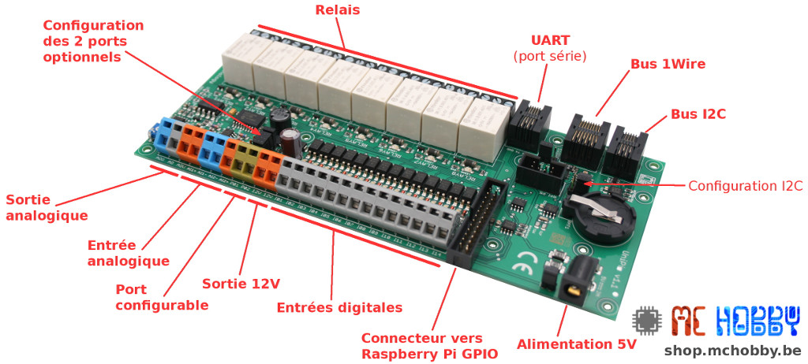

* __8 × relays :__ SPDT, 250V AC/5A -or- 24V DC/5A
* __14 × digital inputs :__ to read signal/state from external devices. Optocouplers offers the suited galvanic isolation. Triggered between 5 to 24V DC. 12 inputs + 2 additionals inputs.
* __2 × analog inputs :__ to read 0-10 V DC signal from external devices.
* __1 × analog ouputs :__ 0-10 V DC output to drive analog voltage input device.
* __1 × 1-Wire port :__ (RJ45) to connect 1-Wire devices like temperature/light/humidity sensor.
* __1 × I2C port :__ (RJ11) to connect expansion modules as relays, analog inputs, digital output.
* __1 × UART port :__ (RJ11) to connect serial based devices like RFID/NFC reader, barcode reader or serial console.
* __1 × Real time clock :__ Real Time Clock with cell coin battery holder
* __1 x I2C breakout :__ available on UNIPI board, can be used to connect your own I2C expansion board inline with the unipi board.
* __1 x 12v output :__ 12v 200mA power supply can be used to feed the digital input on the UniPi board.

## PYBStick-UniPi-Face board
The [PYBStick-UniPi-Face](https://shop.mchobby.be/product.php?id_product=1891) board is an interface for the [PYbStick Standard](https://shop.mchobby.be/product.php?id_product=1844) or [PYbStick PRO](https://shop.mchobby.be/product.php?id_product=1844) microcontrolers and the famous UniPi V1.1 (ou UniPi Lite).

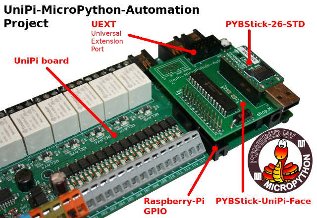

The J2 connector must also be wired (with Dupont wires) to make the I13 & I14 inputs availables.

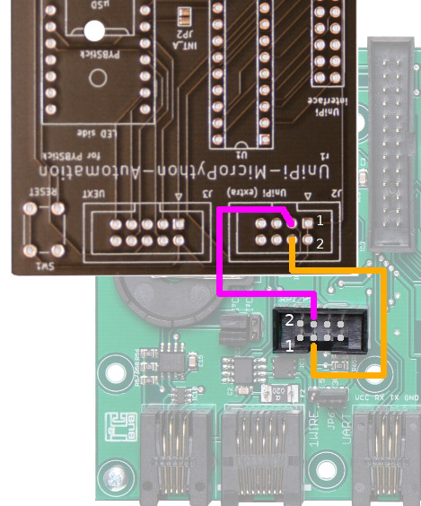

The board schematic can be seen below:

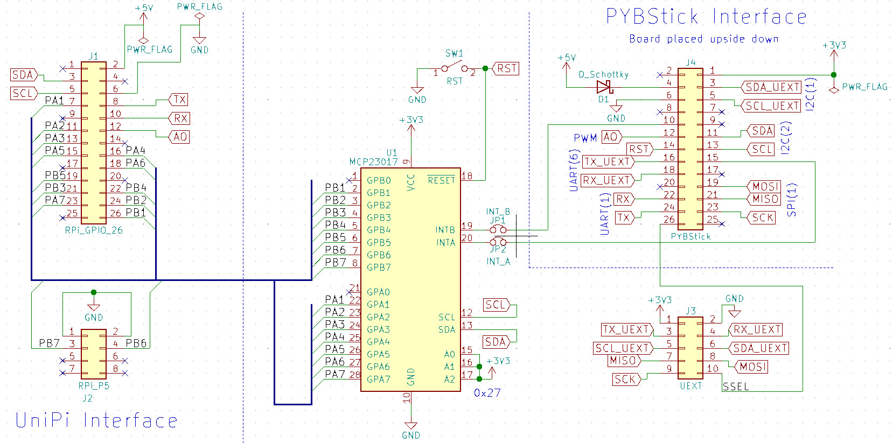

Some of the PYBStick GPIOs may still be available:
* __S7__ available but also the Boot0 pin (must be HIGH at boot time).
* __S10 & S15__ available except if the MCP23017 interrupt jumpers are closed.
* __S3 & S5__ available except if I2C bus is used on the UEXT connector.
* __S16 & S18__ available except if the UART is used on UEXT connector.
* __S19, S21, S23, S26__ available except if SPI bus is used on the UEXT connector.

Many of the PYBStick signals are available on the UEXT connector. If you are not using the UEXT connector then you can easily grab the signals on it (the 2.54mm spacing make it easy to wire).

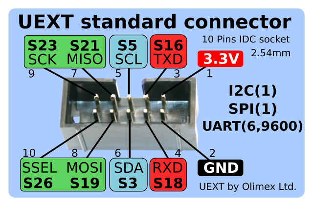

## GRL-Pyboard-UniPi board

The [GRL-Pyboard-UniPi](https://shop.mchobby.be/product.php?id_product=2055) board allows to interface the [MicroPython Pyboard](https://shop.mchobby.be/product.php?id_product=570) on the UniPi V1.1 (or UniPi Lite).

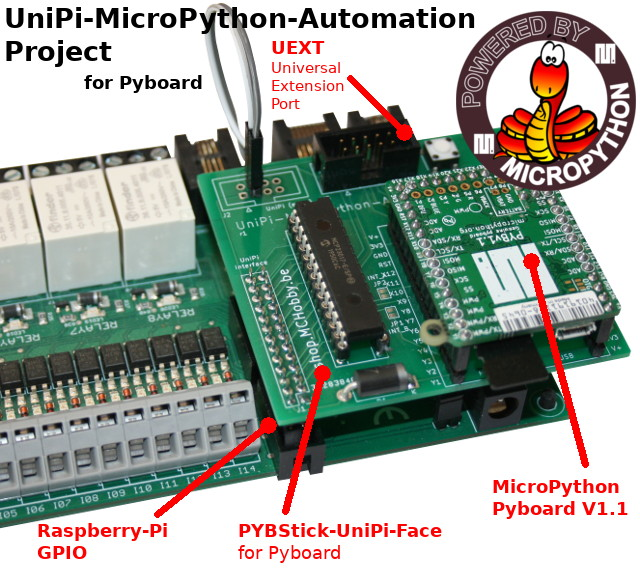

The J2 connector must be wired (with Dupont wire) to use the I13 & I14 (the wiring is identical for the PYBStick interface)


The MicroPython Pyboard interface schematic is the following:


Many Pyboard GPIO are still available:
* __Y3 & Y4__ except if you did solder the interrupt jumper for the MCP23017.
* __Y5 à Y8, Y11, Y12__
* __X3, X11, X12__
* __X17 à X24__

Several Pyboard signals does ends on the UEXT connector. If you do not use this interface then you can grab Pyboard sugnals onto it.

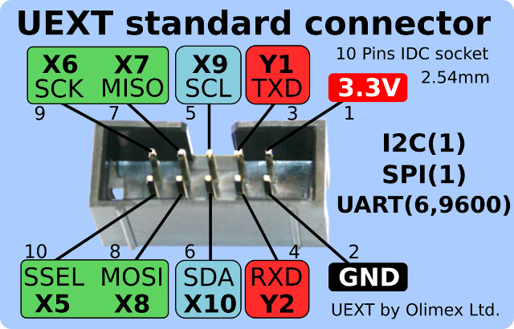

# Install
You will need to copy the following libraries on your MicroPython board to use the UniPiFace + UniPi.

* `unipi.py` : main library to access the UniPi hardware.
* `ds2482.py` : 1Wire bus master over I2C (still under development)
* `mcp342x.py` : ADC conversion
* `mcp2300xx.py` : GPIO extender
* `eeprom24Cxx.py` : EEPROM access
# Test

## Relays

The digital ouputs are available as 8 relay that you can drive as desired.

Each relay can drive a current up to 5A under 250V AC (or 5A under 24V DC). Such relays are SPDT _Single Pole Double Throw_ and offers a Normally Open contact and a Normally Close contact (when relay is not activated). The Normally open contact, annoted NO, is the most used one.

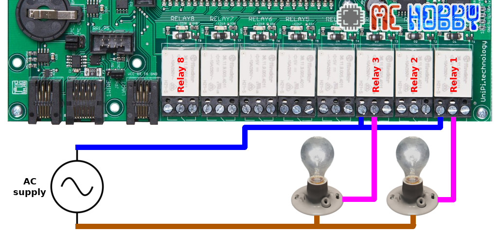

Using the relay is quite simple.

```
from unipi import unipi
import time

# Activate relays
unipi.relays[1] = True
unipi.relays[3] = True
unipi.relays[8] = True
time.sleep( 1 )

# Unactivate relay
unipi.relays[3] = False

# Display relay state
for i in range(1, 9): # de 1 à 8
	print( "relais %s = %s" % (i, unipi.relays[i]) )
```

## Digital inputs

UniPi does have 14 digital inputs protected with optocoupler. Thank to the optocoupler, the inputs can be used with an input voltage up to 12 & 24V (industrial standar).

To ease the UniPi usage, a small 12V 200mA power source is available on the UniPi board. This power source can be used to activate the digital inputs.

The following schematic shows how to use the inner 12V power source as well as an external power source (24V in this case).

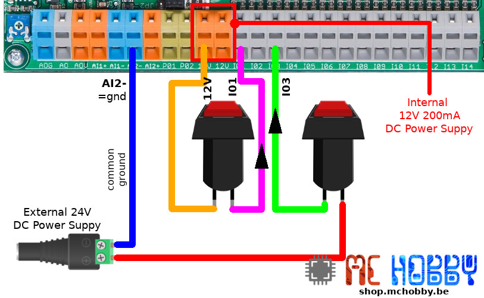

```
from unipi import unipi

# Acquiring the 14 inputs state
unipi.inputs.read()

# Display the states for input 1 and 3
print( "IN1 = %s" % unipi.inputs[1] )
print( "IN3 = %s" % unipi.inputs[3] )

# Display state for all the inputs
for i in range(1, 15): # 1 à 14
	print( "IN%s = %s" % (i, unipi.inputs[i]) )
```

The `read()` method is used to read ALL the UniPi input in one unique operation over the I2C bus (like a snapshot). This way, traffic over the I2C bus will be quite lower offering a bigger bandwidth to other I2C device operations. The downside is to __call the `read()` each time you need to get an update of inputs state__.

The following example read the entries state and display it as a dictionnary.

```
from unipi import unipi

# Acquire the 14 inputs
unipi.inputs.read()
print( unipi.inputs.read_all() )
```
Which displays the following result

```
{1: False, 2: False, 3: False, 4: False, 5: False, 6: False, 7: False, 8: False, 9: False, 10: False, 11: False, 12: False, 13: False, 14: False}
```

Please note that `read_all()` can accept the optionnal parameter `read=True` which force `read_all()` to re-read input state before generating the output dictionnary.

The following example use that capability to re-read state and display the result every second.

```
from unipi import unipi
import time

counter = 0
while True:
	print( "Iter %4i -> %r" % (counter, unipi.inputs.read_all(read=True)) )
	counter += 1
	time.sleep(1)
```

## Analog input

UniPi does have 2 analog inputs labeled  AI1+ et AI2+ used to read the voltage level (DC value only, __10V maximum__).

The analog voltage is measured between AI1- and AI1+. Please note that AI1- is connected to the common ground (GND) of the board. It is the same for the AI2-.

The schematic here below does use a potentiometer to send a 0 to 10V signal to the AI2+ input.

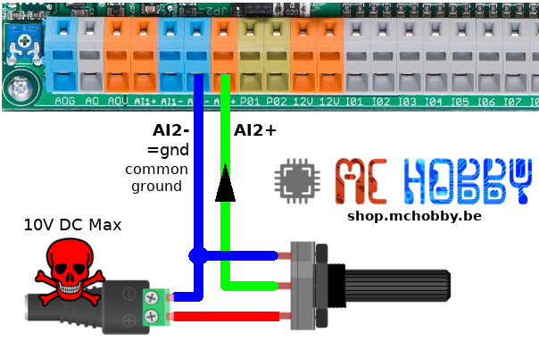

The script reading the analog voltage is quite simple

```
from unipi import unipi
import time

# read an analog voltage between 0 & 10V
print( "--- Lire les entrées AI1+ et AI2+ ---")
print( "ADC 1 = %s Volts" % unipi.adcs[1] )
print( "ADC 2 = %s Volts" % unipi.adcs[2] )

print( "--- continuous reading ---")
while True:
	print( "ADC 1 : %4.2f v | ADC 2 : %4.2f v" % (unipi.adcs[1],unipi.adcs[2]) )
	time.sleep(1)
```

## Analog output

The UniPi does have an analog output labelled A0.

The analog output is powered with a separate voltage source applied to AOG (ground) and AOV (35V max) pins. That voltage is regulated with some electronics.

The maximum output voltage for the Analog Output (A0) is set with the TrimPot (the TrimPot is preconfigured to output 10 Volts on A0 at 100%).

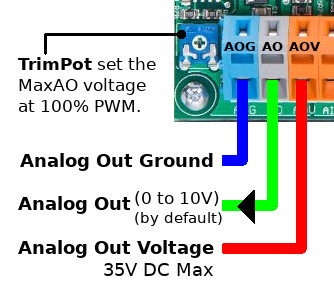

So, it is required to provides an power source to the Analog Output circuitery. Thisc can be done with:
* the internal 12V regulator of the UniPi.
* an external power supply (35V max)

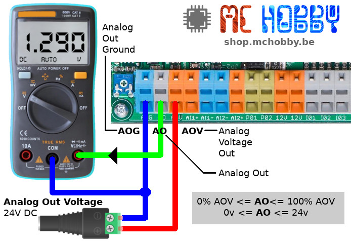

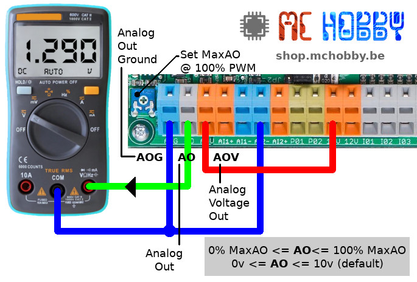

The output voltage is set from 0 to 100% of the maximum voltage (set wuith the TrimPot). This output voltage is set with duty cycle of a PWM signal.

The PWM signal is handled by the UniPi MicroPython library.

```
from unipi import unipi

# AOUT (AO)
print( "--- Set output voltage at 33% of AO Max ---")
unipi.analog_out =33 # 33% of 10V = 3.3V
```

# Advanced features

The UniPi does have additional devices that can be used to offer advanced features.

## UEXT connector

The [UEXT (Universal EXTension)](https://en.wikipedia.org/wiki/UEXT) connector on the interface board carry multiple bus (I2C, SPI, UART) and 3.3V power line.

The `unipi` library helps to create instances fir tge I2C, SPI and UART buses available on the UEXT port.

```
from unipi import unipi
i2c = unipi.uext.i2c( freq=10000 )
spi = unipi.uext.spi( baudrate=1000000, polarity=0, phase=0 )
uart = unipi.uext.uart( 9600, bits=8, parity=None, stop=1 )
```

Very simple to implement, UEXT is an open standard used to plug [existing UEXT modules](https://www.olimex.com/Products/Modules/) (also available [@ MCHobby](https://shop.mchobby.be/fr/138-uext)). It is easy to create its own interface board with UEXT, and UEXT connector are really strong!

**translate**

The following example use a [modtc-mk2 UEXT module](https://shop.mchobby.be/fr/uext/1624-mod-tc-mk2-31855-interface-thermocouple-type-k-avec-max31855-bus-i2c-gpio-3232100016248-olimex.html), an I2C module fitted with a thermocouple reader. [The MicroPython driver is available on the esp8266-upy github](https://github.com/mchobby/esp8266-upy/tree/master/modtc-mk2).

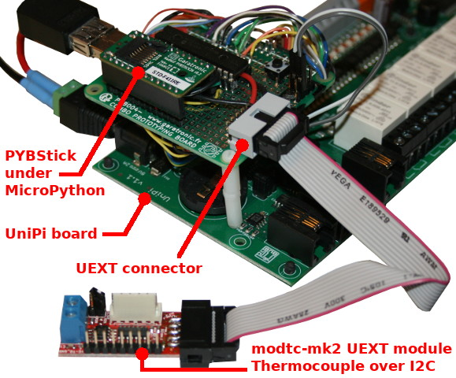

The `modtc_mk2.py` driver (see here below) must be copied to the MicroPython board before running the example.

```
from unipi import unipi
from modtc_mk2 import MODTC_MK2

# Grab an I2C bus instance on the UEXT connector
# Returns a reference to machine.I2C
i2c = unipi.uext.i2c( freq=10000 ) # accept additional parameters
mk2 = MODTC_MK2( i2c )

temp_in, temp_ext = mk2.temperatures
print( "Internal Temp = %s" % temp_in )
print( "External Temp = %s" % temp_ext )
```

## EEPROM

The 256 bytes EEPROM fitted on the UniPi board contains configuration information and some free space.

Among the informations, the EEPROM store the analog input correction coefficient. Those coefficients are automatically used by the UniPi library.

```
from unipi import unipi
import time

print( "UniPi board version : %s" % unipi.eeprom.board_version )
print( "AI1,AI2 coef = %f, %f" % unipi.eeprom.analog_input_coefs )
```

Which produce the following results:

```
UniPi board version : 1.1
AI1,AI2 coef = 5.570117, 5.570414
```

The `unipi.eeprom.dump()` method displays the full cotnent of the EEPROM.

```
0x0 : FF FF FF FF FF FF FF FF : ........
0x8 : FF FF FF FF FF FF FF FF : ........
0x10 : FF FF FF FF FF FF FF FF : ........
...
0xd0 : FF FF FF FF FF FF FF FF : ........
0xd8 : FF FF FF FF FF FF FF FF : ........
0xe0 : FA 55 01 01 3C 1C 00 00 : .U..<...
0xe8 : 02 FD 00 00 00 00 00 00 : ........
0xf0 : 40 B2 3E 67 40 B2 40 D5 : @.>g@.@.
0xf8 : 00 00 00 00 00 00 00 00 : ........
```

# Ressources
* [UniPi-Board.png](docs/UniPi-Board.png) : UniPi V1.1 board image (top view).
* [UniPi-terminals.png](docs/UniPi-terminals.png) : UniPi V1.1 terminals view (large size)

# Licence
The UniPi library and code sample are released under the GPLv3 license.

Copyright (C) 2020  - Meurisse D. (shop.mchobby.be)

This program is free software: you can redistribute it and/or modify
it under the terms of the GNU General Public License as published by
the Free Software Foundation, either version 3 of the License, or
(at your option) any later version.

This program is distributed in the hope that it will be useful,
but WITHOUT ANY WARRANTY; without even the implied warranty of
MERCHANTABILITY or FITNESS FOR A PARTICULAR PURPOSE.  See the
GNU General Public License for more details.

You should have received a copy of the GNU General Public License
along with this program.  If not, see <https://www.gnu.org/licenses/>

# Shopping list
* Avec la PYBStick
 * [PYbStick STD](https://shop.mchobby.be/product.php?id_product=1844) or [PYbStick PRO](https://shop.mchobby.be/product.php?id_product=1844)  @ MCHobby
 * [PYBStick-UniPi-Face interface board (UniPi-Face)](https://shop.mchobby.be/product.php?id_product=1891) @ MCHobby
* Avec MicroPython Pyboard
 * [MicroPython Pyboard](https://shop.mchobby.be/product.php?id_product=570)
 * [GRL-Pyboard-UniPi interface](https://shop.mchobby.be/product.php?id_product=2055) @ MCHobby
* [UniPi board](https://shop.mchobby.be/product.php?id_product=1171) @ MCHobby
* [MicroPython Pyboard board](https://shop.mchobby.be/fr/56-micropython) @ MCHobby
