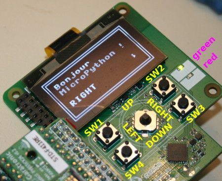

# Concevez des interfaces professionnelles à l'aide du "NadHat Panneau de control OLED" (Control Panel)

Le "[Nadhat Panneau de contrôle OLED](https://shop.mchobby.be/product.php?id_product=1934)" est un HAT pour Raspberry-Pi que l'on peut
facilement contrôler depuis MicroPython puisqu'elle exploite exclusivement le bus I2C.


La carte est par ailleurs testée avec un [PYBStick sous MicroPython](https://shop.mchobby.be/fr/recherche?controller=search&orderby=position&orderway=desc&search_query=pybstick&submit_search=)
équipé de sa carte d'interface [PYBStick-Hat-Face](https://shop.mchobby.be/product.php?id_product=1935).

La carte "Panneau de contrôle" dispose des fonctionnalités suivantes:
* Bus I2C exclusivement
* Possibilité d'utiliser les interruptions
* GPIO compatible Raspberry-Pi
* __Large__ écran OLED 128x64 (compatible SSD1306).
* Joystick 4 positions + bouton poussoir
* 4 boutons de fonction
* Une LED Verte (D2, en haut) + LED rouge (D1, en bas)
* Pilotes MicroPython disponibles

# Brancher

## PYBStick + PYBStick-Hat-Face

Si vous disposez d'une carte d'interface [PYBStick-Hat-Face](https://shop.mchobby.be/product.php?id_product=1935), il suffit de connecter l'ensemble comme proposé ci-dessus.

Pour plus d'information, [suivez ce lien vers le GitHub PYBStick-Hat-Face](https://github.com/mchobby/pyboard-driver/tree/master/PYBStick-hat-face) .

## xxxxx autre carte xxxxxxxx


# Tester

Avant de pouvoir utiliser les exemples, il est nécessaire de copier les bibliothèques et les dépendances sur la PYBStick.
* __cpanel.py__: contient la classe permettant d'interagir avec le panneau de contrôle
* __dependencies.zip__ : contient les bibliothèques de dépendance de `cpanel.py` qui doivent également être copiée sur la carte MicroPython

## test_basic.py

Le script [`test_basic.py`](examples/test_basic.py) effectue une initialisation de l'écran, activation des LEDs détection des boutons à l'exception du SW2 qui correspond à la mise en marche/arrêt en exploitant la broche 28 sur le GPIO (non accessible à la PYBStick + Hat-Face).



Le corps du code peut être réduit au contenu ci-dessous.

A noter que:
* la méthode `p.update()` doit être appelée aussi souvent que possible car c'est elle qui capture les informations concernant les boutons.
* L'écran OLED est refraichit à l'aide de la méthode `p.oled.show()`

``` python
from machine import I2C
from cpanel import *
import time

i2c = I2C( 1, freq=2000000 )
p = CtrlPanel( i2c )

# Traduction des constantes des boutons en texte.
# SW2 = /Q_ON is not wired on the MCP23017 but on GPIO pin 28
# REQ_OFF also managed by SW2 and wired on MCP23017.GPA3
to_text = { SW1:'SW1',SW3:'SW3',SW4:'SW4',UP:'UP',DOWN:'DOWN',LEFT:'LEFT',RIGHT:'RIGHT',CLICK:'CLICK' }

while True:
	p.update()
	for key,name in to_text.items():
		if p.is_down( key ):
			p.oled.fill_rect( 10, 40, 100, 10, 0 )
			p.oled.text(name, 10, 40)
			p.oled.show()
		if p.request_off: # bouton d'extinction.
			p.oled.fill_rect( 10, 40, 100, 10, 0 )
			p.oled.text("Req. OFF", 10, 40)
			p.oled.show()
	time.sleep_ms( 100 )
```

## test_edge.py

Le script d'exemple [`test_edge.py`](examples/test_edge.py) effecture une détection des flans descendant sur les boutons.

Cela permet de compter le nombre de pression sur les boutons boutons. La méthode `p.update()` doit toujours être appelée aussi souvent que possible pour assurer un fonctionnement fluide de l’algorithme de détection.

voici un exemple du contenu produit par le script de test.

```
>>> import test_edge
---------------------------------------------------
Collecting for 10 sec. Press the buttons
----------------------------------------------------
SW3 pressed 1 times
RIGHT pressed 2 times
SW1 pressed 3 times
SW4 pressed 3 times
---------------------------------------------------
```

# Ou acheter

* Les [cartes PYBStick](https://shop.mchobby.be/fr/recherche?controller=search&orderby=position&orderway=desc&search_query=pybstick&submit_search=) chez MCHobby
* La carte d'[interface HAT-FACE](https://shop.mchobby.be/product.php?id_product=1935) pour PYBStick
* Le Hat [Panneau de contrôle OLED (Control Panel)](https://shop.mchobby.be/product.php?id_product=1934)
