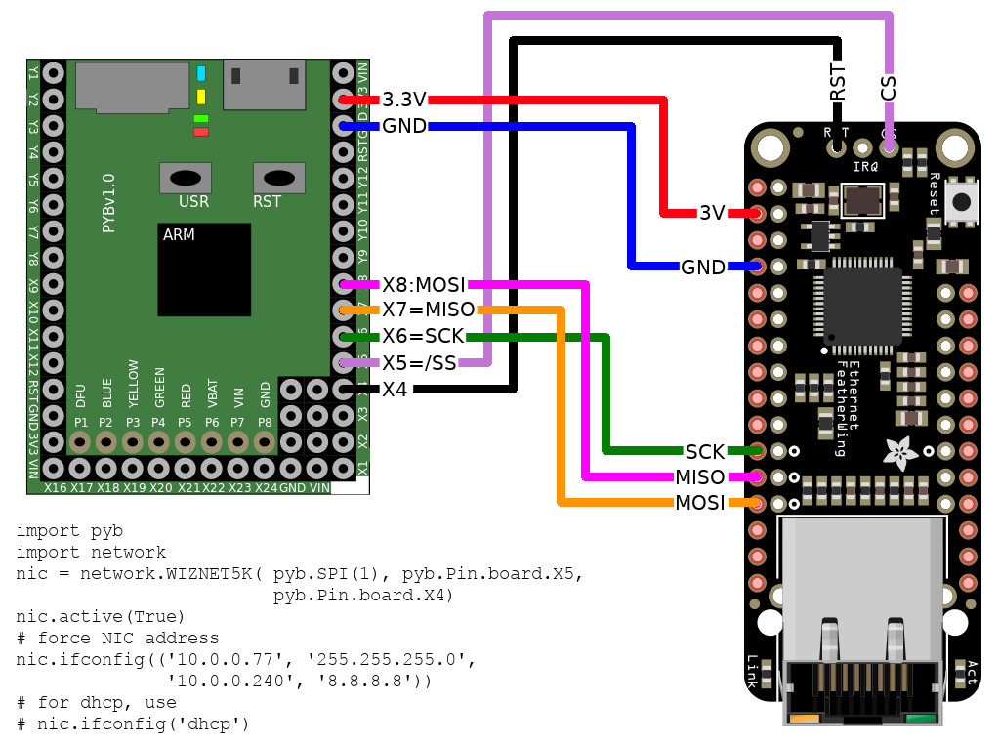
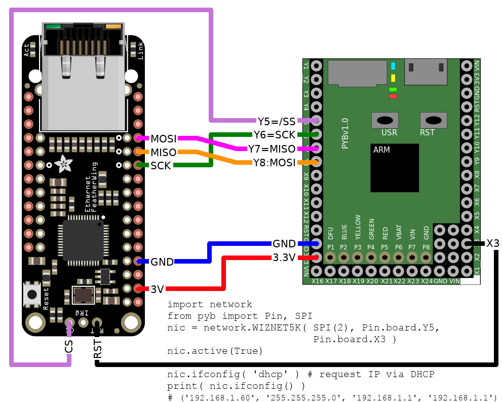

# Connecting a WizNet5500 on the PyBoard

It is possible to use an Wired Ethernet connexion on the pyboard by using a WizNet W5500 module.

Such module is available on various product. For a first try, I would strongly recommend to select a well established manufacturer that check its products.

Low cost chinese product are not reliable and that can creates debugging nightmare! Really!

This exemple works with an Adafruit Ethernet Feather Wing (using a W5500 chipset).

A special thanks to Robert-HH for its support ([see this thread on the MicroPython forum](https://forum.micropython.org/viewtopic.php?f=6&t=7077)).

# MicroPython Network firmware
You have to updgrade your MicroPython with a "Network MicroPython firmware".

Unfortunately the network firmware available at MicroPython.org is not complete (oct 13, 2019) and you will have to compile yourself the needed MicroPython firmware.

__Fortunately__ Robert did share a dirty network firmware shared inside the `docs/_static`. The `pybv11-427-network-20191013-v1.11-dirty.dfu` was compiled for Pyboard V1.1 and MicroPython v1.11 (see [this thread](https://forum.micropython.org/viewtopic.php?f=6&t=7077)).

That firmware works perfectly and is reliable for testing. Once primarily test done, you will have to learn how to compile your own MicroPython firmware.

# Wiring
## Feather Ethernet Wing to PyBoard
The Feather Ethernet Wing can be wired to the Pyboard in two different way.

W5500 wired to the SPI(1) bus



W5500 wired to the SPI(2) bus



## WIZ820io to PyBoard
A wiring is available in the `docs/_static/` but I did not get it working yet. So please, do not consider it as reliable.

# Example

The following example code uses the Feather Ethernet Wing wired to SPI(2).

``` python
>>> import network
>>> from pyb import Pin, SPI
>>> # Parameter are SPI-bus, pin_cs, pin_rst
>>> nic = network.WIZNET5K( SPI(2), Pin.board.Y5, Pin.board.X3 )
>>> # Must activate the NIC first!
>>> nic.active()
False
>>> nic.active(True)
>>> # Request an IP address from DHCP server
>>> nic.ifconfig( 'dhcp' )
>>> # Show the NIC configuration
>>> nic.ifconfig()
('192.168.1.60', '255.255.255.0', '192.168.1.1', '192.168.1.1')
# From now, we can use sockets to request data
```

# Ressources
* [class WIZNET5K – control WIZnet5x00 Ethernet modules](https://docs.micropython.org/en/latest/library/network.WIZNET5K.html)
* [Pyboard + W5500/W5200 Ethernet - Cant get it to work - MicroPython v1.11-422-g98c2eabaf](https://forum.micropython.org/viewtopic.php?f=6&t=7077)

# Shopping list
* [Feather Ethernet Wing (W5500 chipset)](https://shop.mchobby.be/fr/feather-adafruit/957-feather-ethernet-wing-3232100009578-adafruit.html) @ MCHobby
* [Feather Ethernet Wing (W5500 chipset)](https://www.adafruit.com/product/3201) @ Adafruit
