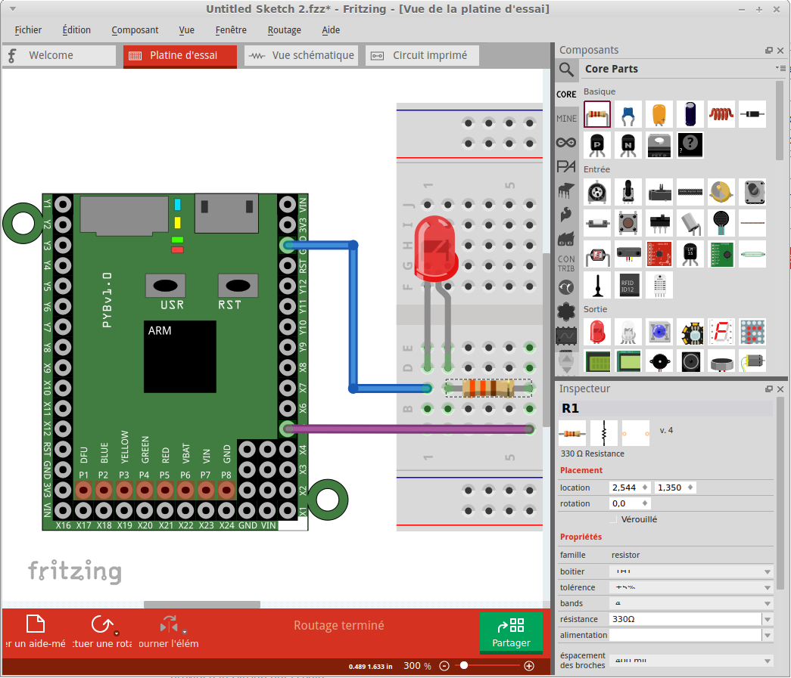

# Composant PyBoard pour Fritzing

Composant Pyboard pour Fritzing réalisé par Mr [Boulanger de CentraleSupélec](http://wdi.supelec.fr/boulanger/MicroPython/#Fritzing).

Ce répertoire contient une copie du fichier [pyboard.fzpz](pyboard.fzpz) produit par Mr Boulanger.

# Installer
 
Télécharger le fichier [pyboard.fzpz](pyboard.fzpz) et l'importer dans Fritzing en l'ouvrant par l'intermédiaire du point de menu "Fichier | Ouvrir".

