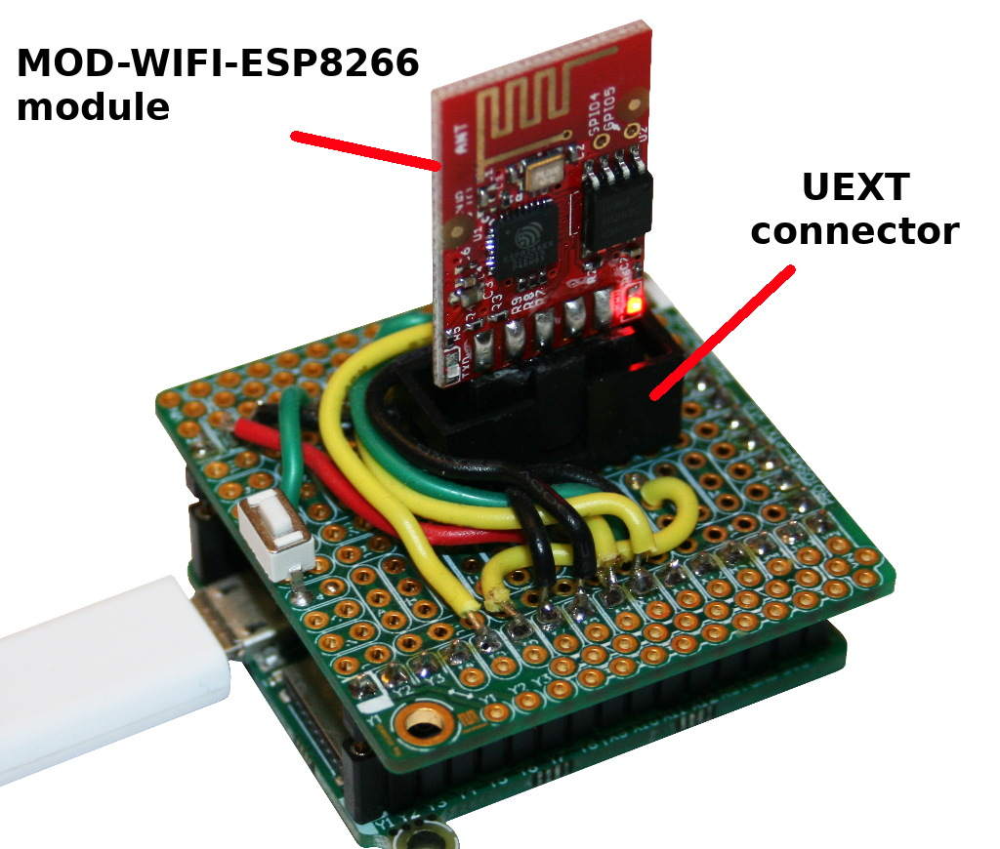

[Ce fichier existe également en FRANCAIS](readme.md)

# Using ESP8266 on pyboard to gain WiFi connectivity

The Olimex's MOD-WIFI-ESP8266 is preconfigured with AT Command firmware allowing the module to be used as WiFi modem.

## Note about the ESP8266
* The ESP UART is set to 115200 bauds 8N1 by default
* The ESP Firmware REQUIRES the command to end with \r\l (CR+LF)
* When working properly the ESP8266 does ECHO the received byte to the TX.
* Starts in access point AP mode.

# wiring

The easiest way to wire the MOD-WIFI-ESP8266 module is to plug it onto an UEXT connector.

The MOD-WIFI-ESP8266 use the following connexions:
* 3.3V and GND
* RX and TX

You may learn more about this connector and its __wiring to the Pyboard__ with [UEXT connector for Pyboard](https://github.com/mchobby/pyboard-driver/tree/master/UEXT).

# test

## PassThrough
This example will forward all serial data coming from ESP8266 Serial Port to USB VCP (Virtual Com Port). Made it back and forward.

This script be great to test the AT Commands on the ESP8266 module.

Just run the `passthrough.py` script and press USR button to cancel the the execution.

# Ressources
* [ESP8266 - AT Command Reference @ Room-15](https://room-15.github.io/blog/2015/03/26/esp8266-at-command-reference/)
* [ESP8266 Resources (with documentation)](https://www.espressif.com/en/products/hardware/esp8266ex/resources)

# Where to buy
* [MOD-WIFI-ESP8266 @ MC Hobby](https://shop.mchobby.be/product.php?id_product=666)
* [MOD-WIFI-ESP8266 @ Olimex](https://www.olimex.com/Products/IoT/ESP8266/MOD-WIFI-ESP8266/open-source-hardware)
