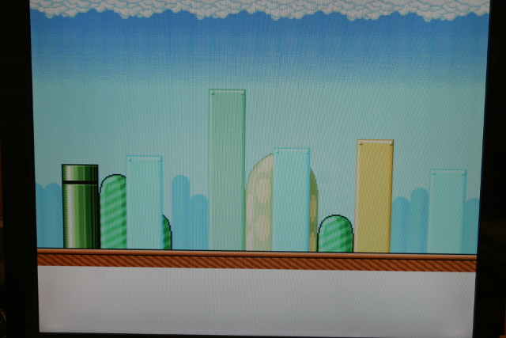
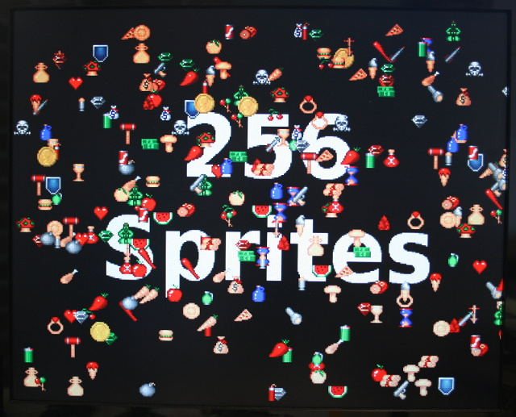
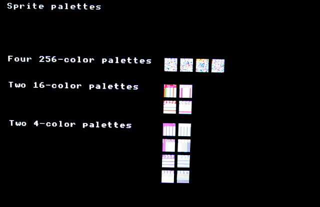

[This file also exists here en ENGLISH](README_eng.md)

* sprite256 : définit, affiche et déplace 256 sprites sur l'écran.
* scroll : utilise la ressource platfomer_x.bin pour créer un paysage de jeu défilant.
* palette : demo sur les palettes de couleurs (alpha)

# Exemple scroll

L'exemple `scroll.py` utilise les 3 fichiers plateforme_x.bin stockés dans le répertoire `/sd` de la pyboard.
Ces fichiers ont étés compilés à l'aide de `htobin.py` et évitent de devoir coder le contenu des fichier Header GameDuino (.h) sous forme de script Python.



Voir aussi [la vidéo (YouTube)](https://youtu.be/Ac-5eExTfJo)

## Créer les fichiers .bin
Voir détails de l'exemple sprite256 !

# Exemple sprite256

L'exemple `spr256.py` utilise les 5 fichiers .bin stockés dans le répertoire `/sd` de la pyboard.
Ces fichiers ont étés compilés à l'aide de `htobin.py` et évitent de devoir coder le contenu des fichier Header GameDuino (.h) sous forme de script Python.

 

 Voir aussi [la vidéo (YouTube)](https://youtu.be/_6DVzVwcSMQ)

## Créer les fichiers .bin
Voici comment les fichiers sont créés sur un système Linux ou Raspbian
```
$ cd modvga/00_basic
$ ./htobin.py ../01_basics/sprite25/sprites256.h
Openning sprites256.h ...
Writing sprites256_pic.bin ...
4096 bytes written
Writing sprites256_chr.bin ...
3808 bytes written
Writing sprites256_pal.bin ...
1904 bytes written
Done!

$ ./htobin.py ../01_basics/sprite256/pickups2.h
Openning pickups2.h ...
Writing pickups2_img.bin ...
13312 bytes written
Writing pickups2_pal.bin ...
512 bytes written
Done!
```

## Tester le script

Démarrez une session REPL puis saisissez

```
import spr256
```

# Exemple palette

L'exemple `pal.py` exploite la fonction `ascii()`.


