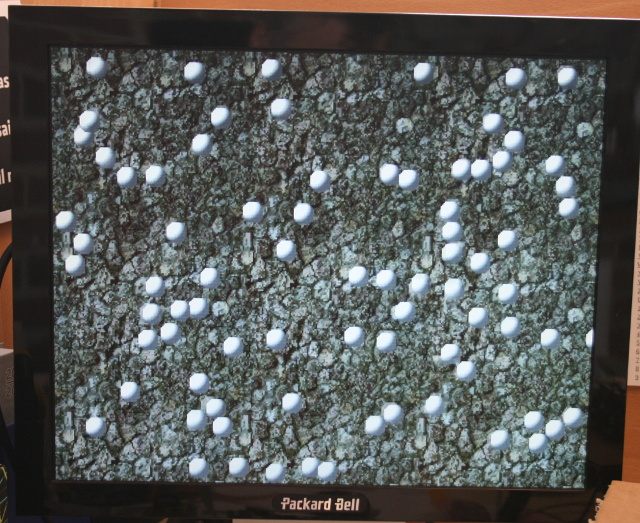

[Ce fichier existe également en FRANCAIS](README.md)

* sprite256 : defines, display and moves 256 sprites on the screen.
* scroll : use the platfomer_x.bin ressource to create a scrolling game landscape.
* collision : 80 balls bouncing together on the screen.
* palette : demo about color palette (alpha)

# scroll example
This example scroll on the screen a landscape which is continuously generated by software.


See also [the video (YouTube)](https://youtu.be/Ac-5eExTfJo)

The `scroll.py` example use the 3 plateforme_x.bin files stored on the `/sd` Pyboard's folder.
Those files are compiled with the `htobin.py` tool and avoids the GameDuino header files (.h) to be encoded as a Python script.

## Create the .bin files
See the details of the sprite256 example !

# sprite256 example
This example moves 256 sprites on the screen.


See also the [YouTube video (YouTube)](https://youtu.be/_6DVzVwcSMQ)

The `spr256.py` script sample use the 5 .bin files stored on the `/sd` pyboard's directory.
Those files are compiled with the `htobin.py` tool and avoids the GameDuino header files (.h) to be encoded as a Python script.

## Create the .bin files
Here is how the .bin files were created on a Linux or Raspbian OS.
```
$ cd modvga/00_basic
$ ./htobin.py ../01_basics/sprite25/sprites256.h
Openning sprites256.h ...
Writing sprites256_pic.bin ...
4096 bytes written
Writing sprites256_chr.bin ...
3808 bytes written
Writing sprites256_pal.bin ...
1904 bytes written
Done!

$ ./htobin.py ../01_basics/sprite256/pickups2.h
Openning pickups2.h ...
Writing pickups2_img.bin ...
13312 bytes written
Writing pickups2_pal.bin ...
512 bytes written
Done!
```

## Test the script

Start a REPL session and key-in the following instruction.

```
import spr256
```

# Palette sample

The `pal.py` example also uses the `ascii()` Gameduino function.


# collision example
Test the GameDuino collision system by making balls bouncing on each others.



The `collide.py` script use 6 binary files stone_wall_x.bin & sphere_x.bin stored on the Puboard's `/sd` folder.
These files are compiled with the `htobin.py` script to avoids to include the GameDuino Header(.h) files as Python script.

See also [the video (YouTube)](https://youtu.be/4vtlTnMPnq0)

## Test the script

Start a REPL session and key-in the following command

```
import collide
```

## Create the .bin files
See the details about the sprite256 example!
