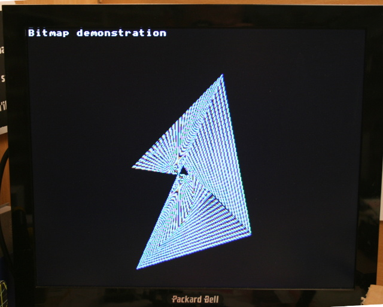

[This file also exists here in ENGLISH](README_eng.md)

* bitmap : dessiner un triangle qui bouge. Tracé pixel par Pixel.
* snow : utiliser du MicroCode sur le co-processeur pour simuler la neige sur l'écran.

# Exemple Bitmap
L'exemple bitmap se penche sur la manipulation d'image constituée de points (Bitmap).
Il utilise un triangle, dont les coins se déplacent, pour traiter le sujet.



## Tester le script

Démarrez une session REPL puis saisissez

```
import bitmap
```

# Exemple snow
Cet exemple simule un écran neigeux à l'aide du co-processeur graphique et du microcode.


## Tester le script

Démarrez une session REPL puis saisissez

```
import snow
```
