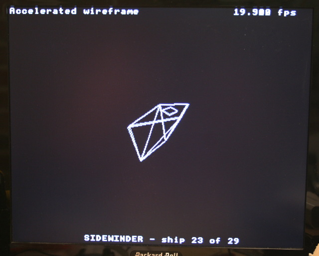

[Ce fichier existe également en FRANCAIS](README.md)

* bitmap : draw a moving rectangle. Drawed pixel per pixel.
* snow : use MicroCode son the co-processor to smilutate a snowy screen.

# Bitmap example
Manipulate image pixel per pixel and drawing lines. Use a moving triangle as a sample.


## Test the script

Start a REPL session then key-in

```
import bitmap
```

# snow example
This example will simulate snow on screen (like disconnected monitor) with
micro-code autonomously executed by the co-processor. So leaving the microcontroler
processor executing its main tasks.


## Test the script

Start the REPL session then key-in this command

```
import snow
```

# Wireframe example

This example will display wirefame animation on screen (rotating of 29 space
 ships). It use micro-code on co-processor to accelerate wireframe display.

This script did not include the ressource inside the python script INSTEAD IT
LOADS AND PARSE C HEADER files on the fly!  



## Test the script

This example will required the following files to be loaded on the Pyboard
* __wiref.py__ : the main script used to test the wirefame feature
* __dg.py__ : the gameduino library
* __gdtls.py__ : gameduino tools library (containing the __HLoader__ class used to __parse .h file__ on the fly)
* __eliteships.h__ : the list of ships, vertices and edges definition.
* __eraser.h__ : screen eraser microcode.
* __wireframe.h__ : wireframe microcode loaded with gd.microcode()

Start the REPL session then key-in this command

```
import wiref
```
