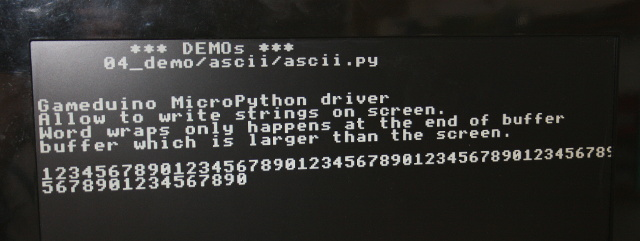
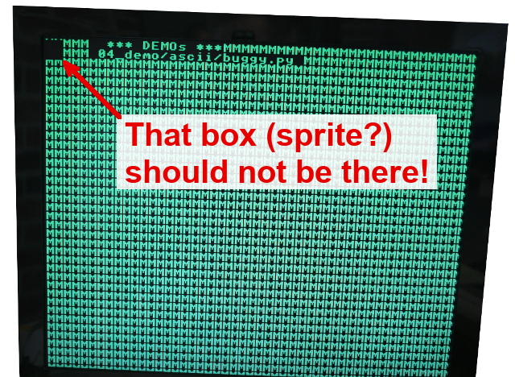
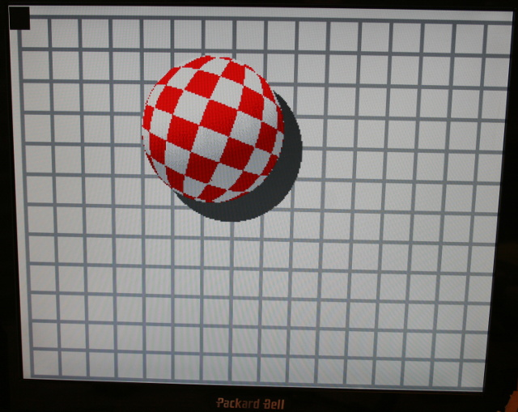
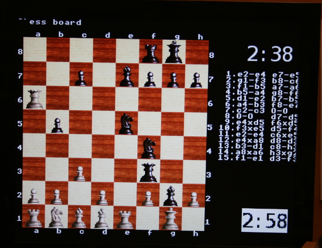
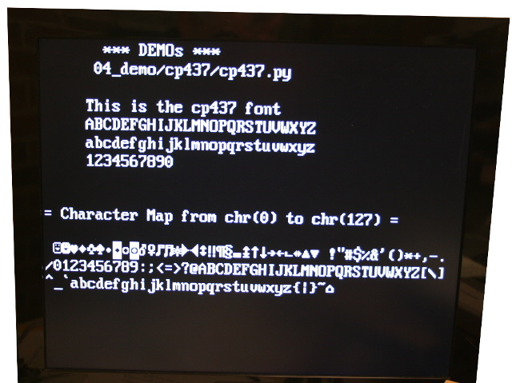

[This file also exists here en ENGLISH](README_eng.md)

* ascii : permet d'afficher du texte (font 8x8 pixels) sur un écran 36 lignes x 47 colonnes.
* ascii-fast : idem ascii mais avec un initialisation nettement plus rapide
* ball : balle 3D rebondissant sur les bords du moniteur
* cp437 : permet d'afficher du texte (font 16x8 pixels, hauteur x largeur) sur un écran 18 lignes x 47 colonnes.

# Exemples ASCII

Ces exemples concernent principalement l'affichage de texte sur l'écran. Il s'agit surtout du résultat attendu du MOD-VGA pour pouvoir l'utiliser avec une carte MicroPython Pyboard.

## ascii/ascii.py
Explique comment utiliser la fonctionnalité ASCII du MODVGA pour afficher du texte sur l'écran.

Le code est vraiment simple.



## ascii/bug.py



Il reste quelque-chose de visible en haut à droite (un sprite?) en haut à droite.

## ascii/dump.py
Fait un "dump" de la RAM_CHR où est stocké la définition des caractères (également des blocs 8x8 pixels lorsque des scène de jeu sont affichées)

Voici une partie du résultat affiché dans la session REPL.
```
--( 48)--------------------
4864 : 0b....11111111....
4866 : 0b..1111....1111..
4868 : 0b..1111..111111..
4870 : 0b..111111111111..
4872 : 0b..111111..1111..
4874 : 0b..1111....1111..
4876 : 0b....11111111....
4878 : 0b................
--( 49)--------------------
4880 : 0b......1111......
4882 : 0b....111111......
4884 : 0b......1111......
4886 : 0b......1111......
4888 : 0b......1111......
4890 : 0b......1111......
4892 : 0b..111111111111..
4894 : 0b................
--( 50)--------------------
4896 : 0b....11111111....
4898 : 0b..1111....1111..
4900 : 0b..........1111..
4902 : 0b........1111....
4904 : 0b......1111......
4906 : 0b....1111........
4908 : 0b..111111111111..
4910 : 0b................
--( 51)--------------------
4912 : 0b....11111111....
4914 : 0b..1111....1111..
4916 : 0b..........1111..
4918 : 0b......111111....
4920 : 0b..........1111..
4922 : 0b..1111....1111..
4924 : 0b....11111111....
4926 : 0b................
```

# Exemple ASCII-FAST

Le script `ascii-fast/asciif.py` utilise la technique des fichiers .bin (expliquée dans la démo "sprite256") pour recharger l'état de RAM_CHR, RAM_PAL, RAM_PIC avec une préconfiguration ascii. Cette approche est __beaucoup plus rapide et nettement plus économe__ en ressource que l'appel de `gd.ascii()`.

Cette version exploite 3 fichiers binaires sur la Pyboard (nommés chr.bin, ram_pal.bin, ram_pic.bin).

## Comment ai-je créés les fichiers bin?

C'est très simple:
1. J'ai retiré toutes les appels à `putstr()` dans l'exemple `ascii.py` puis je l'ai exécuté sur la Pyboard.
2. Résultat du point précédent, j'ai donc un écran noir mais avec la RAM Gameduino correctement initialisée pour faire des appels `putstr()`.
3. J'ai alors utilisé `ramtoh.py` (voir /00_basic/) pour faire un dump des sections de RAM Gameduino correspondant à RAM_CHR, RAM_PAL, RAM_PIC. J'ai donc ces états dans la session REPL (affiché avec le format .h file d'Arduino)
4. J'ai copié le code généré dans un vrai fichier .h qhe j'ai nommé ascii-fast.h (encodé en UTF-8)
5. Pour finir, j'ai compilé le fichier d'entête (.h) sur mon PC avec l'utilitaire  `htobin.py` (aussi dans /00_basic/) our extraire les fichiers .bin du fichier d'entête.

Voila!

Note: il serait bien entendu possible d'extraire directement la RAM Gameduino dans des fichiers écrits directement sur la Pyboard... mais il est plus intéressant d'utiliser le format intermédiaire .h de Gameduino puisque celui-ci est très répandu dans les projet Arduino Gameduino.  

# Exemple Ball

Le script `ball/ball.py` utilise la technique de chargement des fichiers .bin (pour 3 fichiers) pour charger l'arrière plan. Les sprites de la balle sont compressés dans le fichier `ball.bin` qui est directement décompressé avec la classe `GDFileBits`. La fonction `uncompress()` de Gameduino peut détecter la différence entre un fichier .bin et une ressource bytes() et sélectionne automatiquement la classe de décompression appropriée  (`GDFlashBits` ou `GDFileBits`).



Voir aussi [la vidéo sur YouTube](https://youtu.be/J0ZjHtXvZoI)

# Exemple échiquier

Le script `chessboard/chess.py` simule une partie de jeu d'échec avec mouvement des pièces sur l'échiquier.
Ce script utilise également la technique des fichiers .bin pour charger les différentes ressources pour afficher les différents éléments.

A noter que le fichier `Wood32_pic.bin` est maintenu ouvert et utilisé par la fonction `square()` pour dessiner l'arrière plan du damier en bois (en redessinant la même texture à différents endroits).



# Exemples CodePage

## cp437/cp437.py
Explique comment utiliser le code page personnalisé cp437 (font 16 x 8 pixels) avec le MODVGA pour afficher du texte sur l'écran.

Comme cette approche utilise une méthode de stockage différente pour stocker la définition des caractères (en effet, ascii utilise 8x8 pixels), le script `cp437.py` expose deux autres fonctions nommée `drawstr()` & `atxy()` pour afficher du texte.


