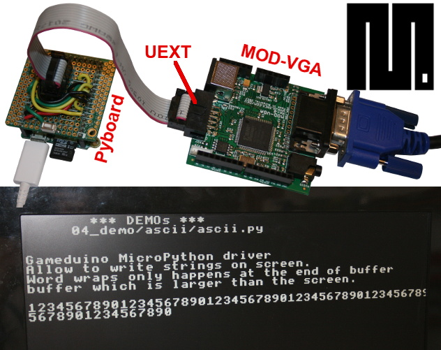

[Ce fichier existe également en FRANCAIS](README.md)

# MODVGA - GameDuino 3.3V with UEXT Connector

The MOD-VGA is a 3.3V shield based on the popular Gameduino design.

The little changes we made were to add a PS2 keyboard, a UEXT connector which
allows all of our boards with a UEXT to connect to MOD-VGA and audio output.

# Warning
A big chunck of GameDuino library is available in `gd.py` file but only few sample are ported to MicroPython.

Some tools have been created to help porting GameDuino ressources to MicroPython. See the file [TOOLS_eng.md for more informations](TOOLS_eng.md)

This MicroPython port is oriented/focused toward text display. The aim is to create a VGA REPL terminal to play with MicroPython Pyboard on a VGA monitors.

Other features/examples may come later depending on free time and personnal interest.

# How to Wire

As you can see, the MOD-VGA is plugged to the Pyboard via an UEXT connector.
* SPI bus is used to transfert the data with the GameDuino
* I2C bus (_to confirm_) used to connect the PS2 keyboard

You may learn more about this connector and its __wiring to the Pyboard__ with [UEXT connector for Pyboard](https://github.com/mchobby/pyboard-driver/tree/master/UEXT).

# Where to buy

* [MOD-VGA @ shop.mchobby.be ](https://shop.mchobby.be/uext/1431-mod-vga-33v-gameduino-alike-board-3232100014312-olimex.html)
* [UEXT boards @ shop.mchobby.be](https://shop.mchobby.be/fr/138-uext)
* [MOD-VGA @ Olimex](https://www.olimex.com/Products/Modules/Video/MOD-VGA/open-source-hardware)
* [Pyboard @ shop.mchobby.be](https://shop.mchobby.be/fr/micropython/570-micropython-pyboard-3232100005709.html)
