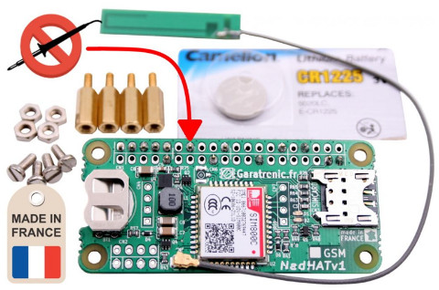
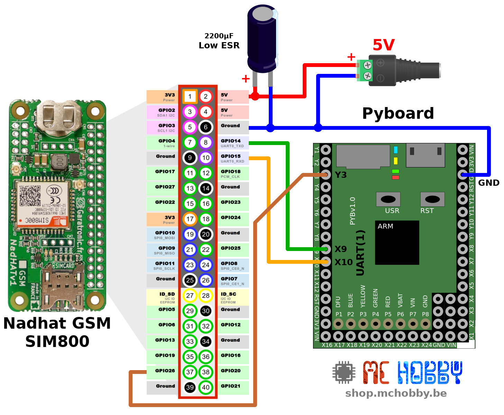
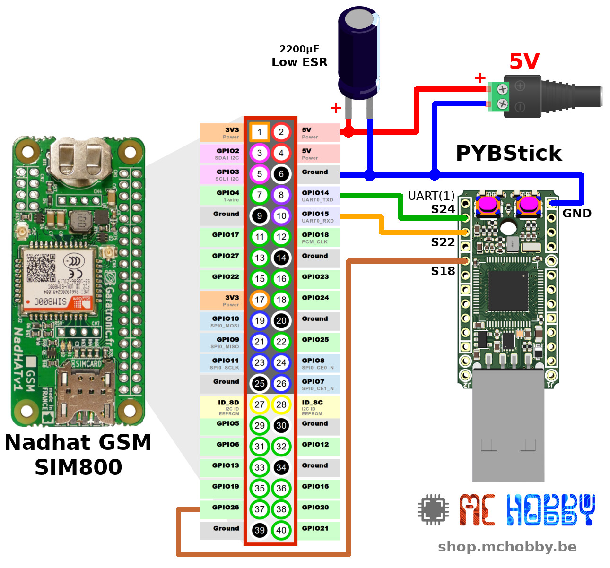

[This file also exists in ENGLISH here](readme_ENG.md)

# Utiliser un module GSM SIMCom avec MicroPython

Cette bibliothèque à été écrite en utilisant la [carte NADHAT GSM](https://shop.mchobby.be/fr/pi-hats/1656-nadhat-gsm-gprs-connecteur-sim800c-v1-3232100016569-garatronic.html) de Garatronic.

Celle-ci est équipée d'un module SIM800 de SIMCOM.



## Consommation

Certaines opérations GSM provoque d'importantes pointes de courants (par exemple l'enregistrement sur le réseau GSM). Des alimentations 5V moins performantes risqueraient de présenter une chute de tension lors d'un brusque appel de courant, ce qui provoquera un redémarrage du module SIM.


Il est vivement conseillé de placer une condensateurs de 2200µF LOW ESR directement sur le GPIO (entre +5V et GND, voir les schémas ci-dessous).

Les condensateurs Low ESR ont une très faible résistance interne et son donc capable de se décharger très rapidement... idéal pour absorber les pics de courants transitoires de la carte NadHat. A contrario, ce même condensateur provoquera un appel de courant plus important sur l'alimentation lors de la mise sous-tension (mais cela sera moins gênant).

__Voici une description des modes et consommation respectives__:

| Mode    | Consommation | Notes        |
|---------|--------------|--------------|
| Power down | 60µA ||
| Sleep mode | 1mA  | Sleep avec DTR @ HIGH, Wake avec DTR @ LOW. Plus de connexion série en mode Sleep. |
| Stand by mode | 18 mA ||
| Appels / SMS | | dépend de la fréquence du réseau utilisée ([GSM Band](https://en.wikipedia.org/wiki/GSM_frequency_bands))|
|| 200 mA | GSM-850
|| 220 mA | E-GSM-900 (Extended GSM-900 band)
|| 145 mA | DCS-1800  (Digital Cellular System)
|| 130 mA | PCS-1900 (Personal Communication Service)
|Data / GPRS | 450 mA ||
| Burst | 2 A | pointe de courant pouvant apparaître durant la transmission |

## LED de Statut
Les modules SIMCOM sont généralement accompagnés d'une LED de statut très pratique pour identifier l'état de la connexion avec le réseau GSM.

* Clignote toutes les 1s: Pas connecté sur réseau GSM
* Clignote toutes les 2s: __Connecté!__ Session de données GPRS.
* Clignote toutes les 3s: __Connecté!__ Services d'appels/SMS disponibles

# Brancher

## Nadhat GSM sur PyBoard



## Nadhat GSM sur PYBStick



# Tester
Tous les exemples ci-dessous sont écrits avec la carte MicroPython Pyboard.

Pour faire fonctionner les scripts de tests avec une carte PYBStick, il faudra modifier le script pour changer le nom des broches utilisées

| Avec Pyboard | Avec PYBStick  | Notes   |
|--------------| ---------------|---------|
| uart = UART(1)  | uart = UART(1)  | __Pyboard:__ X9, X10. __PYBStick:__ S22, S24
| pwr = Pin('Y3') | pwr = Pin('S18')  | Power On Pin

__Numéro de mobile dans les scripts:__

De nombreux scripts utilisent des numéros de téléphones. Ceux-ci sont bien entendu partiellement masqués avec des "xxx" dans le code de démonstration. Il faudra donc y indiquer un numéro de GSM/Mobile valide!

## Test Raw (test_raw.py)
L'exemple [`test_raw.py`](examples/test_raw.py) permet d'activer le module GSM, d'envoyer des commandes AT puis de réceptionner les réponses.

Cet exemple peut être exécuté dans une session REPL à l'aide de `import test_raw`

``` python
PYB: sync filesystems
PYB: soft reboot
MicroPython v1.10 on 2019-01-25; PYBv1.1 with STM32F405RG
Type "help()" for more information.
>>> import test_raw
POWER UP
Training auto-baud detect
--> AT+CGMI
<-- b'AT+CGMI\r\r\n'
<-- b'SIMCOM_Ltd\r\n'
<-- b'\r\n'
<-- b'OK\r\n'
OK received :-)
--> AT+CGMM
<-- b'AT+CGMM\r\r\n'
<-- b'SIMCOM_SIM800C\r\n'
<-- b'\r\n'
<-- b'OK\r\n'
OK received :-)
--> AT+CPIN=1427
<-- b'AT+CPIN=1427\r\r\n'
<-- b'ERROR\r\n'
--> AT+CNET
<-- b'AT+CNET\r\r\n'
<-- b'ERROR\r\n'
```

L'intérêt de la session REPL est qu'elle permet de compléter vos tests puisque le l'espace de nom `test_raw` reste accessible et il est donc possible de faire directement appel au différentes fonctions de la bibliothèque

```
>>> test_raw.send_then_read( 'AT+CPIN=?' )
--> AT+CPIN=?
<-- b'AT+CPIN=?\r\r\n'
<-- b'OK\r\n'
OK received :-)
```

## Test Bibliothèque (test_lib.py)

Le script [`test_lib.py`](examples/test_lib.py) exploite déjà les fondations de la bibliothèque [smodem](lib/smodem.py).

Celui-ci effectue les tâches de configurations du modem et introduction du code PIN pour activer la carte.
Comme il fonctionne en mode DEBUG, tous les messages échangés sur l'UART sont visibles dans la console.

__Avant d'exécuter le script__, il faut changer la valeur de la constante __PIN_CODE__ dans le script.

```
from machine import UART, Pin
from smodem import SimModem
import time

PIN_CODE = '1234'   # <<<<< MODIFIER ICI !
```

Une fois exécuté et terminé,  le script rend la main (au bout de 10 secondes), ce qui permet de réaliser ses propres tests de commande AT.

``` python
MicroPython v1.10 on 2019-01-25; PYBv1.1 with STM32F405RG
Type "help()" for more information.
>>>
>>> import test_lib
 -->>: AT
 <<--: b'AT\r\r\n'
 <<--: b'OK\r\n'
debug: Modem already running
debug: Configure modem
 -->>: ATZ
 <<--: b'ATZ\r\r\n'
 <<--: b'OK\r\n'
 -->>: ATE0
 <<--: b'ATE0\r\r\n'
 <<--: b'OK\r\n'
 -->>: AT+CPIN=1234
 <<--: None
 <<--: None
 <<--: None
 <<--: b'\r\n'
 <<--: b'OK\r\n'
debug: Modem configured
Modem initialized!
 <<--: None
...
 <<--: None
 <<--: b'+CPIN: READY\r\n'
 <<--: None
...
 <<--: None
 <<--: b'\x00'
 <<--: None
 <<--: None
...
 <<--: None
That's all folks
  Do not hesitate to call send() and pump() for your own AT tests
```

Les fonctions suivantes permettent d'interagir avec le modem pour tester vos commandes:
* __send()__ : envoi une commande AT puis extrait les messages jusqu'au prochain OK ou ERROR (timeout_ms = 3000 par défaut)
* __pump()__ : pompe les message sur la voie série (timeout_ms = 5000 par défaut)

Voici quelques exemples saisi après la fin d'exécution de `test_lib.py`

``` python
>>> test_lib.send( 'at+cgmi' )
 -->>: at+cgmi
 <<--: b'at+cgmi\r\r\n'
 <<--: b'SIMCOM_Ltd\r\n'
 <<--: b'\r\n'
 <<--: b'OK\r\n'
>>> test_lib.send( 'at+cgmm' )
 -->>: at+cgmm
 <<--: b'at+cgmm\r\r\n'
 <<--: b'SIMCOM_SIM800C\r\n'
 <<--: b'\r\n'
 <<--: b'OK\r\n'
>>>
```

## Statut (test_status.py)

Le script [`test_status.py`](examples/test_status.py) retourne l'état de plusieurs paramètres utiles en interrogeant plusieurs propriété de la classe `SimModem`


```python
MicroPython v1.10 on 2019-01-25; PYBv1.1 with STM32F405RG
Type "help()" for more information.
>>>
>>> import test_status
debug: False
Status: Ready
Activating....
----[Iteration    0]--------------------------------
Status: Ready, callee:
Mode: 0, format: 0, operator: Orange
Signal Quality: -78 dBm
Network Registration Status: Registered, Home network
Unsollicited Result Code status: Disable Unsollicited Result Code
SIM Serial : 8932026618xxxxxxxxxx
IMEI serial : 86745xxxxxxxxxx
----[Iteration    1]--------------------------------
Status: Ready, callee:
Mode: 0, format: 0, operator: Orange
Signal Quality: -78 dBm
Network Registration Status: Registered, Home network
Unsollicited Result Code status: Disable Unsollicited Result Code
SIM Serial : 8932026618xxxxxxxxxx
IMEI serial : 86745xxxxxxxxxx
```


## Test Scan Réseau (test_netscan.py)

Le script [`test_netscan.py`](examples/test_netscan.py) scan les réseaux mobiles accessibles par la carte.

Ce script initialise le module GSM puis effectue un scan des réseaux accessibles.
Le mode de débogage n'est pas activé par défaut mais il peut être être activer pour voir les échanges de messages sur l'UART.

__Avant d'exécuter le script__, il initialiser la constante __PIN_CODE__ dans le script (avec celui de la carte GSM).

``` python
MicroPython v1.10 on 2019-01-25; PYBv1.1 with STM32F405RG
Type "help()" for more information.
>>>
>>> import test_netscan
debug: False
-- Scan 1/5 ---------------------------------------------------
Scaning can takes up to 45s
-- Scan 2/5 ---------------------------------------------------
Scaning can takes up to 45s
<NetworkScan operator:Orange B, rxlev:26, cellid:0C2B, arfcn:41>
<NetworkScan operator:Orange B, rxlev:21, cellid:0C29, arfcn:37>
<NetworkScan operator:Orange B, rxlev:17, cellid:CC29, arfcn:32>
<NetworkScan operator:PROXIMUS, rxlev:40, cellid:3D66, arfcn:28>
<NetworkScan operator:PROXIMUS, rxlev:32, cellid:3D61, arfcn:30>
<NetworkScan operator:PROXIMUS, rxlev:27, cellid:3D5B, arfcn:71>
<NetworkScan operator:PROXIMUS, rxlev:24, cellid:3AFA, arfcn:4>
<NetworkScan operator:PROXIMUS, rxlev:19, cellid:A062, arfcn:2>
<NetworkScan operator:PROXIMUS, rxlev:18, cellid:B1D0, arfcn:86>
<NetworkScan operator:BASE, rxlev:31, cellid:B29D, arfcn:976>
<NetworkScan operator:BASE, rxlev:28, cellid:B29C, arfcn:985>
<NetworkScan operator:BASE, rxlev:19, cellid:B0F0, arfcn:982>
-- Scan 3/5 ---------------------------------------------------
...
```

## Test décrochage appel vocal (test_pickup.py)

Le test suivant, disponible dans [test_pickup.py](examples/test_pickup.py), attend un appel téléphonique, décroche puis rapproche au bout de 10 secondes.

Résultat:

``` python
>>> import test_pickup
debug: False
Status: Ready
Activating....
Iteration    0, Status: Ready, callee:
Iteration    1, Status: Ready, callee:
Iteration    2, Status: Ready, callee:
...
Iteration   19, Status: Ready, callee:
Iteration   20, Status: Ready, callee:
Iteration   21, Status: Ringing, callee:
Pickup phone (will ends in 10 secs)
Iteration   22, Status: Call in progress, callee: +3249692xxxx
Iteration   23, Status: Call in progress, callee: +3249692xxxx
Iteration   24, Status: Call in progress, callee: +3249692xxxx
Iteration   25, Status: Call in progress, callee: +3249692xxxx
...
...
...
Iteration   37, Status: Call in progress, callee: +3249692xxxx
Iteration   38, Status: Call in progress, callee: +3249692xxxx
Iteration   39, Status: Call in progress, callee: +3249692xxxx
Iteration   40, Status: Call in progress, callee: +3249692xxxx
Hangup call!
Iteration   41, Status: Ready, callee:
Iteration   42, Status: Ready, callee:
Iteration   43, Status: Ready, callee:
```

## Test d'appel vocal (test_call.py)

Ce script d'example, disponible dans [test_call.py](examples/test_call.py), essaye d'appeler le destinataire et si le destinataire attend assez longtemps alors le script termine lui-même l'appel.

Dans cet exemple, le long temps de latence (__appel rejeté ou prématurément terminé par l'appelé__) pour le changement d'état est clairement identifiable.

Chaque itération implique un délai de 1/2 sec.

``` Python
MicroPython v1.10 on 2019-01-25; PYBv1.1 with STM32F405RG
Type "help()" for more information.
>>>
>>> import test_call
debug: False
Status: Ready
Activating....
Iteration    0, Status: Ready
Calling +3249692xxxx (will ends in 60 secs)
Hey the callee did hang-up! I wonna call it again...
Iteration    1, Status: Call in progress
Iteration    2, Status: Call in progress
Iteration    3, Status: Call in progress
Iteration    4, Status: Call in progress
Iteration    5, Status: Call in progress
Iteration    6, Status: Call in progress
Iteration    7, Status: Call in progress
Iteration    8, Status: Call in progress >>> l'appelé REJETE l'appel
Iteration    9, Status: Call in progress
Iteration   10, Status: Call in progress
Iteration   11, Status: Call in progress
...
... Cela peut prendre 40 sec pour obtenir un statut READY
...
Iteration   88, Status: Call in progress
Iteration   89, Status: Call in progress
Iteration   90, Status: Ready
...
... Le script détecte la fin de communication
... et attend un peu avant de rappeler le destinataire
...
Hey the callee did hang-up! I wonna call it again...
Iteration   91, Status: Ready
Hey the callee did hang-up! I wonna call it again...
Iteration   92, Status: Ready
Hey the callee did hang-up! I wonna call it again...
...
...
...
Iteration  153, Status: Ready
Calling +3249692xxxx (will ends in 60 secs)
Hey the callee did hang-up! I wonna call it again...
Iteration  154, Status: Call in progress >>> Le script fait un nouvel appel
Iteration  155, Status: Call in progress
Iteration  156, Status: Call in progress
Iteration  157, Status: Call in progress
Iteration  158, Status: Call in progress
Iteration  159, Status: Call in progress
Iteration  160, Status: Call in progress >>> Le destinataire prend l'appel
Iteration  161, Status: Call in progress
Iteration  162, Status: Call in progress
...
...
...
Iteration  265, Status: Call in progress
Iteration  266, Status: Call in progress
Iteration  267, Status: Call in progress
Hangup call!                             >>> Cette fois c'est le script qui raccroche
That's all Folks!

```

# Envoi SMS

Le script [test_sms_send.py](examples/test_sms_send.py), visible ci-dessous, permet d'envoyer des SMS vers un n° de téléphone.

``` python
from machine import UART, Pin
from smodem import SimModem, AS_READY
import time

PIN_CODE = '1234'       # <<<<< MODIFIER ICI !

PHONE = '+32496928xxx'  # <<<<< MODIFIER ICI !

# UART and PowerPin to SIM Module
# Will be reconfigured by SimModem
uart = UART(1)  # X9, X10 sur Pyboard
pwr = Pin('Y3') # Broche Power On

m = SimModem( uart, pwr_pin = pwr, pin_code=PIN_CODE )
m.debug = False

r = m.activate()   # Activer/Réinitialiser le modem
m.wait_for_ready() # Attendre que le modem soit prêt

mr = m.send_sms( PHONE, 'Hello world!\r\nFrom MicroPython' )
if mr:
	print( "Message sent. Message_reference: %i" % mr )
else:
	print( "Message not sent (or Message_reference not captured)" )

# Using Latin chars
mr = m.send_sms( PHONE, 'Bénédicte est la maîtresse à demeure :-)\r\nMerci MicroPython & NADHAT-GSM' )
if mr:
	print( "Message sent. Message_reference: %i" % mr )
else:
	print( "Message not sent (or Message_reference not captured)" )
```

Ce qui produit le résultat suivant:

```
MicroPython v1.10 on 2019-01-25; PYBv1.1 with STM32F405RG
Type "help()" for more information.
>>>
>>> import test_sms_send
Modem initialized!
Message sent. Message_reference: 2
Message sent. Message_reference: 3
```

# Reception de SMS (test_sms_read.py)

Le script [test_sms_read.py](examples/test_sms_read.py), visible ci-dessous, permet de réceptionner des SMS.

__Note:__ la propriété `m.stored_sms` produit parfois une erreur sur le module SimCom. Peut-être faut-il faire plusieurs tentatives (le modem n'est peut être pas prêt ?!?!)

``` python
from machine import UART, Pin
from smodem import SimModem, AS_READY
import time

PIN_CODE = '1234'  # <<<<< MODIFIER ICI !

# L'UART et la broche PowerOn branché sur le module SIMCOM seront
# reconfiguré par la bibliothèque SimModem
uart = UART(1) # X9, X10 sur Pyboard
pwr = Pin('Y3') # broche Power On

m = SimModem( uart, pwr_pin = pwr, pin_code=PIN_CODE )
m.debug = False

r = m.activate() # Activer / réinitialiser le Modem
print( 'Modem initialized!' )

# Attendre que le modem soit prêt
m.wait_for_ready()

# Il arrive que des SMS soient toujours stockés dans la mémoire OU reçu
# par le SIM800 actif alors qu'il n'y a pas/plus de logiciel extrayant les
#   SMS réceptionnés par le SIM800 (donc ayant raté les publications des
#   "Unsollicited Result Code" sur l'UART)
#
# Voici comment les lire et les effacer avant le dépassement des SLOT SMS disponibles.
print( '==[ Display stored SMS ]=============================================' )
print( '' )
stored = m.stored_sms
for id in stored:
	sms = m.read_sms( id, delete=False ) # Doit être effacés séparemment car pas dans la liste de réception
	m.delete_sms( id )
	print( 'Sender : %s' % sms.sender )
	print( 'Time   : %s' % sms.send_date )
	for line in sms.lines:
		print( line )
	print( '-'*40 )

# Attendre les prochains SMS et les lires
print( '' )
print( '==[ Wait for SMS ]===================================================' )
print( '' )
while True:
	m.update()
	if m.has_sms:
		for id in m.rec_sms:
			sms = m.read_sms( id, delete=True ) # Delete it from the SMS Store
			print( 'Sender : %s' % sms.sender )
			print( 'Time   : %s' % sms.send_date )
			for line in sms.lines:
				print( line )
			print( '-'*40 )
```

Ce qui produit les résultats suivants sur la console REPL.

```
MicroPython v1.12 on 2020-05-12; PYBSTICK26_STD with STM32F411RE
Type "help()" for more information.
>>> import test_sms_read

debug: Modem already running
debug: Configure modem
debug: Modem configured!
Modem initialized!

==[ Display stored SMS ]=============================================


==[ Wait for SMS ]===================================================

Sender : +324969xxxx
Time   : 20/10/07 23:18:35+08
I love MicroPython
----------------------------------------
Sender : +324969xxxx
Time   : 20/10/07 23:19:28+08
1000000000 de fois plus efficace
----------------------------------------
```

# Où acheter
* [Carte NadHat GSM](https://shop.mchobby.be/fr/pi-hats/1656-nadhat-gsm-gprs-connecteur-sim800c-v1-3232100016569-garatronic.html)
* [Carte MicroPython Pyboard](https://shop.mchobby.be/fr/micropython/570-micropython-pyboard-3232100005709.html)
* [PYBStick Standard](https://shop.mchobby.be/fr/micropython/1844-pybstick-standard-26-micropython-et-arduino-3232100018440-garatronic.html) & [PYBStick-Hat-Face](https://shop.mchobby.be/fr/micropython/1935-interface-pybstick-vers-raspberry-pi-3232100019355.html)
