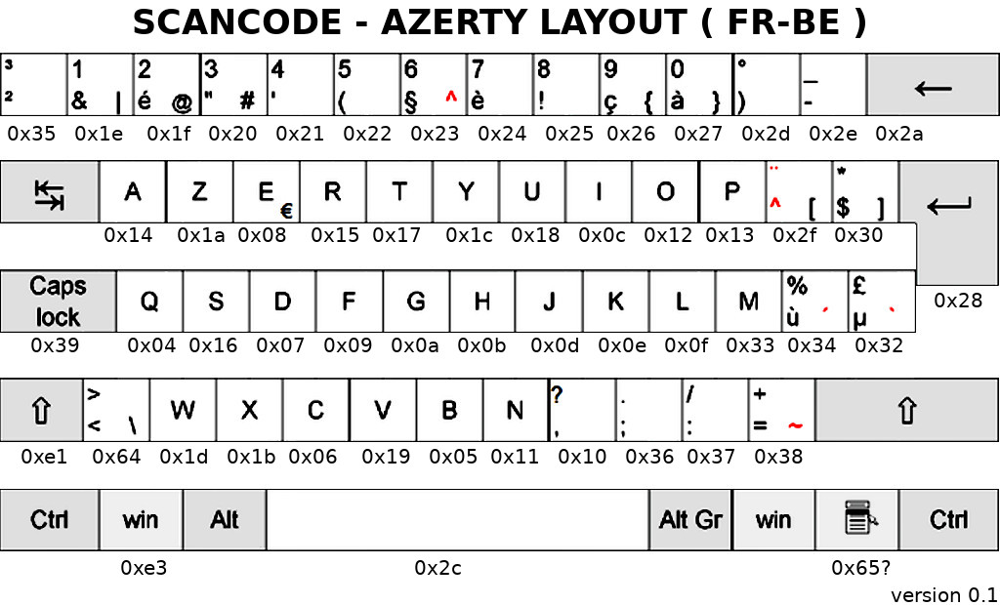

[This file also exists in ENGLISH here](readme_ENG.md)

# Utiliser la Pyboard comme une souris / Clavier (périphérique HID)

Cette section du dépôt propose des exemples et bibliothèque pour faciliter l'usage de la Pyboard comme périphérique HID (surtout en périphérique clavier).

Il ne faut pas oublier d'activer le mode HID dans le fichier `boot.py` .

``` python
import machine
import pyb
#pyb.main('main.py') # main script to run after this one

# act as a serial device and a keyboard
pyb.usb_mode('VCP+HID', hid=pyb.hid_keyboard)
```

Il est aussi possible d'utiliser la constante pyb.hid_mouse (valeur par défaut de `usb_mode()`

# Clavier = ScanCode
L'utilisation du clavier repose sur des envois de rapport HID de type clavier. Ceux-ci se base sur l'utilisation des ScanCode pour identifier la position de la touche pressée sur le clavier.



# Bibliothèque

L'utilisation de la bibliothèque repose sur deux outils:
* `usbhid.py` : contient des fonctions utilitaires. Celle-ci recoivent le périphérique HID en paramètre et un KeyMapping.
* `kmap_frbe.py` : contient la déclaration du KeyMapping, permettant d'associer les ScanCode aux lettres présentes sur les touches du clavier. Le KeyMapping est un dictionnaire toujours nommé `kmap`. Pour le fichier `kmap_frbe.py`, le dictionnaire `kmap` contient le KeyMapping d'un clavier AZERTY (fr) avec la disposition Belge (be). Pour un clavier AZERTY Français disposition Française, il faudrait créer un fichier `kmap_frfr.py`.

# Exemples

Le répertoire `examples` propose des exemples très instructifs. N'hésitez pas à les consulter.

# Ressources
* http://wiki.micropython.org/USB-HID-Keyboard-mode-example-a-password-dongle
