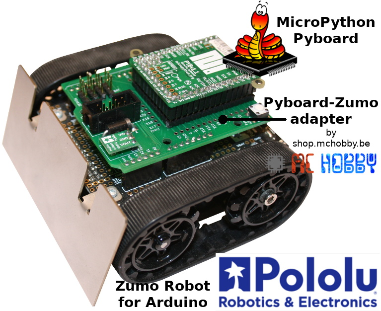
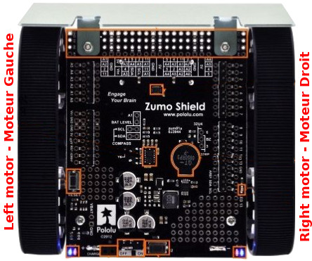
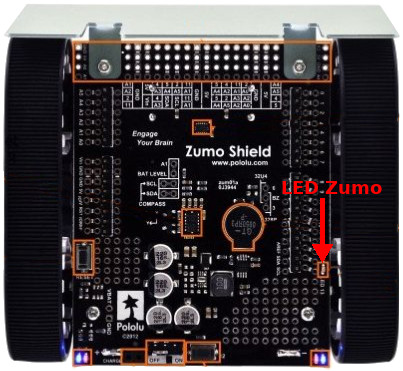
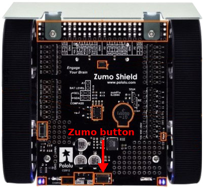
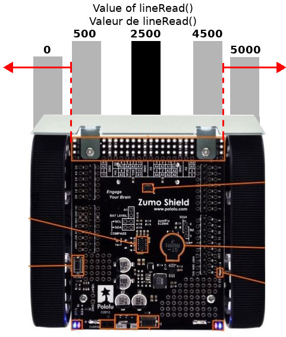

[This file also exists in ENGLISH here](readme_ENG.md)

# ROBOT ZUMO V1.2 sous MicroPython avec la Pyboard originale

Ce portage MicroPython concerne le [Robot Zumo de Pololu](https://www.pololu.com/product/2510). Ce robot peut être acheté en pièce détachées ou en version pré-assemblé (comme sur la photo). Ce robot est conçu pour un carte Arduino Uno __MAIS NOUS ALLONS LE FAIRE FONCTIONNER avec une carte MicroPython Pyboard__.

Le Zumo robot est composé d'un châssis, deux moteurs, un shield pour Arduino, une lame en acier inoxydable de 0,9mm d'épaisseur montée à l'avant du châssis lui permettant ainsi de pousser les objets et adversaires aux alentours, d'une matrice de capteurs infrarouge spécialement conçue pour le suivi de lignes.

Vous pouvez consulter les liens suivants pour plus de détails à propos du robot Zumo: [Robot Zumo @ MCHOBBY](https://shop.mchobby.be/fr/prototypage-robotique-roue/448-robot-zumo-pour-arduino-assemble-moteurs-3232100004481-pololu.html) ou [Robot Zumo @ Pololu](https://www.pololu.com/product/2510)



Ce robot Zumo est initialement programmé à l'aide d'un Arduino Uno ou d'un Arduino Leonardo.
Dans ce projet le robot Zumo est programmé grâce à un [adaptateur Pyboard vers UNO-R3](https://github.com/mchobby/pyboard-driver/tree/master/UNO-R3).

Toutes les bibliothèques et exemples en Arduino fournis par [Pololu](https://www.pololu.com) ont été portés sous Micropython.

# Brancher

## Adaptateur Pyboard vers Zumo

TODO TODO TODO TODO TODO TODO

Le [schéma de l'adaptateur est disponible ici](docs/_static/schematic.jpg)

## Connexion DIY
Vous pouvez aussi réaliser les connexions Pyboard --> UNO-R3 comme visible en début de cette documentation. Ce n'est pas très beau mais pleinement fonctionnel.


Avec raccordement DIY, vous aurez besoin d'utiliser un [régulateur 5V S7V7F5 de Pololu](https://www.pololu.com/product/2119) pour générer 5V à partir de la tension VIN obtenue depuis les piles du shield Zumo robot. Suivez ce [schéma de distribution d'alimentation](https://github.com/mchobby/pyboard-driver/blob/master/UNO-R3/docs/_static/power-distribution.jpg) repris du projet PYBOARD-UNO-R3. La carte PYBOARD-UNO-R3 dispose, elle, de son propre convertisseur de type buck.

Voyez les schémas DIY du projet [PYBOARD-UNO-R3](https://github.com/mchobby/pyboard-driver/tree/master/UNO-R3) pour les raccordements broches-pyboard vers broches-arduino.

# Tester

Avant de tester l'adapteur Pyboard-Zumo (ou votre propre adaptateur), il est nécessaire de copier les bibliothèques nécessaires sur votre carte MicroPython.

Les bibliothèques ont été portées depuis le code source Arduino produit par Pololu. __Les fonctions/méthodes ont conservés les convention de nommage C pour faciliter la transition des utilisateurs d'Arduino vers MicroPython__.

* [zumoshield.py](lib/zumoshield.py) : commande moteur et suiveur de ligne du Zumo
* [pushbutton.py](lib/pushbutton.py) : outil de manipulation de bouton
* [zumobuzzer.py](lib/zumobuzzer.py) : Support du Zumo buzzer
* [lsm303.py](lib/lsm303.py) : Support de l'accéléromètre/magnétomètre 3 axes
* [L3G.py](lib/L3G.py) : Support Gyroscope
* [qtrsensors.py](lib/qtrsensors.py) : support général des suiveurs de ligne de Pololu

## Etat par défaut

Lors de la mise en route de la Pyboard, les broches sont configurées en entrées, ce qui a pour effet de faire tourner le deux moteurs.

Cas qui risque de se présenter lorsque l'on branche la Pyboard sur un ordinateur puis que l'on mette le Zumo sous tension.

Il faut donc initialiser les sorties de Pyboard le plus vite possible pour éviter aux moteurs de se mettre en route. Cela peu se faire à l'aide des deux lignes suivantes saisie sur le session REPL (ou placée au début du fichier `main.py`).

``` python
>>> from zumoshield import ZumoMotor
>>> zumo = ZumoMotor()
```

Voyez le script [examples/main.py](examples/main.py) qui contient le code minimaliste pour initialiser rapidement le Zumo.

## Piloter les moteurs

Placer des piles dans le Zumo puis placer le commutateur en position "ON".

Les LEDs a l'arrière du Zumo doivent s'allumer.



Saisir le code suivant dans une session REPL:

``` python
>>> from zumoshield import ZumoMotor
>>> motors=ZumoMotor()
>>> # Marche avant
>>> motors.setSpeeds( 200, 200 ) # -400..0..400
>>> # Stop
>>> motors.setSpeeds( 0, 0 ) # -400..0..400
>>> # Marche arrière
>>> motors.setSpeeds( -100, -100 ) # -400..0..400
>>> motors.setSpeeds( 0, 0 ) # -400..0..400
```

L'exemple suivant montre comment inverser le sens de rotation du moteur droit pour faire tourner le Zumo à droite.

``` python
>>> from zumoshield import ZumoMotor
>>> from time import sleep
>>> motors=ZumoMotor()
>>> # Marche avant
>>> motors.setSpeeds( 100, 100 ) # -400..0..400
>>> # Tourner à droite
>>> motors.flipRightMotor( True )
>>> motors.setSpeeds( 100, 100 ) # Indiquer la vitesse de rotation
>>> # Attendre une seconde
>>> sleep( 1 )
>>> # Reprendre la marche avant (en indiquer la vitesse)
>>> motors.flipRightMotor( False )
>>> motors.setSpeeds( 100, 100 )
>>> sleep( 1 )
>>> # Stop
>>> motors.setSpeeds( 0, 0 ) # -400..0..400
```

## Buzzer

Voici quelques exemples extraient de [mazesolver.py](examples/mazesolver.py) pour jouer une suite de notes.

La syntaxe est décrite dans document de Pololu pour la méthode [Zumo32U4Buzzer::play()](https://pololu.github.io/zumo-32u4-arduino-library/class_zumo32_u4_buzzer.html)

``` python
from zumobuzzer import PololuBuzzer
from time import sleep

buzzer=PololuBuzzer()
buzzer.play("c8")
sleep(2)
buzzer.play(">g32>>c32")
sleep(2)
buzzer.play("l16 cdegreg4")
sleep(2)
buzzer.play(">>a32")
sleep(2)
buzzer.play(">>a32")
```
Il est également possible de jouer directement de notes avec `playNote()` en précisant la Note, sa durée en ms et le volume (0-15) de celle-ci.

Exemple issus de [borderdetect.py](examples/borderdetect.py) .

``` python
from zumobuzzer import PololuBuzzer, NOTE_G
buzzer = PololuBuzzer()

for x in range(3):
		time.sleep(1)
		# Note(octave), Durée, Volume
		buzzer.playNote(NOTE_G(3),200,15)
time.sleep(1)
buzzer.playNote(NOTE_G(4),500,15)
time.sleep(1)
```

## LEDs du Zumo

Le Zumo est équipé d'une LED utilisateur orange marquée "LED 13".



Cette LED est visible sur le côté droit du Zumo.

``` python
from machine import Pin
from time import sleep

led = Pin("Y6", Pin.OUT)

# Allume la LED sur le côté droit du Zumo
led.value(1)
sleep(2)
led.value(0)
```

## Bouton poussoir 1

La carte Pyboard-to-Zumo dispose d'un bouton utilisateur qui est monté en parallèle sur le bouton utilisateur de la pyboard.

``` python
import pyb
sw = pyb.Switch()
while True:
	if sw.value():
		print( "Pressed" )
	else:
		print( "..." )
```

pour plus d'information sur la classe `Switch`, référez vous à la [documentation MicroPython officielle](https://docs.micropython.org/en/latest/pyboard/tutorial/switch.html) .

## Bouton poussoir 2

Le bouton poussoir du Zumo (à côté de l'interrupteur On/OFF) est raccordé sur la broche "Y7" de la Pyboard. L'entrée est branchée à la masse lorsque ce bouton est pressé.



Le bouton poussoir peut être lu directement avec l'aide des classes `Pin` et `Signal`.

La classe `Signal` sert a inverser la logique du signal.

``` python
from machine import Pin, Signal
pin = Pin( "Y7", Pin.IN, Pin.PULL_UP )
btn = Signal( pin, invert=True )
while True:
	if btn.value():
		print( "Pressed" )
	else:
		print( "..." )
```

La bibliothèque [pushbutton](lib/pushbutton.py) propose des outils pour faciliter l'usage

## Suiveur de ligne

Le suiveur de ligne présent à l'avant du Zumo permet de détecter la présente d'une ligne noir (largeur de 15mm).

Le script suivant active les LEDs infrarouges puis effectue une lecture récurrente des récepteurs Infrarouge.



``` python
# Arrêter les moteurs
from zumoshield import ZumoMotor
mot = ZumoMotor()

# Tester le capteur infrarouge
#
import time
from zumoshield import ZumoReflectanceSensorArray
r = ZumoReflectanceSensorArray()

# déplacer le zumo au dessus de la ligne durant
# cette calibration en 10 étapes. Permet d'évaluer le
# contraste noir/blanc.
#
for i in range(10):
    print( "Calibrate %i / 10" % i+1 )
    r.calibrate()
    time.sleep(0.5)

# Lecture de la position de la ligne
#
while True:
    sensors = [0 for i in range(6)]
    # Avec le Zumo dirigé vers l'avant
    #   Valeur de 500 à 4500 : ligne de gauche à droite.
    #   valeur 2500 : ligne pile au centre
    #   valeur 0 : ligne hors capteur à gauche
    #   valeur 5000 : ligne hors capteur à droite
    position = r.readLine( sensors )
    print( 'Line position: ', position )
    time.sleep( 1 )
```

# Scripts d'exemples

## BorderDetect

L'exemple [borderdetect.py](examples/borderdetect.py) est un programme ou le robot Zumo ne sors jamais d'un ring. Le ring est une surface blanche un contour noir.

Le capteur infrarouge détecte la différence de couleurs à l'aide de la bibliothèque [qtrsensors.py](lib/qtrsensors.py). Le noir est peu réfléchissant et le blanc est fortement réfléchissant. En fonction de ces informations les moteurs vont avancer, reculer ou tourner.


"VIDEO ZUMO ET RING"

## LineFollower

Comme son nom l'indique le robot Zumo suit un ligne. Dans cet exemple la ligne est noir. La ligne peut être droite comme courbée.
Grâce aux classes [QTRsensors](https://github.com/mchobby/pyboard-driver/tree/master/Zumo-Robot/lib/qtrsensors.py) et [ZumoMotor](https://github.com/mchobby/pyboard-driver/tree/master/Zumo-Robot/lib/zumoshield.py) le robot Zumo garde une bonne trajectoire.

Voir cette [vidéo réalisée à la Maker Faire Paris 2019](https://youtu.be/VHN83aYCH8Q) (YouTube)

## Compass

L'exemple Compass (Boussole) fait tourner le robot Zumo en carré. Grâce au magnétomètre du LSM303 le robot Zumo tourne 4 fois de 90 degrés à l'aide du champ magnétique terrestre.

[VIDEO COMPASS]

# Bibliothèques

## Classe QTRSensors

La bibliothèque [qtrsensors.py](lib/qtrsensors.py) propose la classe `QTRSensors` qui sert à lire les informations du [capteur de réflectance](https://www.pololu.com/product/1419/) et permet au robot Zumo de distinguer une ligne noire sur fond blanc (ou inversément).

Le [Capteur de réflectance](https://www.pololu.com/product/1419/) existe en plusieurs exemplaires de 1 à 31 capteurs infrarouge. Le Zumo Robot en utilise seulement 6.


## Classe ZumoBuzzer

Le buzzer présent le shield du robot Zumo est prit en charge par la bibliothèque [zumobuzzer.py](lib/zumobuzzer.py). C'est un buzzer passif capable de produire différents son en faisant varier le signal PWM qui le fait osciller.

Cette bibliothèque permet de produire des notes sur plusieurs octaves (ainsi que la durée des sons). Une mélodie peut être saisie dans une chaîne de caractère et être décodée par la bibliothèque.


## Bibliothèque zumoshield

La bibliothèque [zumoshield.py](lib/zumoshield.py) contient les classes `ZumoMotor` et  `ZumoReflectanceSensorArray` permettant de prendre rapidement le contrôle des moteurs [moteurs 75:1 du Zumo](https://shop.mchobby.be/fr/moteurs-continu/431-micro-moteur-751-hp-axe-3mm-d-engrenage-metal-3232100004313-pololu.html) et du [suiveur de ligne](https://www.pololu.com/product/1419/) présent sur le Robot Zumo.


## Classe Pushbutton

La bibliothèque [pushbutton.py](lib/pushbutton.py) défini la classe `Pushbutton` permettant de détecter l'état enfoncé ou relâché d'un bouton.

## Classe L3GD20_I2C

La bibliothèque [L3G.py](lib/L3G.py) contient la classe L3GD20_I2C prenant en charge le Gyroscope L3GD20H intégré au Zumo Robot.
L3GD20H est un gyroscope de type MEMS (Microelectromechanical systems) qui permet de calculer la vitesse angulaire en degrés/secondes.


## LSM303
Le capteur LSM303 est un magnétomètre et accéléromètre. Il se trouve sur le shield du robot Zumo. Il communique en I2C, pour plus d'information rediriger vous vers le [github du capteur LSM303.](https://github.com/mchobby/esp8266-upy/tree/master/lsm303)


# Materiel
* [Adaptateur Pyboard-UNO-R3](https://github.com/mchobby/pyboard-driver/tree/master/UNO-R3) @ MCHobby (permet de connecter une Pyboard sur des shields Arduino)
* [Robot Zumo assemblé](https://shop.mchobby.be/fr/prototypage-robotique-roue/448-robot-zumo-pour-arduino-assemble-moteurs-3232100004481-pololu.html?search_query=zumo&results=5) @ MC Hobby

## Robot Zumo Pièces:          
* [Chassis sans moteurs](https://shop.mchobby.be/fr/prototypage-robotique-roue/447-zumo-kit-chassis-sans-moteur-3232100004474-pololu.html?search_query=zumo&results=5) @ MC Hobby
* [Kit chenille](https://shop.mchobby.be/fr/prototypage-robotique-roue/435-kit-chenille-85mm-entre-axe-3232100004351-pololu.html?search_query=zumo&results=5) @ MC Hobby
* [Micro motor 75:1](https://shop.mchobby.be/fr/moteurs-continu/431-micro-moteur-751-hp-axe-3mm-d-engrenage-metal-3232100004313-pololu.html?search_query=75%3A1&results=6)  @ MC Hobby
* [Zumo Shield](https://www.pololu.com/product/2508) @ Pololu
* [Zumo Blade](https://www.pololu.com/product/1410) @ Pololu
* [Zumo Reflectance Sensor Array](https://www.pololu.com/product/1419/) @ Pololu
