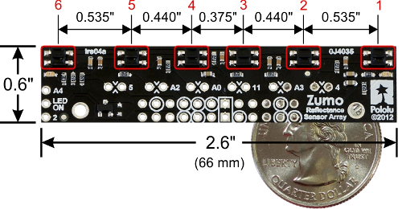
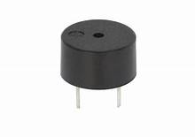
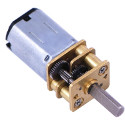
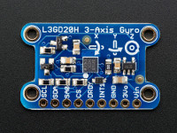

# ROBOT ZUMO V1.2 sous MicroPython avec la Pyboard originale

Voici le robot Zumo V1.2. Vous pouvez le retrouver en pièces détachées ou assemblé comme sur l'image.
Il est composé d'un châssis, deux moteurs, un shield pour Arduino, une lame en acier inoxydable de 0,9mm d'épaisseur montée à l'avant du châssis lui permettant ainsi de pousser les objets et adversaires aux alentours, d'une matrice réfléchissante spécialement conçue pour le Zumo.
Pour plus de détails à propos du robot Zumo vous pouvez trouvez ceci sur le site de [MCHOBBY](https://shop.mchobby.be/fr/prototypage-robotique-roue/448-robot-zumo-pour-arduino-assemble-moteurs-3232100004481-pololu.html)

Ce robot Zumo est initialement programmé à l'aide d'un Arduino Uno ou d'un Arduino Leonardo.
Dans ce projet le robot Zumo est programmé grâce à un [adaptateur Pyboard vers UNO-R3](https://github.com/mchobby/pyboard-driver/tree/master/UNO-R3).

Toutes les libraires et exemples en Arduino fournis par [Pololu](https://www.pololu.com/) ont été portés en Micropython.

# Raccordements

## Pyboard-UNO-R3

Brancher l'adaptateur [PYBOARD-UNO-R3](https://github.com/mchobby/pyboard-driver/tree/master/UNO-R3) avec la Pyboard sur le Robot Zumo pour Arduino.

Vous pouvez aussi réaliser les connexions Pyboard --> UNO-R3 comme indiqué sur le schéma [PYBOARD-UNO-R3](https://github.com/mchobby/pyboard-driver/tree/master/UNO-R3).

# Test

## BorderDetect

L'exemple [BorderDetect] est un programme ou le robot Zumo ne sors jamais d'un ring. Le ring est une surface blanche un contour noir. Le capteur infrarouge détecte la différence de couleurs à l'aide de la librairie [QTRsensors]. Le noir est peu réfléchissant et le blanc est fortement réfléchissant. A l'aide de ses informations les moteurs vont avancer, reculer ou tourner.

"VIDEO ZUMO ET RING"

## LineFollower

Comme son nom l'indique le robot Zumo suit un ligne. Dans cet exemple la ligne est noir. La ligne peut être droite comme courbée.
Grâce à la libraire [QTRsensors](https://github.com/mchobby/pyboard-driver/tree/master/Zumo-Robot/lib/qtrsensors.py) et [ZumoMotor](https://github.com/mchobby/pyboard-driver/tree/master/Zumo-Robot/lib/zumoshield.py) le robot Zumo garde une bonne trajectoire.

[VIDEO LINEFOLLOWER]

## Compass

L'exemple Compass (Boussole) fait tourner le robot Zumo en carré. Grâce aux [magnétomètre de l'LSM303] le robot Zumo tourne 4 fois de 90 degrés à l'aide du champ magnétique terrestre.

[VIDEO COMPASS]

# Libraires

## QTRSensors

La librairie [QTRSensors] sert à lire les informations du [Capteur de réflectance](https://www.pololu.com/product/1419/) pour voir comment le robot Zumo est positionné sur une surface composé de blanc et de noir.
Le [Capteur de réflectance](https://www.pololu.com/product/1419/) existe en plusieurs exemplaires de 1 à 31 capteurs infrarouge. Le Zumo en utilise seulement 6.

## ZumoBuzzer

Le buzzer sur le shield du robot Zumo est un Piezo buzzer. C'est un buzzer passif. Un buzzer passif n'est pas limité à un son comme l'actif. Ce script permet d'émettre le son des notes d'un octave, de modifier l'octave et de modifier le temps des notes.

## Zumoshield

Le script Zumoshield contient toutes les fonction nécessaires pour commander les [moteurs 75:1 du Zumo](https://shop.mchobby.be/fr/moteurs-continu/431-micro-moteur-751-hp-axe-3mm-d-engrenage-metal-3232100004313-pololu.html?search_query=moteurs&results=168). Il y a également l'initiation des broches pour le [Capteur de réflectance](https://www.pololu.com/product/1419/)

## Pushbutton

Pushbutton n'est pas une librairie très compliqué. Elle vérifie si le bouton est enfoncé ou relâché.

## L3GD20H
Ceci est un gyroscope de type MEMS (Microelectromechanical systems). Un gyroscope calcul la vélocité angulaire en degrés/secondes. Le capteur L3GD20H utilise une communication I2C dans ce projet mais peut également utiliser la communication SPI.

## LSM303
Le capteur LSM303 est un magnétomètre et accéléromètre. Il se trouve sur le shield du robot Zumo. Il communique en I2C, pour plus d'information rediriger vous vers le [github du capteur LSM303.](https://github.com/mchobby/esp8266-upy/tree/master/lsm303)

# Materiel
Adaptateur Pyboard-UNO-R3 @ MCHobby (bientôt disponible)

[Robot Zumo assemblé](https://shop.mchobby.be/fr/prototypage-robotique-roue/448-robot-zumo-pour-arduino-assemble-moteurs-3232100004481-pololu.html?search_query=zumo&results=5) @ MC Hobby

## Robot Zumo Pièces:          

[Chassis sans moteurs](https://shop.mchobby.be/fr/prototypage-robotique-roue/447-zumo-kit-chassis-sans-moteur-3232100004474-pololu.html?search_query=zumo&results=5) @ MC Hobby

[Kit chenille](https://shop.mchobby.be/fr/prototypage-robotique-roue/435-kit-chenille-85mm-entre-axe-3232100004351-pololu.html?search_query=zumo&results=5) @ MC Hobby

[Micro motor 75:1](https://shop.mchobby.be/fr/moteurs-continu/431-micro-moteur-751-hp-axe-3mm-d-engrenage-metal-3232100004313-pololu.html?search_query=75%3A1&results=6)  @ MC Hobby

[Zumo Shield](https://www.pololu.com/product/2508) @ Pololu

[Zumo Blade](https://www.pololu.com/product/1410) @ Pololu

[Zumo Reflectance Sensor Array](https://www.pololu.com/product/1419/) @ Pololu

# Datasheets

LSM303D

L3GD20H

Reflectance Sensor Array
